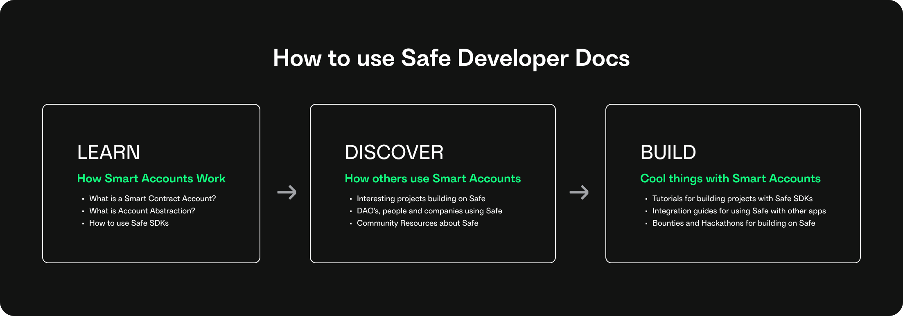
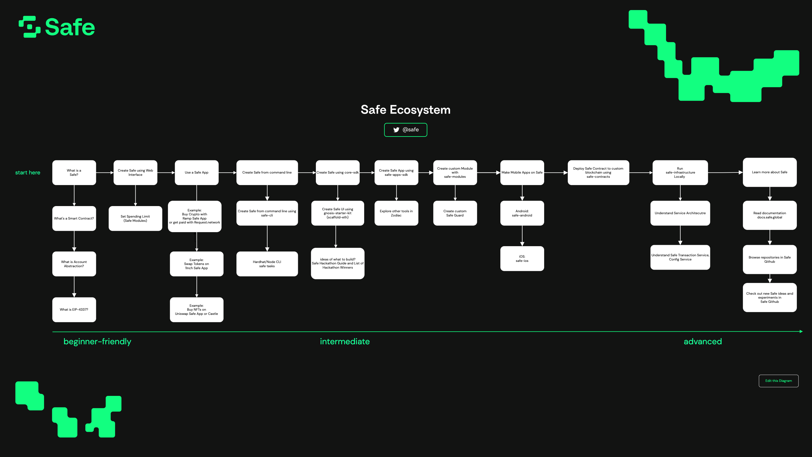

# 👋 Introduction

Safe brings digital ownership of accounts to everyone by building universal and open contract standards for the custody of digital assets, data, and identity with the Safe ecosystem. These docs explain how to build with Safe.

### How to Read this Guide

There are three main sections in this guide: Learn, Discover, and Build.

<figure><figcaption></figcaption></figure>

1. [Learn](https://docs.safe.global/learn) about how Smart Accounts (aka Smart Contract Accounts) work.
2. [Discover](https://docs.safe.global/discover/) how others are building and using Smart Accounts
3. [Build](https://docs.safe.global/build) cool things with Smart Accounts.

We recommend starting with Learn and seeing some tutorials there to learn more about how Smart Accounts work. Then, head to the Discover section to get some ideas and inspiration for the types of things you can build with smart accounts. Finally, complete one of the Build tutorials to build something that uses Smart Accounts.

### Getting Started

Safe has a lot of features which means a lot of information. To make it easier to navigate, here is a step-by-step guide you can follow:

1. [Learn about Smart Accounts](learn/what-is-a-smart-contract-account.md)
   1. Make a Safe
   2. Learn about Account Abstraction
2. [Learn about the different Safe{Core} tools](learn/safe-core/)
   1. [Safe{Core} Account Abstraction SDK](learn/safe-core/safe-core-account-abstraction-sdk/)
   2. [Safe{Core} API](learn/safe-core/safe-core-api/)
   3. [Safe{Core} Protocol](learn/safe-core/safe-core-protocol/)
3. [Discover](discover/) interesting projects that others have built using Smart Accounts
   1. [Safe Hackathon Guide and List of Hackathon Winners](https://safe-global.notion.site/Safe-Hackathon-Success-Guide-53d2fb3c29424b58b1c4407519a54930)
4. [Build](build/) your own apps using smart accounts

You can also follow the [Ecosystem Diagram](https://viewer.diagrams.net/index.html?tags=%7B%7D\&target=blank\&highlight=0000ff\&edit=\_blank\&layers=1\&nav=1\&page-id=atRejJyS5DeNAtDboIeV\&title=Safe%20Diagrams.drawio#Uhttps%3A%2F%2Fdrive.google.com%2Fuc%3Fid%3D1WcTgdHoQttJ0K\_fV8mDg-RmDZRYGe3D-%26export%3Ddownload).

<figure><figcaption>
<a href="https://viewer.diagrams.net/?tags=%7B%7D&#x26;target=blank&#x26;highlight=0000ff&#x26;edit=_blank&#x26;layers=1&#x26;nav=1&#x26;page-id=atRejJyS5DeNAtDboIeV&#x26;title=Safe%20Diagrams.drawio#Uhttps%3A%2F%2Fdrive.google.com%2Fuc%3Fid%3D1WcTgdHoQttJ0K_fV8mDg-RmDZRYGe3D-%26export%3Ddownload">View Diagram</a>
</figcaption></figure>

### Contact Us

#### Community

- [Tweet us on Twitter @safe](https://twitter.com/safe).
- GitHub
   - [Open an issue](https://github.com/safe-global).
   - Check out the [5afe GitHub](https://github.com/5afe/) page where we put more experimental, non-production-ready code.
- [Chat with us on Discord](https://chat.safe.global/).
- [Participate in the Safe Forum](https://forum.safe.global/).
- Follow Safe adoption on [Dune Analytics](https://dune.com/safe).

#### Support

- [Ask 'safe-core' questions on Ethereum Stack Exchange](https://ethereum.stackexchange.com/questions/tagged/safe-core).
