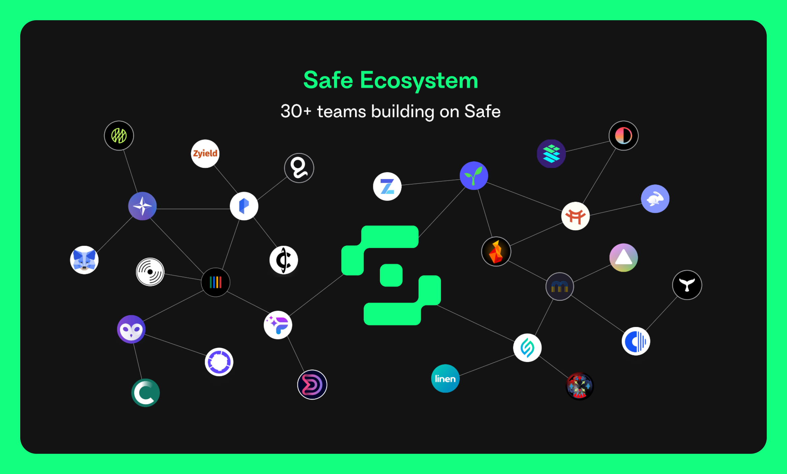
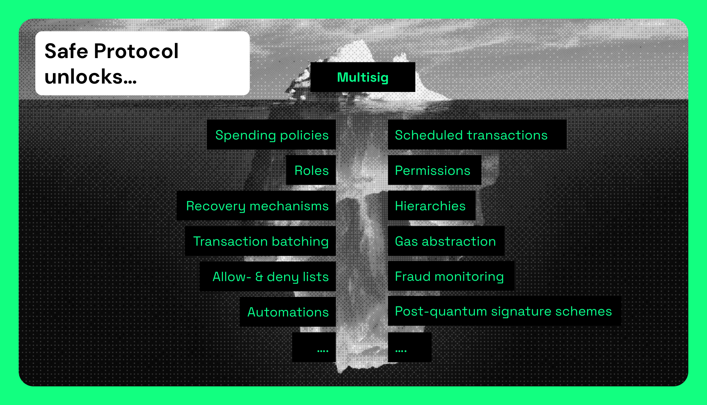

# 👋 Introduction

The Safe developer docs aim to provide an overview of the Safe smart contracts, interfaces and integrations.

It’s a place where you can explore different use cases, as well as detailed tutorials on how to make use of our stack, add more security to managing funds across multiple EVM networks and interact with the decentralized web.

The Safe ecosystem is growing with 30+ teams bringing smart contract accounts to a variety of use cases. From [DAO payments](https://coinshift.xyz/), [NFT collecting](https://www.prysm.xyz/), and more, Safe can be used as the platform to build any idea you can dream of. And we’re committed to supporting entrepreneurs building smarter self-custody solution with our newly announced [$1M in in grants](https://safe.mirror.xyz/nsKIREptDQPBv\_JlgeVRRDH2p2-nJm1KUpSoZEYuB\_0) for builders.

<figure><figcaption></figcaption></figure>

[Account abstraction is coming](https://www.youtube.com/watch?v=WsZBymiyT-8) and we believe that multi-signature wallets are just the tip of the iceberg when it comes to the potential that smart contract accounts will unlock. Safe provides a composable Protocol to build smart contract wallets with an extensive set of tools, SDKs, public indexer endpoints. As the most battle-tested smart contract account (established 2018 and securing over $40B on Ethereum Mainnet alone), Safe will become the shelling point of the account abstraction initiatives.

<figure><figcaption></figcaption></figure>

If you have any questions, just reach out on our [Discord](https://chat.safe.global), or look through our [hackathon guide](https://www.notion.so/Safe-Hackathon-Success-Guide-53d2fb3c29424b58b1c4407519a54930) for mode ideas on what we’d like to see built.

📚 **Learning Materials:**

* Guards docs:[https://docs.gnosis-safe.io/contracts/guards](https://docs.gnosis-safe.io/contracts/guards)
* Safe Core SDK repo:[https://github.com/safe-global/safe-core-sdk](https://github.com/safe-global/safe-core-sdk)
* Safe Core SDK docs:[https://docs.gnosis-safe.io/build/sdks/core-sdk](https://docs.gnosis-safe.io/build/sdks/core-sdk)
* Safe Modules docs:[https://docs.gnosis-safe.io/contracts/modules-1](https://docs.gnosis-safe.io/contracts/modules-1)
