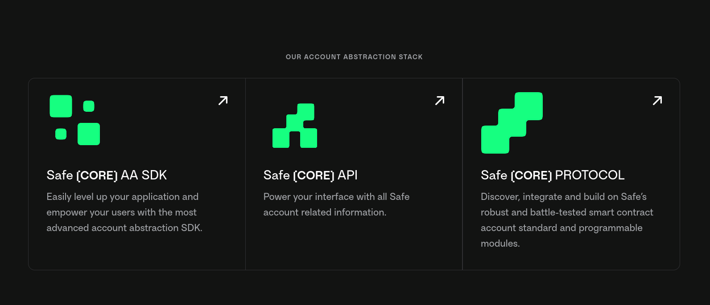

# What is Safe?

[Safe](https://safe.global) brings digital ownership of accounts to everyone by building universal and open contract standards for the custody of digital assets, data, and identity.

Safe is at the forefront of modular Smart Account infrastructure, paving the way for developers to create a diverse range of applications and wallets.

Our brand is separated into three categories and it is important to differentiate each of them:

<figure></figure></figure>

## Safe{Core} Protocol

The [Safe{Core} Protocol](https://docs.safe.global/safe-core-protocol/safe-core-protocol) is an open, modular framework to make smart accounts secure, portable, and composable.

This section in the documentation contains information and relevant links about the Safe{Core} Protocol, what it is and what are the different elements involved.

## Safe{Core} AA SDK

The [Safe{Core} AA SDK](https://docs.safe.global/safe-core-sdk) is a set of developer kits that allow integrating Safe with different external service providers to provide developers and users the ability to abstract the complexity that comes with operating a smart contract account.

This section in the documentation contains relevant information and tutorials on what SDK Kits there are and how to integrate them.

## Safe{Core} API

The [Safe{Core} API](https://docs.safe.global/safe-core-api) makes reference to all the Safe infrastructure needed to power interfaces with all Safe account related information. This includes the Safe Transaction Service, Safe Events Service, etc.

This section in the documentation contains information related with the services architecture.

## Reference

The [Reference](https://docs.safe.global/reference) section in this documentation contains technical details describing the different tools available at Safe in detail.

<!---
## Getting started

Safe has a lot of features which means a lot of information. To make it easier to navigate, here is a step-by-step guide you can follow:

1. [Learn about Smart Accounts](learn/what-is-a-smart-contract-account.md)
   - Make a Safe
   - Learn about Account Abstraction
2. [Learn about the different Safe{Core} tools](learn/safe-core/)
3. [Discover](discover/) interesting projects that others have built using Smart Accounts
   - [Safe Hackathon Guide and List of Hackathon Winners](https://safe-global.notion.site/Safe-Hackathon-Success-Guide-53d2fb3c29424b58b1c4407519a54930)
4. [Build](build/) your own apps using smart accounts

There is also available the [Safe Ecosystem Diagram](https://viewer.diagrams.net/index.html?tags=%7B%7D&target=blank&highlight=0000ff&edit=_blank&layers=1&nav=1&page-id=atRejJyS5DeNAtDboIeV&title=Safe%20Diagrams.drawio#Uhttps%3A%2F%2Fdrive.google.com%2Fuc%3Fid%3D1WcTgdHoQttJ0K_fV8mDg-RmDZRYGe3D-%26export%3Ddownload):

<figure></figure>
--->