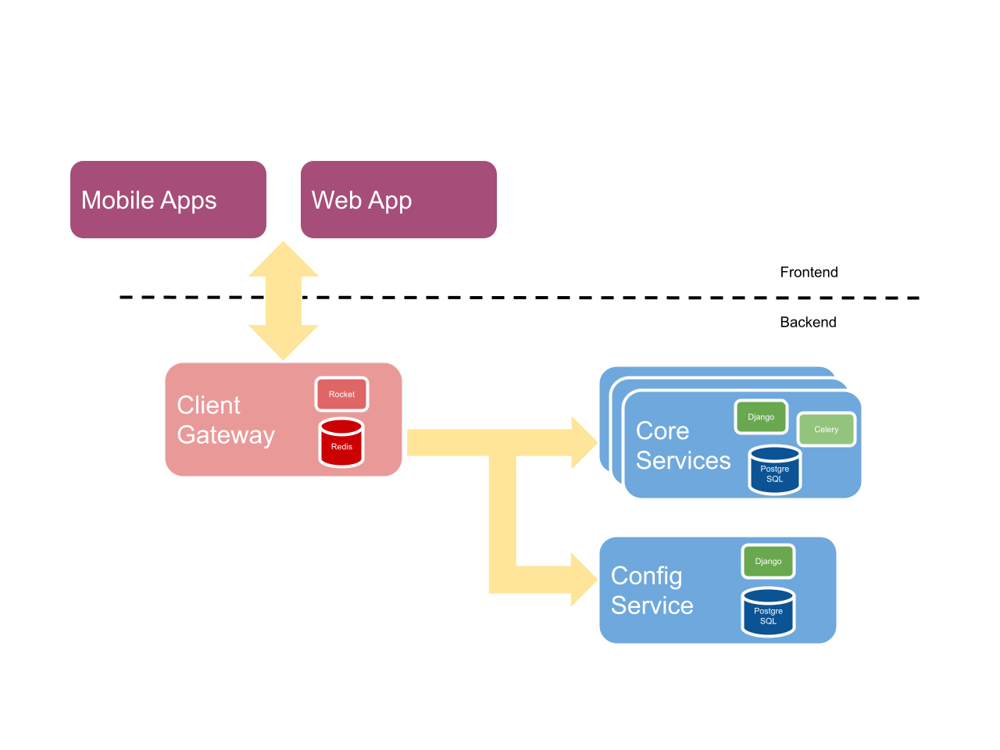

# Service Architecture

Currently our whole infrastracture is constituted by mainly 3 services. Here is a list with the links to their respective repositories:

* [Safe Transaction Service](https://github.com/gnosis/safe-transaction-service/) (python)
* [Safe Config Service](https://github.com/gnosis/safe-config-service) (python)
* [Safe Client Gateway](https://github.com/gnosis/safe-client-gateway/) (rust)

As you can see from Fig. 1 , our full production setup is a mixture of several instances of the Safe Transaction Service (from now on referred to as "core service") orchestrated by the Safe Config Service (henceforth referred to as "config service") which are later consumed by the Safe Client Gateway (here on after referred to as "client gateway").

The core services use event indexing to keep track of transactions related to our safe contracts. There is one instance of the core services per supported network (mainnet, rinkeby, xdai, polygon, among others).

The config services keeps track of all the networks we support and therefore of all the instances of the core services that are available. In addition to this, the config service provides information regarding chain dependant variables such as RPC endpoints, gas price oracles, in which URL a given core service instance for a chain can be reached, among other things.

The client gateway leverages the config services to determine how to reach the core service instance required for a given request. If the network is supported (which is determined by the config service, as aforementioned) the client gateway forwards the request to the given core service instance. The client gateway transforms (and sometimes aggregates) data sources from the core services, catering specifically to the UI needs of our frontend clients. This process is illustrated in Fig. 2

Even though currently our config and core services instances are reachable by clients that are not the client gateway, in the future we may change this; the client gateway was conceived as the outermost component of our infrastructure, therefore ideally should be the single point of communication with any frontend client.
