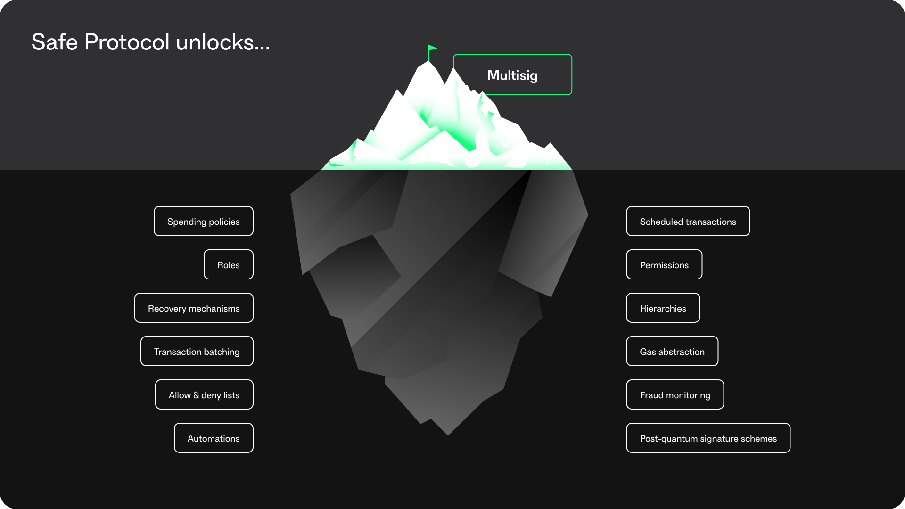

# Things you can do with Safe

Safe accounts are built to be fully customizable. This means that the only limit to what you can do with a Safe account is your imagination.

<figure></figure>

### Live features

* [Multisig](https://help.safe.global/en/articles/40863-signature-policies): Require multiple signing accounts to approve a transaction before executing.
* [Spending policies](https://help.safe.global/en/articles/40842-set-up-and-use-spending-limits): Limit the amount that a signing account can withdraw from a Safe.
* Automation
  * Scheduling transactions: Automatically execute transactions on a schedule.
* Access controls
  * Roles and permissions: Set specific rules on what types of actions certain accounts can perform.
  * Apps and permissions: Set specific rules on what types of actions certain apps can perform.
  * Hybrid custody
* Recovery mechanisms: Allow owners to recover access to their Safe if they lose a primary key.
* Hierarchies: Different permission sets based on roles within an organization.
* Transaction batching: Send multiple transactions at once.
* [Gas abstraction](safe-core-sdk/relay-kit/README.md): Pay for transaction fees using ERC-20 tokens.
* Ethereum staking: [Stake ETH with Confidence: How to Use Safe Smart Accounts for Ethereum Validators](https://help.safe.global/en/articles/71879-stake-eth-with-confidence-how-to-use-safe-smart-accounts-for-ethereum-validators)
* Security
  * Allow & deny lists
  * Fraud monitoring
  * Post-quantum signature schemes

## Protocols

- Ethereum and 12 other layer 1 (L1) and test networks
- ERC-20s
- Layer two (L2) accounts based on smart contracts

## Layer 2s (L2s)

#### About

- Requires creating a new Safe on each network
- Make sure to use the correct token contract for the given Layer 2 (L2)

#### Types

- Arbitrum
- [Optimism](https://dune.com/safe/optimism)
- [Polygon](https://dune.com/safe/polygon)
- [xDAI](https://dune.com/safe/gnosis-chain) (Gnosis Chain)
- AVAX
- [BSC](https://dune.com/safe/bsc)
- EWC

#### Multichain strategy

- Enable the features of programmable accounts without interacting directly with the contracts.
    - [Account Abstraction is NOT coming](https://safe.mirror.xyz/9KmZjEbFkmI79s28d9xar6JWYrE50F5AHpa5CR12YGI)
- Use a universal readable name/ID to interact across many protocols.
    - E.g. Ethereum Name Service (ENS) maps the name/ID to each chain-specific address.
    - [Account Abstraction in a Multichain Landscape - Part 1: Addresses](https://safe.mirror.xyz/4GcGAOFno-suTCjBewiYH4k4yXPDdIukC5woO5Bjc4w)

## Which Safe tool should I use?

Here is a diagram to help you decide which tool to use.

