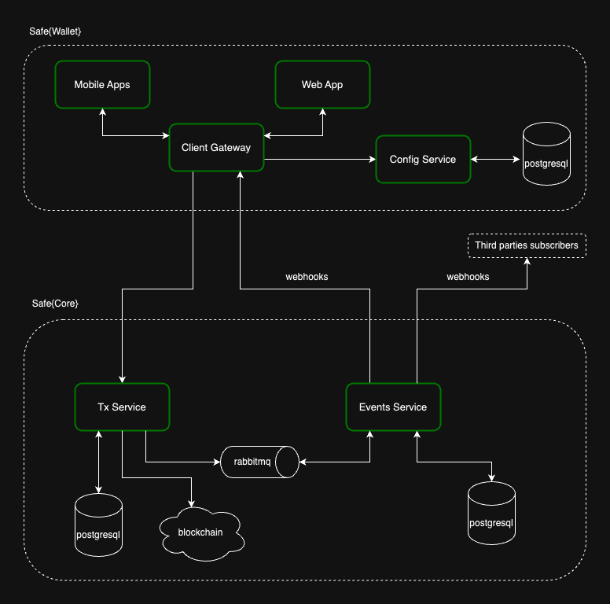
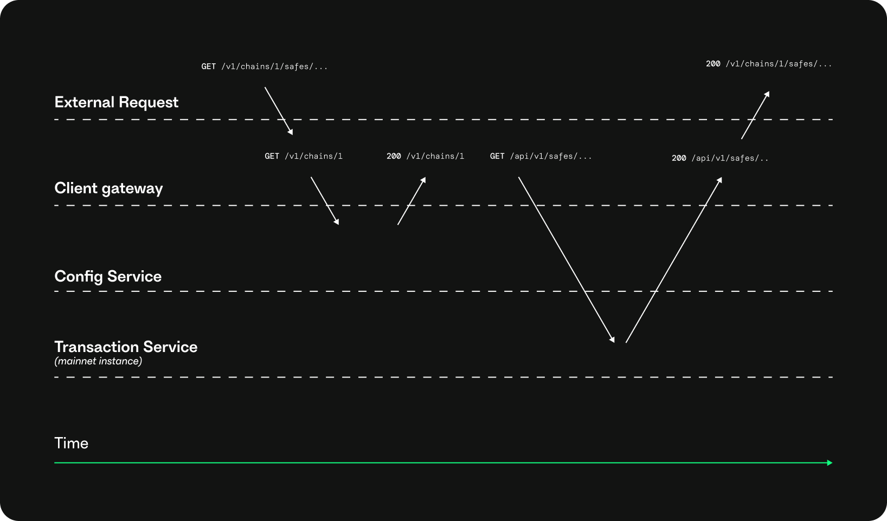

# Service architecture

The Safe infrastructure consists of four services:

* [Safe Transaction Service](https://github.com/safe-global/safe-transaction-service): Keeps track of transactions related to Safe contracts (Python). Also referred to as *Transaction Service*.
* [Safe Events Service](https://github.com/safe-global/safe-events-service): Handles Safe indexing events from the Transaction Service and delivers them as HTTP webhooks.
* [Safe Config Service](https://github.com/safe-global/safe-config-service): Keeps track of all supported networks and chain-specific variables (Python). Also referred to as *Config Service*.
* [Safe Client Gateway](https://github.com/safe-global/safe-client-gateway-nest): Uses the config service to find the Transaction Service instance required for a given request (Node.js). Also referred to as *Client Gateway*.

Safe's production setup is a mixture of several instances of the Safe Transaction Service orchestrated by the Config Service, later consumed by the Client Gateway.

## Safe Transaction Service

The Transaction Service uses tracing in Mainnet/Sepolia and Gnosis Chain and event indexing in other chains to keep track of transactions related to Safe contracts. One instance of the Transaction Service runs per supported network (Mainnet, Sepolia, Gnosis Chain, Polygon, etc.).

## Safe Config Service

The Config Service keeps track of all the supported networks and all the available Transaction Service instances. The Config Service also provides information about chain-dependent variables such as RPC endpoints, gas price oracles, and URLs for the Transaction Service instances for different chains.

## Safe Client Gateway

The Client Gateway leverages the config service to find the Transaction Service instance required for a specific request. The Client Gateway forwards the request to the specified Transaction Service instance for the supported networks (determined by the Config Service). The Client Gateway transforms, aggregates, and caches information from the Config and Transaction Services, optimizing data for Safe's web and mobile clients.

Even though Safe Config and Transaction Service instances are reachable by clients that aren't the Client Gateway, this may change in the future. The Client Gateway is the outermost component of the Safe infrastructure and should be the single point of communication with any frontend client.

## Running locally

[Safe Infrastructure](https://github.com/safe-global/safe-infrastructure) and the [running services locally guide](https://github.com/safe-global/safe-infrastructure/blob/main/docs/running_locally.md) show how to run Safe's infrastructure (Safe UI, Safe{Wallet} and the backend, and Safe{Core}). Note that these documents are examples of how these services run, and the configuration should adapt to the needs of a specific use case.
