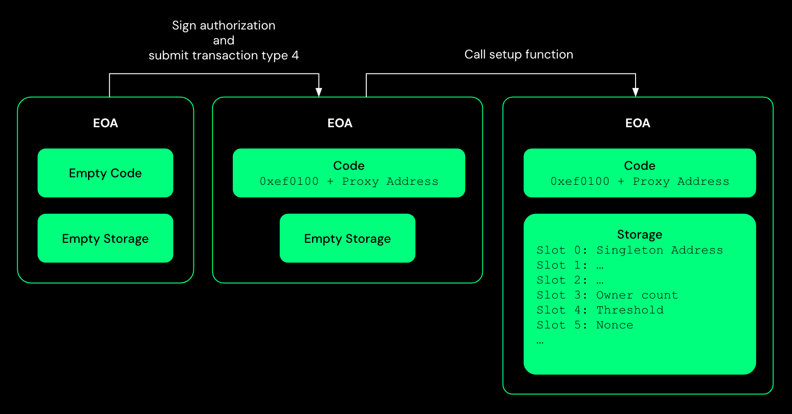
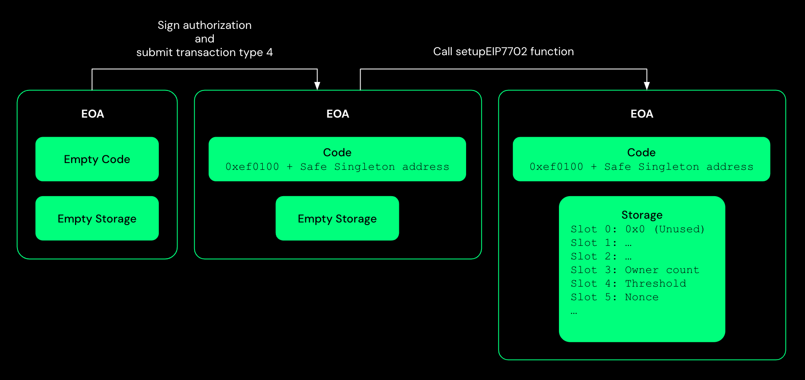
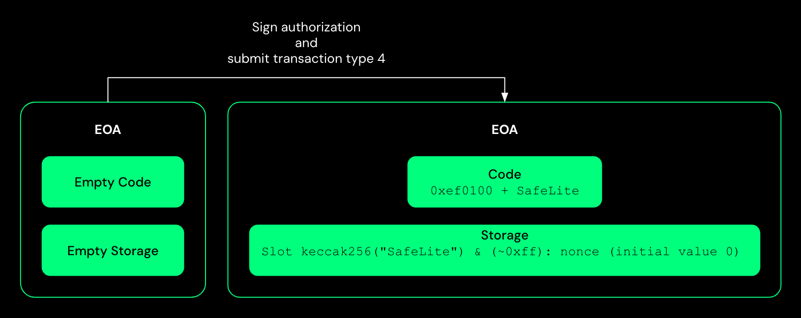

import { Callout } from 'nextra/components'

# Safe and EIP-7702

EIP-7702 does not specify how to initialise the storage of the account but only gives a way to set the code of the account. This means that the account will be created with an empty storage, and the user will have to set the storage manually.

Existing Safe contracts cannot be used with EIP-7702, because of following reasons:

- Delegating to Safe Singleton or the Proxy contract will expose the EOA account to the risk of front-running during setup.
- In its current implementation, the Safe Singleton contract does not let itself to become an owner meaning that after delegating to the Safe Singleton, the EOA account cannot sign Safe transactions and will need to keep another private key to do so.

## Possible approaches

### Modified safe proxy

This approach uses the [SafeEIP7702Proxy](https://github.com/5afe/safe-eip7702/blob/main/safe-eip7702-contracts/contracts/SafeEIP7702Proxy.sol), a proxy contract derived from the [Safe Proxy](https://github.com/5afe/safe-eip7702/blob/main/safe-eip7702-contracts/contracts/SafeEIP7702Proxy.sol) with the following changes:

- The constructor of the `SafeEIP7702Proxy` contract has the additional `setupDataHash` parameter, which is the hash of the `setup` function call data. Thus, the address of the proxy contract also depends on the `setupDataHash` and not just the Singleton contract address. The proxy contract uses this hash to verify that the `setup` function parameter values are unchanged during the initialization of storage.
- The proxy implements the `setup` function, which calls the `setup` function of the `singleton` contract and has additional logic:
  - Set the storage slot 0, that is, the address of the singleton in the EOA storage.
  - Verify that the `setupDataHash` equals the hash of the `setup` function call data.

This approach has a gas overhead as a new proxy contract has to be deployed for each EOA account, as the `setupDataHash` may be unique for each user. However, using this approach, users can use Safe\{Wallet\} with minor modifications and import the EOA account as a Safe account. 

Follow the instructions here to use this approach to set code in EOA: https://github.com/5afe/safe-eip7702/tree/main/safe-eip7702-contracts#execute-scripts

### Modified safe singleton

This approach uses the [SafeEIP7702](https://github.com/safe-global/safe-smart-account/blob/feature/eip-7702/contracts/experimental/SafeEIP7702.sol) contract, a derived version of Safe Singleton that overrides the `setup` function and reverts when called. Instead, the contract's new `setupEIP7702` function has a `signature` parameter. The default owner will be set to the address of the EOA account that delegates to this Singleton contract with a threshold of 1.

Because this approach does not use a proxy contract, storage slot 0 remains unused. The Safe Transaction Service and other services that depend on the value at storage slot 0 will not work with this approach.

### SafeLite

[SafeLite](https://github.com/5afe/safe-eip7702/blob/main/safe-eip7702-contracts/contracts/experimental/SafeLite.sol) is a lite version of Safe that is compatible with EIP-7702. The contract does not have a proxy and does not need initialization.

SafeLite supports ERC-4337 and can use features such as sponsored transactions and batch transactions. SafeLite also supports ERC-1271 for contract-based signatures.

SafeLite is not compatible with Safe\{Wallet\} as it does not use the same storage layout as the existing Safe contracts.

It does not have the features of the existing Safe contracts such as Modules, Fallback Handler, and Guards.

<Callout type='error' emoji='‼️'>
  All the above approaches are experimental and the contracts are not yet audited. Use them at your own risk.
</Callout>

## Other resources

- [Demo with SafeEIP7702Proxy](https://github.com/5afe/safe-eip7702/blob/main/README.md#demo-using-ui)
- [Code walk through](https://www.youtube.com/watch?v=dx4mk6tKHCo)
- [Slides](https://docs.google.com/presentation/d/1blYoVXLdPUNXhfSlck5bgbs8-h9StI9om7wsxj1SxVM)