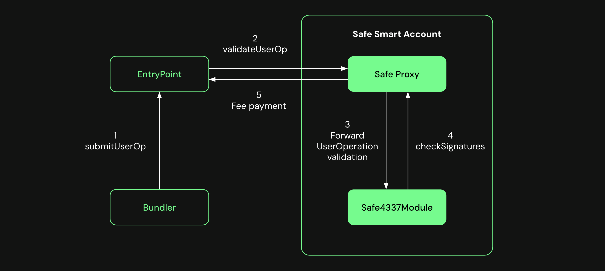
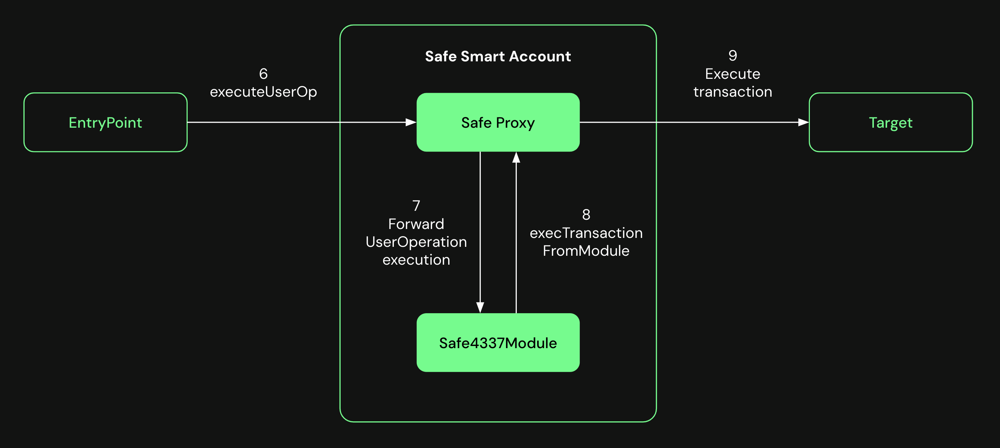

import { Callout } from 'nextra/components'

# Safe and ERC-4337

Safe has adopted a modular and flexible approach to integrating the ERC-4337, allowing users to turn their Safe account into an ERC-4337 smart account.

Safe ERC-4337 compatibility is provided via [Safe Modules](../../home/glossary.md#safe-module) and the Fallback Handler. This means the functionality is not implemented directly in the Safe Smart Account, but in the [Safe4337Module](https://github.com/safe-global/safe-modules/blob/main/modules/4337/contracts/Safe4337Module.sol) contract, which can be enabled in any Safe account at the Safe deployment time or afterward.

## Safe4337Module

This module is an extension to the Safe Smart Account that acts both as a Fallback Handler, meaning that the Safe Proxy contract will fallback to this contract when its functions are called in the proxy, and a Safe Module, having the right to execute Safe transactions once it's enabled in a Safe account.

It implements the ERC-4337 interface, including the functions to validate and execute the `UseOperation`s, and it's limited to the `EntryPoint` address.

<Callout type='info' emoji='ℹ️'>
  This module must only be used with Safe [v1.4.1](https://github.com/safe-global/safe-smart-account/blob/v1.4.1/CHANGELOG.md) or newer.
</Callout>

### UserOperation validation

The Safe Proxy contract receives a call to the `validateUserOp` function from the `EntryPoint` and forwards it to the `Safe4337Module`. The module validates the `UserOperation` object by checking that the Safe owners signed the `UserOperation` hash and returns the result. It also executes a module transaction to pay the fees back.

### UserOperation execution

After successful validation, the `EntryPoint` calls the `executeUserOp` function, forwarding it again to the module, which executes a module transaction with the target and data specified in the `UserOperation` object.

