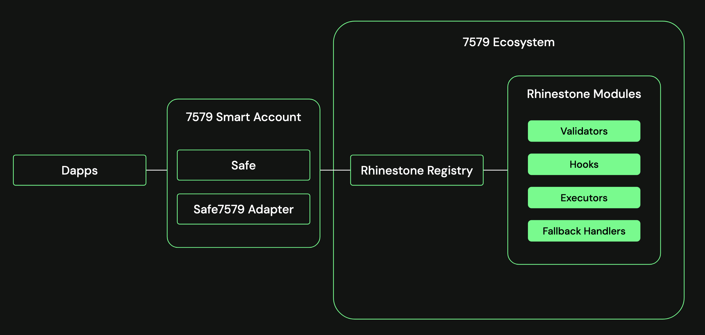
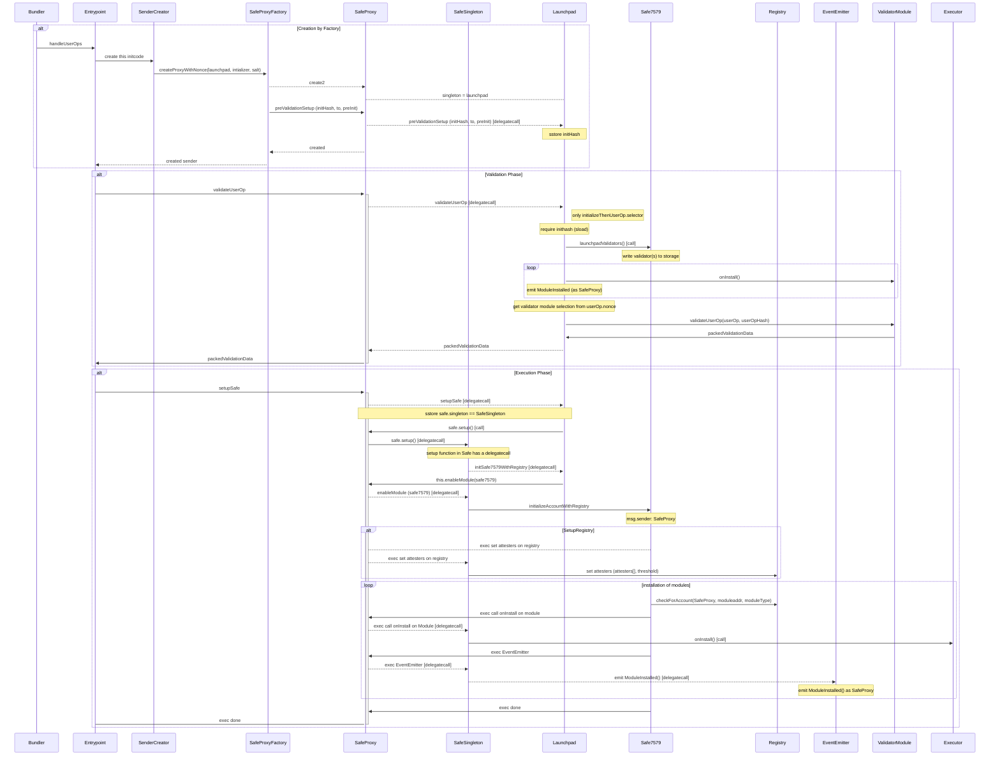

import { Steps } from 'nextra/components'
import CustomCard from '../../../components/CustomCard'

# Safe and ERC-7579

The Safe7579 Adapter is a smart contract developed by Rhinestone and Safe to make Safe Smart Accounts compliant with ERC-7579. Through this, [14 audited modules](https://github.com/rhinestonewtf/core-modules/tree/main/src) developed by Rhinestone will be available for builders building with the Safe7579 Adapter, such as a dead man switch, flash-loan, social recovery, etc.

Additionally, the Rhinestone registry provides per-transaction security checks on modules, so modules with security compromises are automatically disabled for your account.

## Safe7579 Adapter

As ERC-7579 is a superset of ERC-4337, the Safe7579 Adapter ensures full compliance with ERC-4337. The Safe7579 Adapter is both a Safe Module and a Fallback Handler. 
- **Safe Module:** It extends the functionality of a Safe account, allowing it to utilize ERC-7579 modules.
- **Fallback Handler:** It is a fallback handler because certain functions, such as validateUserOp in ERC-7579, are not natively supported by Safe.

Additionally, a launchpad contract facilitates the setup of new Safes with Safe7579 Adapter.

## Creation of new Safes compatible with ERC-7579

The launchpad contract works around the 4337 limitations, which allows the deployment of exactly one contract whose address matches the sender of the user operation.

The creation of new Safes occurs in the following three high-level steps.

<Steps>
    ### Creation by Factory
    -  Bundler informs `Entrypoint` to `handleUserOps`.
    -  Entrypoint calls `SenderCreator` to call `SafeProxyFactory`.
    - `SenderCreator` requests `safeProxy` creation from `SafeProxyFactory` using `createProxyWithNonce`.
    - `SafeProxyFactory` creates a new `SafeProxy` using `create2`.
    - `SafeProxy` is created with a singleton address set to `Launchpad` .
    - `initHash` is stored in the `SafeProxy` storage.
    
    ### Validation Phase
    - `Entrypoint` validates user operations in `SafeProxy` via `validateUserOp`.
    - `SafeProxy` delegates validation to `Launchpad`.
    - `Launchpad` ensures the presence of `initHash` from phase one and calls `Safe7579.launchpadValidators`.
    - `ValidatorModule` gets installed by `Launchpad`.
    - `ValidatorModule` validates user operations and returns `packedValidationData`.
    - `Launchpad` returns packedValidationData to `SafeProxy`, `SafeProxy` returns to `Entrypoint`.
    
    ### Execution Phase
    - `Entrypoint` triggers `launchpad.setupSafe()` in `SafeProxy`.
    - `SafeProxy` delegates the setup to `Launchpad`.
    - `LaunchPad` upgrades `SafeStorage.singleton` to `SafeSingleton`.
    - `LaunchPad` calls `SafeProxy.setup()` to initialize `SafeSingleton`.
    - Setup function in `SafeProxy.setup()` delegatecalls to `lauchpad.initSafe7579`.
    - `initSafe7579()` initializes `Safe7579` with executors, fallbacks, hooks, `IERC7484` registry.
</Steps>

The following detailed sequence outlines the creation, validation, and execution phases in the system's operation.

{/* <!-- vale off --> */}

{/* <!-- vale on --> */}

## Further reading
- [Safe7579 on GitHub](https://github.com/rhinestonewtf/safe7579)
