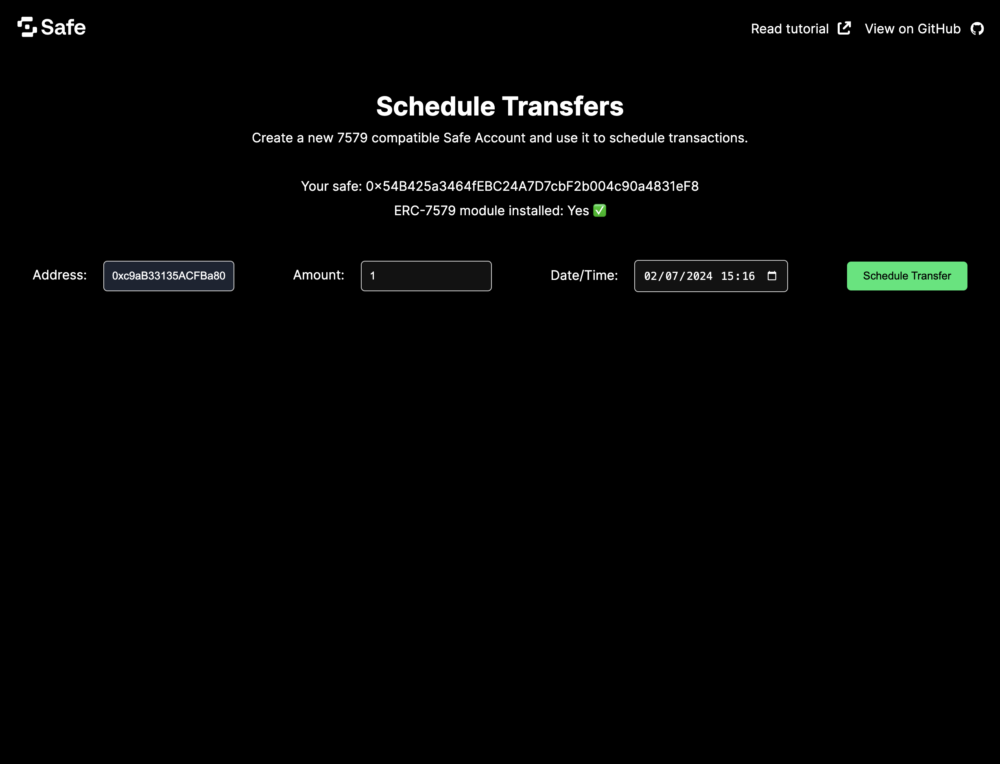
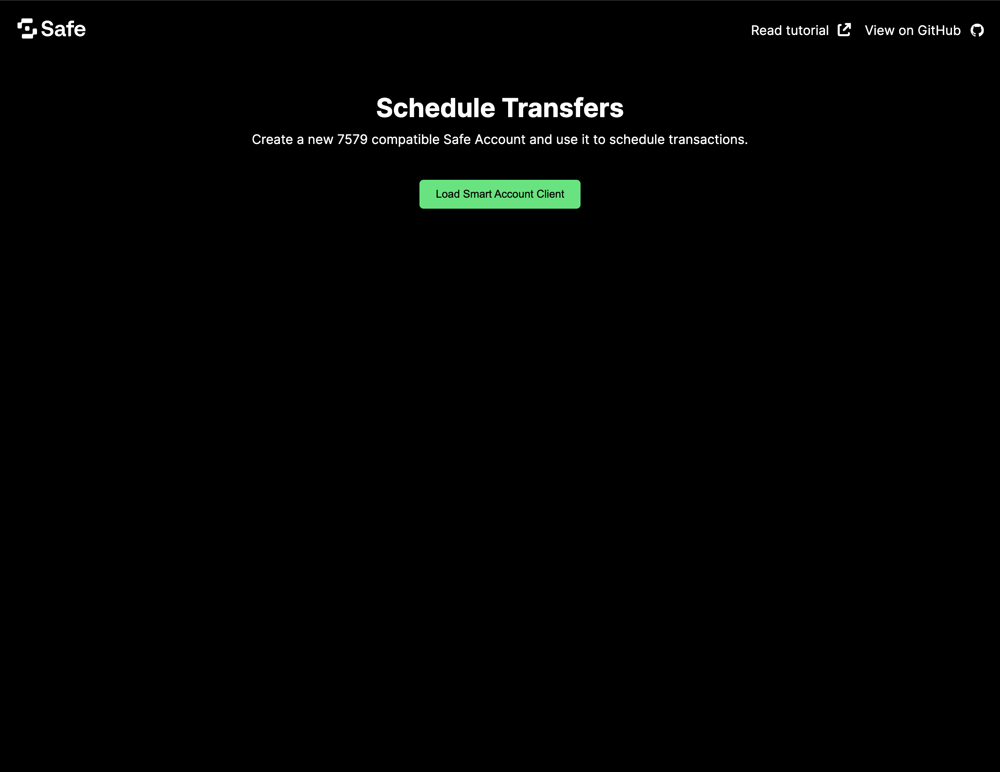

import { Callout } from 'nextra/components'

# **How to build an app with Safe and ERC-7579**

The smart account ecosystem was fragmented, with each provider building its own modules often incompatible with other smart account implementations. Developers had to build new modules compatible with their smart accounts or miss out on essential application features.

[ERC-7579](https://docs.safe.global/advanced/erc-7579/overview) aims to ensure interoperability across implementations. It defines the account interface so developers can implement modules for all smart accounts that follow this standard. The Safe7579 Adapter makes your Safe compatible with any ERC-7579 modules. As a developer building with Safe, you get access to a rich ecosystem of modules to make your application feature-rich.

Let's say you want to build an app to enable scheduling transfers for monthly salaries to a team of contributors. However, Safe does not offer a native module for scheduling transfers. With the ERC-7579 compatibility, you can use Rhinestone's [Scheduled Transfer module](https://docs.rhinestone.wtf/module-sdk/modules/scheduled-transfers) with Safe to build an app to schedule transfers ahead of time.

This tutorial will teach you to build an app that can:

- Deploy an ERC-7579-compatible Safe Smart Account.
- Create a scheduled transaction.
- Execute it at the requested date and time.



## Prerequisites

**Prerequisite knowledge:** You will need some basic experience with [React](https://react.dev/learn), [Next.js](https://nextjs.org/docs), [ERC-4337](https://docs.safe.global/home/4337-overview) and [ERC-7579](https://docs.safe.global/advanced/erc-7579/overview).

Before progressing with the tutorial, please make sure you have:

- Downloaded and installed [Node.js](https://nodejs.org/en/download/package-manager) and [pnpm](https://pnpm.io/installation).
- Created an API key from [Pimlico](https://www.pimlico.io/).

**Note:** If you wish to follow along using the completed project, you can [check out the GitHub repository](https://github.com/5afe/safe-7579-tutorial) for this tutorial.

## **1. Setup a Next.js application**

Initialize a new Next.js app using pnpm with the following command:

```shell
pnpm create next-app
```

When prompted by the CLI:

- Select `yes` to TypeScript, ESLint, and App router.
- Select `no` to all other questions (Tailwind, `src` directory, and import aliases).

### **Install dependencies**

For this project, we'll use Pimlico's [Permissionless.js](https://docs.pimlico.io/permissionless) to set up a Safe and interact with it, Rhinestone's [Module SDK](https://docs.rhinestone.wtf/module-sdk) to install and use core modules, and [viem](https://www.npmjs.com/package/viem) for some helper functions.

<Callout type='warning' emoji='⚠️'>
  As of now, `permissionless.js` can only be used to deploy single-signer Safe accounts. Multi-signature ERC-7579 Safes will be coming soon.
</Callout>

Run the following command to add all these dependencies to the project:

```shell
pnpm add permissionless viem @rhinestone/module-sdk
```

Now, create a file named `.env.local` at the root of your project, and add your Pimlico API key to it:

```shell
echo "NEXT_PUBLIC_PIMLICO_API_KEY='your_pimlico_api_key_goes_here'" > .env.local
```

### **Run the development server**

Run the local development server with the following command:

```shell
pnpm dev
```

Go to `http://localhost:3000` in your browser to see the default Next.js application.


## 2. Initialize `permissionless` client

Create a `lib` folder at the project root, and add a file `permissionless.ts`:

```shell
mkdir lib
cd lib
touch permissionless.ts
```

Add the code necessary to create Pimlico's `smartAccountClient` by adding this content to `permissionless.ts` :

```typescript
// from ../../../../examples/erc-7579/lib/permissionless.ts
```

It will load a `PRIVATE_KEY` from `.env.local` (or generate one if it doesn't exist) and then create the `publicClient`, `paymasterClient` and `bundlerClient` necessary to initialize the `permissionless` library. It then creates an ERC-7579-compatible Safe Smart Account from the generated private key before passing it to `createSmartAccountClient` to generate a Permissionless client.

## 3. Add Rhinestone module functionality

Create a new file `scheduledTransfers.ts` in the `lib` folder:

```shell
touch scheduledTransfers.ts
```

Add the code necessary to create a scheduled transfer using Rhinestone's `ScheduledTransfers` module:
```typescript
// from ../../../../examples/erc-7579/lib/scheduledTransfers.ts
```

This file contains two functions:
- `install7579Module` will install the module to a Safe and schedule its first transfer; 
- `scheduleTransfer` to schedule subsequent transfers in a Safe where the module has been previously installed.

In the UI, we can then detect whether the Safe has the module installed when a user tries to schedule a transfer. If not, it will run `install7579Module`; and if it does, it will run `scheduleTransfer`.

For brevity, we are only covering a simple use case of the `ScheduledTransfers` module. You can find more information about the module's functionalities in the [Rhinestone documentation](https://docs.rhinestone.wtf/module-sdk/modules/scheduled-transfers), such as the capacity to schedule recurring transfers, with a pre-determined number of repeats.

## 4. Add UI components

Now that we have the logic necessary to set up a safe and schedule a transfer, let's create a simple UI to interact with it. Create a new file `ScheduledTransferForm.tsx` in the `components` folder:

```shell
cd ..
mkdir components
cd components
touch ScheduledTransferForm.tsx
```

Add the following code to `ScheduledTransferForm.tsx`:

```tsx
// from ../../../../examples/erc-7579/components/ScheduledTransferForm.tsx
```

This component will detect whether the Safe has the module installed, and then allow the user to input the amount, receiver address, and date and time for the scheduled transfer.

Now, edit `app/page.tsx` to include the `ScheduledTransferForm` component:

```tsx
// from ../../../../examples/erc-7579/app/page.tsx
```

## 5. Add styling (optional)

We can add some styling to our app by editing the contents of `layout.tsx` in `app` folder:

```tsx
// from ../../../../examples/erc-7579/app/layout.tsx
```

This will add some basic styling to the app, including a header. You can also add some custom CSS to `globals.css` in the same folder:

```css
h1,
h2,
h3 {
  margin-top: 40px;
  margin-bottom: 10px;
}

button {
  cursor: pointer;
  border: none;
  background: #00e673;
  color: black;
  padding: 10px 20px;
  border-radius: 5px;
  margin: 10px 0;
}

input {
  padding: 10px;
  border-radius: 5px;
  border: 1px solid #ccc;
  margin: 10px 0;
}

button:disabled {
  background: #ccc;
  color: #666;
}
```

## **Testing your app**

That's it! You can find the source code for the example created in this tutorial [on GitHub](https://github.com/5afe/safe-7559-tutorial). You can now return to your browser and see the app displayed.



Click the **Create Safe** button to initialize the Permissionless client with the private key you stored on `.env.local`. It will deploy an ERC-7579-compatible Safe Smart Account on its first transaction.


Once loaded, you will be able to choose an amount to send, a receiver address and select a date and time for your scheduled payment. Click **Schedule Transfer** to send the transaction. The first time you do this, it will deploy the Safe to Sepolia test network and install the ScheduledTransfers module.

## **Do more with Safe and ERC-7579**

We learned how to deploy an ERC-7579-compatible Safe Smart Account and use an ERC-7579-compatible module, the Scheduled Transfer from Rhinestone. We hope you enjoyed this tutorial and that the combination of Safe and 7579 will allow you to tap into new functionalities for your decentralized apps.

As a next step, you can add more functionalities to your app using other [ERC-7579-compatible modules](https://docs.rhinestone.wtf/module-sdk/modules/ownable-validator). Here are some ideas:

- [Create a dead man switch](https://docs.rhinestone.wtf/module-sdk/modules/deadman-switch) in case your account becomes inactive after a certain amount of time.
- Add [multi-factor validation](https://docs.rhinestone.wtf/module-sdk/modules/mfa-validator) to your Smart Account.
- [Designate an owner](https://docs.rhinestone.wtf/module-sdk/modules/ownable-executor) that can act on your behalf for executing transactions and paying for gas.

You can also find more inspiration on this list of [ERC-7579 modules](https://erc7579.com/modules). You can also read more about this ERC in our [overview](https://docs.safe.global/advanced/erc-7579/overview) or in the [official documentation](https://erc7579.com/).

Did you encounter any difficulties? Let us know by opening [an issue](https://github.com/5afe/safe-7559-tutorial/issues/new) or asking a question on [Stack Exchange](https://ethereum.stackexchange.com/questions/tagged/safe-core) with the `safe-core` tag.
