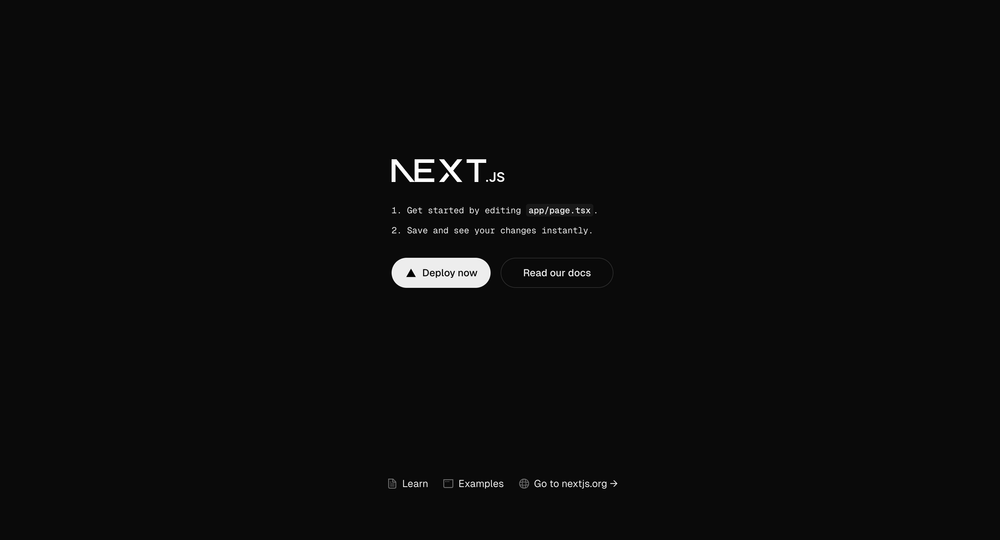

import { Callout } from 'nextra/components'

# **How to build an app with Safe and ERC-7579**

The smart account ecosystem was fragmented, with each provider building its own modules often incompatible with other smart account implementations. Developers had to build new modules compatible with their smart accounts or miss out on essential application features.

[ERC-7579](https://docs.safe.global/advanced/erc-7579/overview) aims to ensure interoperability across implementations. It defines the account interface so developers can implement modules for all smart accounts that follow this standard. The Safe7579 Adapter makes your Safe compatible with any ERC-7579 modules. As a developer building with Safe, you get access to a huge ecosystem of modules to make your application feature-rich.

Let's say you want to build an app where users can add their friends and family as a backup for your Safe. With the ERC-7579 compatibility, you can use Rhinestone's [Social Recovery module](https://docs.rhinestone.wtf/module-sdk/modules/social-recovery) to recover your Safe in case you lose access to it.

This tutorial will teach you to build an app that can:

- Deploy an ERC-7579-compatible Safe Smart Account.
- Install the Social Recovery module and add guardians.
- Recover your Safe by adding a guardian as a new owner.


## Prerequisites

**Prerequisite knowledge:** You will need some basic experience with [React](https://react.dev/learn), [Next.js](https://nextjs.org/docs), [ERC-4337](https://docs.safe.global/home/4337-overview) and [ERC-7579](https://docs.safe.global/advanced/erc-7579/overview).

Before progressing with the tutorial, please make sure you have:

- Downloaded and installed [Node.js](https://nodejs.org/en/download/package-manager) and [pnpm](https://pnpm.io/installation).
- Created an API key from [Pimlico](https://www.pimlico.io/).
- Downloaded and installed [Metamask](https://metamask.io/download.html) or any other Ethereum wallet.

**Note:** If you wish to follow along using the completed project, you can [check out the GitHub repository](https://github.com/5afe/safe-7579-tutorial) for this tutorial.

## **1. Setup a Next.js application**

Initialize a new Next.js app using pnpm with the following command:

```shell
pnpm create next-app
```

When prompted by the CLI:

- Select `yes` to TypeScript, ESLint, and App router.
- Select `no` to all other questions (Tailwind, `src` directory, and import aliases).

### **Install dependencies**

For this project, we'll use Pimlico's [Permissionless.js](https://docs.pimlico.io/permissionless) to set up a Safe and interact with it, Rhinestone's [Module SDK](https://docs.rhinestone.wtf/module-sdk) to install and use core modules, and the [Protocol Kit](../../../sdk/protocol-kit) to get our Safe data. We will also use [viem](https://www.npmjs.com/package/viem) for some helper functions, and [Material UI](https://mui.com) to style our app.

<Callout type='warning' emoji='⚠️'>
  As of now, `permissionless.js` can only be used to deploy single-signer Safe
  accounts, which is generally considered insecure. Multi-signature ERC-7579
  Safes will come soon.
</Callout>

Run the following command to add all these dependencies to the project:

```shell
pnpm add permissionless viem @rhinestone/module-sdk@0.1.4 @safe-global/protocol-kit @mui/material @emotion/styled @emotion/react
```

Now, create a file named `.env.local` at the root of your project, and add your Pimlico API key to it:

```shell
echo "NEXT_PUBLIC_PIMLICO_API_KEY='your_pimlico_api_key_goes_here'" > .env.local
```

### **Run the development server**

Run the local development server with the following command:

```shell
pnpm dev
```

Go to `http://localhost:3000` in your browser to see the default Next.js application.



## 2. Initialize `permissionless` client

Create a `lib` folder at the project root, and add a file `permissionless.ts`:

```shell
mkdir lib
cd lib
touch permissionless.ts
```

This file will enable us to create Pimlico's client. It will:

- Create a viem `publicClient`, a `paymasterClient` and `bundlerClient` necessary to initialize the `permissionless` library;
- Create an ERC-7579-compatible Safe Smart Account from the user's connect wallet
- Generate a Permissionless client.

We can then call `getPermissionlessClient()` wherever we need to interact with the Safe via Pimlico.

Add the following code to `permissionless.ts` to allow this functionality:

```typescript
// from ../../../../examples/erc-7579/lib/permissionless.ts
```

## 3. Add Rhinestone module functionality

Create a new file `socialRecovery.ts` in the `lib` folder:

```shell
touch socialRecovery.ts
```

Add the code necessary to recover your Safe using Rhinestone's `SocialRecovery` module:

```typescript
// from ../../../../examples/erc-7579/lib/socialRecovery.ts
```

This file contains four functions:

- `install7579Module` will install the module to a Safe;
- `getGuardians` to get all the onchain guardians for a given Safe (if this Safe was deployed and the module has been previously installed);
- `recoverSafe` to recover the Safe by adding a guardian as a new owner.

In the UI, we can then detect whether the Safe has the module installed. If not, it will let the user choose guardians and install it.

## 4. Get Safe data

Create a new file `safe.ts` in the `lib` folder:

```shell
touch safe.ts
```

This file will contain functions to get useful Safe data (namely, who are the owners and whether this Safe is already deployed) via the Protocol Kit:

```typescript
// from ../../../../examples/erc-7579/lib/safe.ts
```

It contains three functions:

- `getSafeData` will get Safe information from the Protocol Kit, namely whether it is deployed, and its owners.
- `deploySafe` will deploy a Safe (if it is not already deployed), here by simply send a dummy transaction (claim an NFT).
- `getRandomUint256` will generate a random number to use as a NFT token ID for the Safe deployment.

We will also add a file `utils.ts` in the `lib` folder, to contain one formatting function that will be used to display addresses in a more readable format.:

```shell
touch utils.ts
```

```typescript
// from ../../../../examples/erc-7579/lib/utils.ts
```

Finally, we will add a file `userOp.ts` in the `lib` folder, which will be used to prepare the UserOperation to recover the Safe:

```shell
touch userOp.ts
```

```typescript
// from ../../../../examples/erc-7579/lib/userOp.ts
```

This file contains two functions:

- `getUserOp` will prepare the UserOperation to recover the Safe, in this case by adding the first guardian as a new owner.
- `getUserOpHash` will create a hash from the UserOperation, which can be signed by the guardians and included in the recovery transaction.

## 5. Add UI components

Now that we have the logic necessary to create and recover a Safe, let's create a simple UI to interact with it. Create a new file `SafeAccountDetails.tsx` in the `components` folder:

```shell
cd ..
mkdir components
cd components
touch SafeAccountDetails.tsx
```

Add the following code to `SafeAccountDetails.tsx`:

```tsx
// from ../../../../examples/erc-7579/components/SafeAccountDetails.tsx
```

This component will display the Safe's details, such as the address, owners, and whether the Social Recovery module is installed.

Now, create a new file `SocialRecovery.tsx` in the same folder:

```shell
touch SocialRecovery.tsx
```

Add the following code to `SocialRecovery.tsx`:

```tsx
// from ../../../../examples/erc-7579/components/SocialRecovery.tsx
```

This component will provide a form to allow the user to input the address of `n` guardians, where `n` is a threshold that can be modified in the UI. The component will detect whether the Safe has the module installed, and then let the user select guardians.

By default, the initial guardians are the other accounts that are connected to the app. But this can be changed in the UI. Once all set, we can call `install7579Module` by clicking the **Enable Social Recovery** button.

Once the module installed, this component will create the [`UserOperation`](/glossary#useroperation) to recover the Safe, which will be signed by the guardians.

Create a new file `Guardian.tsx` in the `components` folder to enable that functionality:

```shell
touch Guardian.tsx
```

Add the following code to `Guardian.tsx`:

```tsx
// from ../../../../examples/erc-7579/components/Guardian.tsx
```

This component provides state for each guardian that will be added, and will allow them to sign a hash of this `UserOperation`. It will request access to the user wallet (such as Metamask for example), and prepare the message to sign.

If the threshold is reached and all the signatures are gathered, then the user is prompted to execute the `UserOperation`, and the safe is recovered.

Now, edit `app/page.tsx` to include all our components:

```tsx
// from ../../../../examples/erc-7579/app/page.tsx
```

This main component contains the logic to connect the user's wallet, and display the rest of the app. It contains state that is shared by the other components, such as the Safe data, the guardians, and the accounts connected.

## 5. Add styling (optional)

We can add some styling to our app by editing the contents of `layout.tsx` in `app` folder:

```tsx
// from ../../../../examples/erc-7579/app/layout.tsx
```

This will add some basic styling to the app, including a header. You can also add some custom CSS to `globals.css` in the same folder:

```css
h1,
h2,
h3 {
  margin-top: 40px;
  margin-bottom: 10px;
}

button {
  cursor: pointer;
  border: none;
  background: #00e673;
  color: black;
  padding: 10px 20px;
  border-radius: 5px;
  margin: 10px 0;
}

input {
  padding: 10px;
  border-radius: 5px;
  border: 1px solid #ccc;
  margin: 10px 0;
}

button:disabled {
  background: #ccc;
  color: #666;
}
```

Finally, in the `public` folder, add three icons. You can find them in the project's GitHub repository: [`safe.svg`](https://github.com/5afe/safe-passkeys-nuxt/blob/main/public/safe.svg), [`github.svg`](https://github.com/5afe/safe-passkeys-nuxt/blob/main/public/github.svg/), and [`external-link.svg`](https://github.com/5afe/safe-passkeys-nuxt/blob/main/public/external-link.svg).

## **Testing your app**

That's it! You can find the source code for the example created in this tutorial [on GitHub](https://github.com/5afe/safe-7579-tutorial). You can now return to your browser and see the app displayed.


Click the **Create Safe** button to initialize the Permissionless client with the private key you stored on `.env.local`. It will deploy an ERC-7579-compatible Safe Smart Account.


Once loaded, you will be able to choose guardians and enable the Social Recovery module. Click **Enable Social Recovery** to install the module and add these addresses as your Safe's guardians. Try adding a few addresses from your Metamask wallet.

You can then recover your Safe by signing all the messages necessary to reach the threshold. The app will request access to your wallet to sign the messages; please connect it to all the accounts you added as guardians, so you can sign the corresponding messages with each account. The app will automatically route the correct message to the correct connected account and signature.

Once all the signatures are gathered, the app will let you execute the UserOperation. Click **Execute Recovery** to recover your Safe. Once complete, you should see `Guardian #1` as a new owner of the Safe, along with the address corresponding to the private key in your `.env.local`.

<Callout severity='info'>
  Some `UserOperations` may take some time to execute. If you encounter any
  issues, check the console for any timeout errors and refresh the page if
  needed.
</Callout>

## **Do more with Safe and ERC-7579**

We learned how to deploy an ERC-7579-compatible Safe Smart Account and use an ERC-7579-compatible module, the Scheduled Transfer from Rhinestone. We hope you enjoyed this tutorial and that the combination of Safe and 7579 will allow you to tap into new functionalities for your decentralized apps.

As a next step, you can add more functionalities to your app using other [ERC-7579-compatible modules](https://docs.rhinestone.wtf/module-sdk/modules/ownable-validator). Here are some ideas:

- [Create a dead man switch](https://docs.rhinestone.wtf/module-sdk/modules/deadman-switch) in case your account becomes inactive after a certain amount of time.
- Add [multi-factor validation](https://docs.rhinestone.wtf/module-sdk/modules/multi-factor) to your Smart Account.
- [Designate an owner](https://docs.rhinestone.wtf/module-sdk/modules/ownable-executor) that can act on your behalf for executing transactions and paying for gas.

You can also find more inspiration on this list of [ERC-7579 modules](https://erc7579.com/modules). You can also read more about this ERC in our [overview](https://docs.safe.global/advanced/erc-7579/overview) or in the [official documentation](https://erc7579.com/).

Did you encounter any difficulties? Let us know by opening [an issue](https://github.com/5afe/safe-7579-tutorial/issues/new) or asking a question on [Stack Exchange](https://ethereum.stackexchange.com/questions/tagged/safe-core) with the `safe-core` tag.
