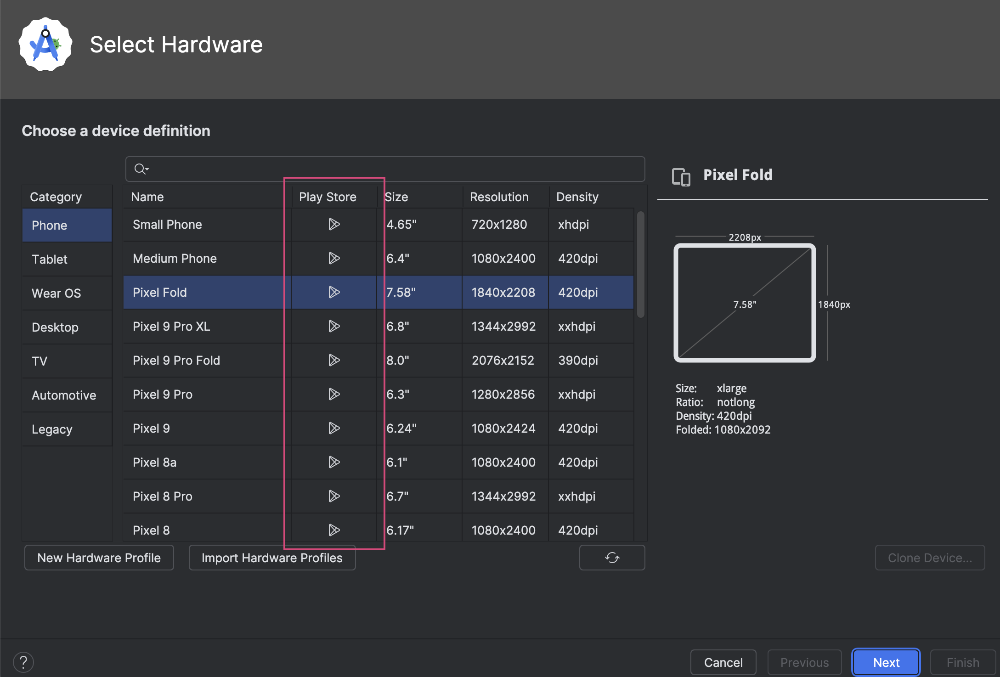
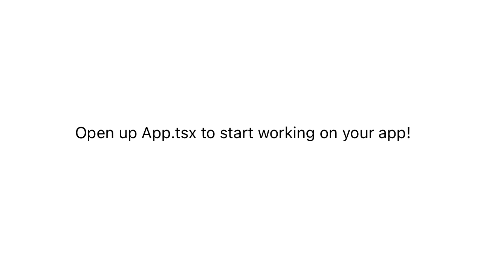

import { Callout } from 'nextra/components'

# How to build a React Native app with Safe and passkeys

An increasing number of applications rely on passkeys to authenticate users securely and with little friction. Security and user-friendliness are crucial to making web3 a reality for the next billion users.
Being able to unlock a Safe Smart Account with your fingerprints or Face ID, sending transactions without worrying about third-party wallet interfaces, phishing attempts, or securing seed phrases will bring new forms of ownership to the connected world.
Today, we'll learn how to use passkeys with [React Native](https://reactnative.dev) and [Expo](https://docs.expo.dev).

This tutorial will demonstrate creating a React Native app for using [passkeys](../overview.mdx) in your Safe. This app will allow you to:

- Deploy a new Safe on Ethereum Sepolia.
- Create a new passkey secured by the user's device.
- Sign messages and create transactions using the passkey as a signer.


## **What you'll need**

**Prerequisite knowledge:** You will need some basic experience with [React](https://react.dev/learn), [React Native](https://reactnative.dev) and [Expo](https://docs.expo.dev).

Before progressing with the tutorial, please make sure you have:

- Downloaded and installed [Node.js](https://nodejs.org/en/download/package-manager).

**Note:** If you wish to follow along using the completed project, you can [check out the GitHub repository](https://github.com/5afe/react-native-passkeys-tutorial) for this tutorial.

## 1. Setup a React Native app using Expo

### Initialize a new project

Initialize a new React Native project using Expo. Run the following command in your terminal:

```bash
npx create-expo-app@latest --template blank-typescript
```

When prompted by the CLI enter the name of the application (e.g react-native-passkeys).

### Install dependencies

Run the following command to add all these dependencies to the project:

```bash
npm install @safe-global/protocol-kit react-native-passkeys react-native-base64 @react-native-async-storage/async-storage react-native-prompt-android expo-build-properties
```

For this project, we'll use:

- [`@safe-global/protocol-kit`](https://github.com/safe-global/safe-core-sdk): [Protocol Kit](../../../sdk/protocol-kit.mdx) from the Safe\{Core\} SDK to set up a Safe, sign and send transactions.
- [`react-native-passkeys`](https://github.com/peterferguson/react-native-passkeys): Expo module to help you create and authenticate with passkeys on iOS, Android & web with the same api.
- [`react-native-base64`](https://github.com/eranbo/react-native-base64): Base64 encoding and decoding helping util.
- [`@react-native-async-storage/async-storage`](https://github.com/react-native-async-storage/async-storage): An asynchronous, unencrypted, persistent, key-value storage system for React Native.
- [`react-native-prompt-android`](https://github.com/powerdesigninc/react-native-prompt): This package helps you to use Prompt Dialog cross platform iOS(Alert.prompt) and Android(Dialog).
- [`expo-build-properties`](https://docs.expo.dev/versions/latest/sdk/build-properties): A [config plugin](https://docs.expo.dev/config-plugins/introduction) configuring the native build properties of your android/gradle.properties and ios/Podfile.properties.json directories during [Prebuild](https://docs.expo.dev/workflow/prebuild).

### Configure React Native and Expo

You need to configure your environment to use React Native and Expo. If you are a React Native developer, you have probably set everything up already. However, if you are new to React Native, you should prepare your environment. The best option is to follow the [official Expo documentation](https://docs.expo.dev/get-started/set-up-your-environment).

We will use emulators and development builds in this tutorial, so please go to the specific sections to configure them. If you know how to use a physical device, you can skip these steps. If you only want to test one platform, that's fine too and you only need to follow one of the steps below:

- [**Android Studio Emulator**](https://docs.expo.dev/get-started/set-up-your-environment/?platform=android&device=simulated&mode=development-build)
- [**iOS Simulator**](https://docs.expo.dev/get-started/set-up-your-environment/?platform=ios&device=simulated&mode=development-build)

### Add environment variables

Now, create a file named `.env` in the root of your project and add the following keys:

```bash
# Add the Safe account owners.
EXPO_PUBLIC_SAFE_OWNERS=["0xOwnerAddress1", "..."]
# Safe salt nonce. A random number that is used to generate to Safe account address. When you change the number a new Safe will be predicted.
# This is useful to start testing the app with a new Safe account.
EXPO_PUBLIC_SAFE_SALT_NONCE=1
# The private key of the Safe account owner that will be used to deploy the Safe or execute transactions. Should have some test Sepolia ETH.
EXPO_PUBLIC_SAFE_SIGNER_PK=add_your_private_key_here
# Sepolia RPC URL you want to use
EXPO_PUBLIC_RPC_URL=https://...
```

### Setup and host `AASA` and `assetslinks.json` files

To use passkeys in the app, you need to complete some additional setup in the Android and iOS projects. The steps are outlined in the `README.md` file of the [react-native-passkeys](https://github.com/peterferguson/react-native-passkeys) repository. Please follow the instructions for each platform you want to test. They are as follows:

- For iOS, serve the [Apple App Site Association](https://developer.apple.com/documentation/xcode/supporting-associated-domains) (AASA) file
- For Android, serve an [`assetlinks.json`](https://developer.android.com/training/app-links/verify-android-applinks)

To facilitate this, we are providing a simple [Node Express web server](https://github.com/5afe/aasa-server) for testing. Fill in your data in the `apple-app-site-association` and `assetlinks.json` files, then start the server.

```bash
npm start
```

Once you have it running, you need a public and secured with SSL domain to test the passkeys (http://localhost:3000 is not valid). You can use a service like [ngrok](https://ngrok.com) to create a tunnel to your local server.

```bash
ngrok http 3000
```

The ngrok service will provide you with a public domain that you should add in your project files where explained in the [react-native-passkeys](https://github.com/peterferguson/react-native-passkeys) repository.

If you are using iOS simulator remember to add your provisioning profile to sign the app through xcode. Setup as well [developer mode](https://developer.apple.com/documentation/xcode/configuring-an-associated-domain) in your `app.json`.

```json
"associatedDomains": [
  "webcredentials:your-ngrok-domain?mode=developer"
]
```

### Run emulators

After completing all these configurations 🙃, you can now run a local build of the app on the emulators using the following commands:

```bash
npx expo run:android
npx expo run:ios
```

An important consideration is that the chosen Android emulator must be compatible with Google Play Services to store the passkeys in the Android keystore. When creating the emulator with Android Studio Device Manager, be sure to include one with the Play Store services.



After building and initializing, you should see the app running on the emulator. You can begin developing the app.



## 2. Add project lib folder

Create a `lib` folder at the project root. This is the folder where we will include the logic to store and retrieve the passkey:

```bash
mkdir lib
cd lib
```

## 3. Add storage functionality

Create a `storage.ts` file inside the lib folder:

```bash
touch storage.ts
```

Add the following code to the `storage.ts` file:

```tsx
// from ../../../../examples/react-native-passkeys/lib/storage.ts
```

This file will contain all the logic to store the passkey in the device storage or in the web local storage depending on the platform.

## 4. Add passkeys functionality

Create a `passkeys.ts` file inside the lib folder:

```bash
touch passkeys.ts
```

Add the following code to the `passkeys.ts` file:

```tsx
// from ../../../../examples/react-native-passkeys/lib/passkeys.ts
```

In this file, we have 2 main functions:

- `createPasskey`, which helps create a new passkey using `react-native-passkeys`.
- `getPasskey` helps retrieve the passkey using `react-native-passkeys` lib. This is the one we need to pass to the protocol kit and will be called to sign any message or transaction.

## 5. Add Safe functionality

Create a `safe.ts` file inside the lib folder:

```bash
touch safe.ts
```

Add the following code to the `safe.ts` file:

```tsx
// from ../../../../examples/react-native-passkeys/lib/safe.ts
```

## 6. Add UI functionality

Go to the `App.tsx` file and add the following code:

```tsx
// from ../../../../examples/react-native-passkeys/components/App.tsx
```

Now we should have a working app that allows the user to activate the Safe account


