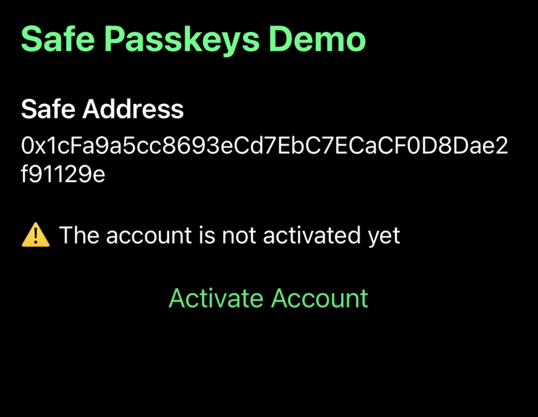

import { Callout } from 'nextra/components'
import { Bleed } from 'nextra-theme-docs'

# How to build a React Native app with Safe and passkeys

An increasing number of applications rely on passkeys to authenticate users securely and with little friction. Security and user-friendliness are crucial to making web3 a reality for the next billion users.
Being able to unlock a Safe Smart Account with your fingerprints or Face ID, sending transactions without worrying about third-party wallet interfaces, phishing attempts, or securing seed phrases will bring new forms of ownership to the connected world.
Today, we'll learn how to use passkeys with [React Native](https://reactnative.dev) and [Expo](https://docs.expo.dev).

This tutorial will show you how to create a React Native app for using [passkeys](../overview.mdx) in your Safe. This app will enable you to:

- Deploy a new Safe on Ethereum Sepolia.
- Create a new passkey secured by the user's device.
- Sign messages and create transactions using the passkey as a signer.

This is how the final app will look:


## **What you'll need**

**Prerequisite knowledge:** You will need some basic experience with [React](https://react.dev/learn), [React Native](https://reactnative.dev) and [Expo](https://docs.expo.dev).

Before progressing with the tutorial, please make sure you have:

- Downloaded and installed [Node.js](https://nodejs.org/en/download/package-manager).
- Have enrolled to the [Apple Developer Program](https://developer.apple.com/programs/enroll/) and installed [XCode](https://developer.apple.com/xcode/) (if you want to test the app on iOS)
- Have downloaded and installed [Android Studio](https://developer.android.com/studio) and have a Google account connected to your emulator (if you want to test the app on Android)

**Note:** If you wish to follow along using the completed project, you can [check out the GitHub repository](https://github.com/5afe/react-native-passkeys-tutorial) for this tutorial.

## 1. Setup a React Native app using Expo

### Initialize a new project

Initialize a new React Native project using Expo by running the following command in your terminal:

```bash
npx create-expo-app@latest --template blank-typescript
```

When prompted by the CLI, enter the name of the application (for example, react-native-passkeys).

### Install dependencies

Run the following command to add the project dependencies:

```bash
npm install @safe-global/protocol-kit react-native-passkeys react-native-base64 @react-native-async-storage/async-storage react-native-prompt-android expo-build-properties
```

We are using:

| Package                                                                                                    | Description                                                                                                                                                                                                                                      |
| :--------------------------------------------------------------------------------------------------------- | :----------------------------------------------------------------------------------------------------------------------------------------------------------------------------------------------------------------------------------------------- |
| [`@safe-global/protocol-kit`](https://github.com/safe-global/safe-core-sdk)                                | [Protocol Kit](../../../sdk/protocol-kit.mdx) package from the Safe\{Core\} SDK to set up a new Safe account, sign and send transactions.                                                                                                        |
| [`react-native-passkeys`](https://github.com/peterferguson/react-native-passkeys)                          | Expo module for creating and authenticating passkeys on iOS, Android, and the web using the same API.                                                                                                                                            |
| [`react-native-base64`](https://github.com/eranbo/react-native-base64)                                     | Base64 encoding and decoding helping utilities.                                                                                                                                                                                                  |
| [`@react-native-async-storage/async-storage`](https://github.com/react-native-async-storage/async-storage) | An asynchronous, unencrypted, persistent key-value storage system for React Native. We'll use local storage in the web and this AsyncStorage on the apps to store the passkey `rawId` and `coordinates`                                          |
| [`react-native-prompt-android`](https://github.com/powerdesigninc/react-native-prompt)                     | This package allows you to use Prompt Dialog across platforms, including iOS (Alert.prompt) and Android (Dialog).                                                                                                                                |
| [`expo-build-properties`](https://docs.expo.dev/versions/latest/sdk/build-properties)                      | A [plugin](https://docs.expo.dev/config-plugins/introduction) to configure the native build properties in your android/gradle.properties and ios/Podfile.properties.json directories during [Prebuild](https://docs.expo.dev/workflow/prebuild). |

### Configure your development environment to use React Native and Expo

You need to configure your environment. If you are a React Native developer, you may have already set everything up. However, if you are new to React Native, you should prepare your environment. The best option is to follow the [official Expo documentation](https://docs.expo.dev/get-started/set-up-your-environment).

We will use emulators and development builds in this tutorial, so please refer to the relevant sections in the Expo documentation for proper configuration. If you know how to do that or want to use a physical device, you can skip these steps. If you only want to test one platform, that's fine too, you only need to follow one of the steps below:

- [**Android Studio Emulator**](https://docs.expo.dev/get-started/set-up-your-environment/?platform=android&device=simulated&mode=development-build)
- [**iOS Simulator**](https://docs.expo.dev/get-started/set-up-your-environment/?platform=ios&device=simulated&mode=development-build)

**⚠️ An important consideration is that the selected Android emulator must be compatible with Google Play Services to store the passkeys in the Android keystore. When [creating the emulator](https://docs.expo.dev/get-started/set-up-your-environment/?platform=android&device=simulated&mode=development-build#set-up-an-emulator) using Android Studio Device Manager, ensure that you include one with Play Store services.**


### Add environment variables

Create a file named `.env` in the root of your project and add the following keys:

```bash
# Add the Safe account owners.
EXPO_PUBLIC_SAFE_OWNERS=["0xOwnerAddress1", "..."]
# Safe salt nonce. A random number that is used to generate to Safe account address. When you change the number a new Safe will be predicted.
# This is useful to start testing the app with a new Safe account.
EXPO_PUBLIC_SAFE_SALT_NONCE=1
# The private key of the Safe account owner that will be used to deploy the Safe or execute transactions. Should have some test Sepolia ETH.
EXPO_PUBLIC_SAFE_SIGNER_PK=add_your_private_key_here
# Sepolia RPC URL you want to use
EXPO_PUBLIC_RPC_URL=https://...
```

Remember to add the .env file to your `.gitignore` file to avoid committing sensitive information.

### Run emulators

After completing all these configurations 🙃, you can finally run the local development build of the app on the emulators (Emulators should be running) by using the following commands:

```bash
npx expo run:android
npx expo run:ios
```

After the building and initialization steps visible in the terminal logs, you should see the app running on the emulator. You can now begin developing the app.


## 2. Add project lib folder

Create a `lib` folder at the project root. This is the folder where we will include the logic to store and retrieve the passkey:

```bash
mkdir lib
cd lib
```

## 3. Add storage functionality

Create a `storage.ts` file inside the `lib` folder:

```bash
touch storage.ts
```

Add the following code to the `storage.ts` file:

```tsx
// from ../../../../examples/react-native-passkeys/lib/storage.ts
```

This file will contain all the logic to store the passkey in the device storage or in the web local storage depending on the platform.

## 4. Add passkeys functionality

Create a `passkeys.ts` file inside the lib folder:

```bash
touch passkeys.ts
```

Add the following code to the `passkeys.ts` file:

```tsx
// from ../../../../examples/react-native-passkeys/lib/passkeys.ts
```

We are adding 2 main functions here:

- `createPasskey` helps generate a new passkey using `react-native-passkeys`.
- `getPasskey` retrieves the passkey using the `react-native-passkeys` library. This method is necessary for pass to the [protocol-kit init](https://docs.safe.global/reference-sdk-protocol-kit/initialization/init) method and will be used to sign any message or transaction.

## 5. Add Safe functionality

Create a `safe.ts` file inside the lib folder:

```bash
touch safe.ts
```

Add the following code to the `safe.ts` file:

```tsx
// from ../../../../examples/react-native-passkeys/lib/safe.ts
```

We are introducing four new methods to securely deploy, sign messages, and execute transactions.

- `activateAccount` will deploy a new Safe account on Sepolia based on the predicted configuration.
- `addPasskeyOwner` adds a new passkey owner to the Safe account.
- `signPasskeyMessage` helps sign messages using the passkey signer.
- `sendDummyPasskeyTransaction` creates and executes a dummy on-chain rejection transaction to test the passkey signer.

## 6. Add UI functionality

Using the existing `App.tsx` file, we will add UI components to interact with the Safe account and passkeys. Let's update the entire content and use this instead:

```tsx
// from ../../../../examples/react-native-passkeys/components/App.tsx
```

Now we should have a functional app that enables users to activate their Safe account and interact with passkeys.



## 7. Setup and host `AASA` and `assetslinks.json` files

To use passkeys in the app, you need to complete some additional setup in the Android and iOS projects. The steps are outlined in the `README.md` file of the [react-native-passkeys](https://github.com/peterferguson/react-native-passkeys) repository. Please follow the instructions for each platform you want to test. Basically you need to:

- **iOS**: Serve the [Apple App Site Association](https://developer.apple.com/documentation/xcode/supporting-associated-domains) (AASA) file
- **Android**: Serve the [`assetlinks.json`](https://developer.android.com/training/app-links/verify-android-applinks)

To facilitate this, we are providing a simple [Node Express web server](https://github.com/5afe/aasa-server) for testing. Clone the repository, fill in your data in the `apple-app-site-association` and `assetlinks.json` files and start the server.

```bash
git clone https://github.com/5afe/aasa-server.git
npm install
# Update the apple-app-site-association and assetlinks.json files
npm start
```

Once you have it running, you need a public domain secured with SSL to test the passkeys (`localhost` is not valid). You can use a service like [ngrok](https://download.ngrok.com/mac-os) to create a tunnel to your local server.

After the installation, create a tunnel to the localhost port you are using, which should be `3000` if you are using the provided server.

```bash
ngrok http 3000
```

The ngrok service will provide you with a public domain. You must copy this domain (without `https://`) and add it to your project files after completing the steps below:

- [passkeys.ts](https://github.com/5afe/react-native-passkeys-tutorial/blob/913cc17f353062bf1c4c55ad303e8623b6035a6b/lib/passkeys.ts#L8)
- [app.json](https://github.com/5afe/react-native-passkeys-tutorial/blob/913cc17f353062bf1c4c55ad303e8623b6035a6b/app.json#L19). It's important to have the [developer mode](https://developer.apple.com/documentation/xcode/configuring-an-associated-domain) activated (?mode=developer) in your `app.json`.

Not updating this information will result in an error when trying to create a passkey.

```
Error Domain=com.apple.AuthenticationServices.AuthorizationError Code=1004 "(null)"
```

⚠️ If you are using iOS simulator remember to:

- Add your provisioning profile to sign the app through xcode. You can open the generated iOS project in xcode and under Signing & Capabilities choose your team.
- Activate FaceId. Go to Features > Face ID > Enrolled in the iOS simulator menu.

## 8. See the App in action


## Do more with passkeys

We learned how to use passkeys (create them, store them, and use them securely) and how they can interact with a Safe (deploy it and send transactions). We hope you enjoyed this tutorial and that the combination of passkeys and the ERC-4337 will unlock new forms of ownership for your project and users.

You can now integrate passkeys with more transactions and functionalities of the Safe ecosystem. You can read more about passkeys in our [overview](/advanced/passkeys/overview) or in the [WebAuthn API documentation](https://developer.mozilla.org/en-US/docs/Web/API/Web_Authentication_API).

Did you encounter any difficulties? Let us know by opening [an issue](https://github.com/5afe/react-native-passkeys-tutorial/issues/new) or asking a question on [Stack Exchange](https://ethereum.stackexchange.com/questions/tagged/safe-core) with the `safe-core` tag.

## Links

- [React Native Passkeys Tutorial](https://github.com/5afe/react-native-passkeys-tutorial)
- [AASA server](https://github.com/5afe/aasa-server)
