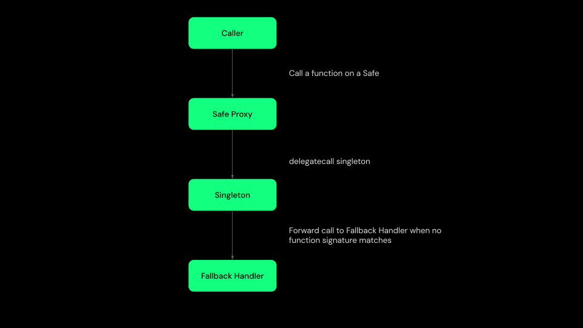

import { Callout } from 'nextra/components'

# Safe Fallback Handler

<Callout type='error' emoji='‼️'>
  Using a Safe Fallback Handler can introduce security risks, as it enables
  execution of arbitrary external functions within the Safe Smart Account. Only
  integrate fallback handlers from trusted sources that have undergone thorough
  security audits.
</Callout>

The Safe Fallback Handler enables extending the functionality of a Safe Smart Account without modifying its core contract code. It addresses Ethereum's 24KB contract size limitation by delegating additional logic to external smart contracts. Fallback Handlers clearly separate modular logic from the core Safe implementation.

A basic Safe Smart Account does not require any modules by default. The addition or removal of modules must be confirmed by a predefined threshold of Safe owners. To maintain transparency and security, an event is emitted whenever the fallback handler is updated.

## How it works

If configured, the fallback handler contract is invoked whenever the function signature in the provided calldata does not match any existing function in the core Singleton contract.

When forwarding a call to a fallback handler, the Safe Smart Account appends the original caller's address to the calldata. This allows the fallback handler to identify who initiated the request.

## Examples

Below are several practical examples of fallback handlers that extend the functionality of Safe Smart Accounts. Each handler demonstrates specific capabilities and integration scenarios, highlighting how fallback handlers can be effectively utilized in various use cases.

### TokenCallbackHandler

Source code: [TokenCallbackHandler](https://github.com/safe-global/safe-smart-account/blob/main/contracts/handler/TokenCallbackHandler.sol)

Manages callbacks from supported token standards, allowing Safe accounts to directly receive tokens.

Supports the following token interfaces:

- `ERC1155TokenReceiver`
- `ERC777TokensRecipient`
- `ERC721TokenReceiver`

### CompatibilityFallbackHandler

Source code: [CompatibilityFallbackHandler](https://github.com/safe-global/safe-smart-account/blob/main/contracts/handler/CompatibilityFallbackHandler.sol)

- Extends `TokenCallbackHandler` functionality.
- Implements ERC-1271 via the `isValidSignature` method, enabling secure on-chain signature verification.
- Provides a `simulate` function, which executes a static `delegatecall` to a target contract and intentionally reverts afterward to avoid unintended state changes.
- Includes additional utility functions:
  - **`getMessageHash`:** Generates message hashes specific to the calling Safe instance.
  - **`encodeMessageDataForSafe`:** Encodes messages using the Smart Account's domain separator and a predefined message type hash.
  - **`getMessageHashForSafe`:** Combines message encoding and hashing into a final message hash.
  - **`getModules`:** Retrieves a paginated list (first 10 entries) of modules associated with the Safe.

### ExtensibleFallbackHandler

Source code: [ExtensibleFallbackHandler](https://github.com/safe-global/safe-smart-account/blob/main/contracts/handler/ExtensibleFallbackHandler.sol)

The ExtensibleFallbackHandler enables assigning individual fallback handlers to specific function signatures, allowing for more granular control over fallback behavior.

### Safe4337Module as Fallback Handler

Source code: [Safe4337Module](https://github.com/safe-global/safe-modules/blob/main/modules/4337/contracts/Safe4337Module.sol)

This fallback handler implements the `validateUserOp` function defined by ERC-4337, enabling Safe Smart Accounts to be used as ERC-4337 compatible smart contract wallets.
