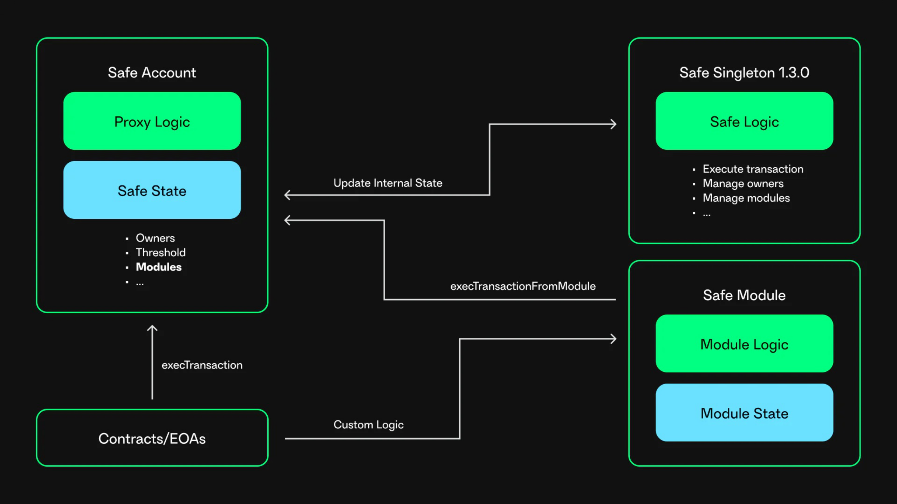

import { Callout } from 'nextra/components'

import YouTube from '../../components/YouTube'

# Safe Modules

## Overview

Safe Modules are smart contract extensions that enhance the functionality of Safe Smart Accounts by enabling additional features. They operate alongside Safe's core multi-signature mechanism, allowing automated actions or custom transaction logic. Multiple modules can be enabled simultaneously, offering highly customizable setups tailored to specific needs. These modules extend Safe contracts while keeping their logic separate from the core contracts. Although a basic Safe does not require any modules, they can be added or removed with confirmation from the required threshold of owners. Events are emitted whenever a module is added, removed, or when a module transaction succeeds or fails.

Safe Modules offer several benefits:

- **Automation**: Enable recurring transactions, DeFi interactions, or scheduled payments without manual approvals.
- **Enhanced Security**: Impose restrictions such as whitelists, rate limits, or spending caps to control fund usage.
- **Scalability**: Support complex operations by delegating responsibilities to specialized modules.
- **Flexibility**: Safes can be tailored to unique workflows or integrated with broader frameworks like DAOs or DeFi protocols.

By decoupling these features from the Safe Smart Account contract, modules allow developers to build and deploy new capabilities without compromising the Safe Smart Account's security guarantees.

Safe Modules can include daily spending allowances, amounts that can be spent without the approval of other owners, recurring transactions modules, and standing orders performed on a recurring date. For example, paying your rent or social recovery modules may allow you to recover a Safe if you lose access to owner accounts.

## How Safe Modules Work

1. **Enabling a Module**: A module is added to the Safe via the `enableModule()` function. The Safe maintains an internal registry of authorized modules.
2. **Transaction Execution**:
    - A user (can be a contract or an EOA) interacts with the Module by triggering a call to a module function.
    - The Module validates the request, ensuring the user is authorized and the operation complies with the Module's rules.
    - If valid, the Module calls `execTransactionFromModule` on the Safe which executes the transaction.

## How to create a Safe Module

A great way to understand how Safe Modules work is by creating one. An excellent place to start is [Safe Modding 101: Create your own Safe Module](https://www.youTube.com/watch?v=nmDYc9PlAic).

<YouTube embedId='nmDYc9PlAic' />

## Examples

1. [Safe Modules](https://github.com/safe-global/safe-modules)
2. [Zodiac-compliant modules](https://www.zodiac.wiki/documentation)
3. [Pimlico](https://docs.pimlico.io/permissionless/how-to/accounts/use-safe-account)

<Callout type='error' emoji='‼️'>
  Safe Modules can be a security risk since they can execute arbitrary
  transactions. Only add trusted and audited modules to a Safe. A malicious
  module can take over a Safe.
</Callout>

## Reference

- [Safe Module Reference](/reference-smart-account/modules/enableModule)
