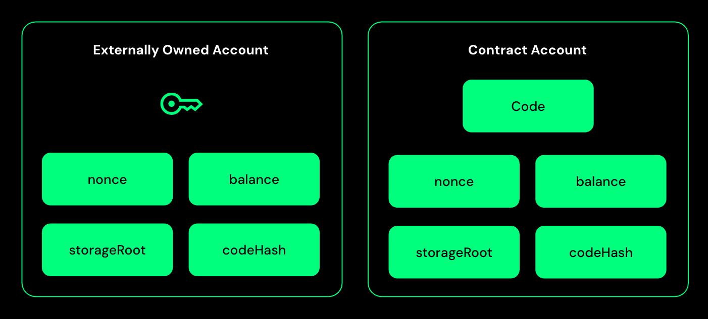
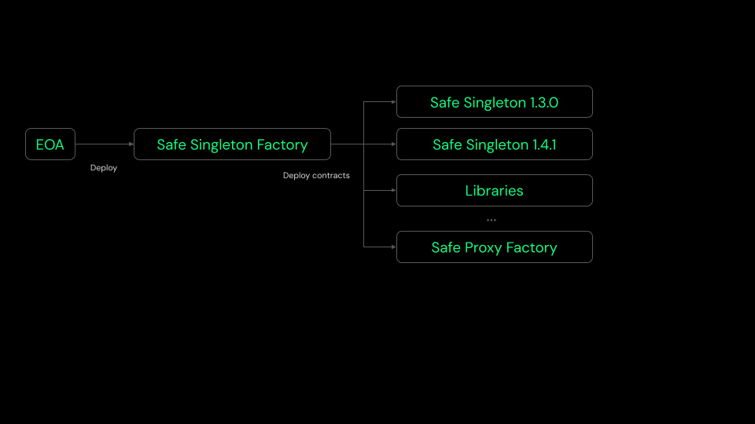
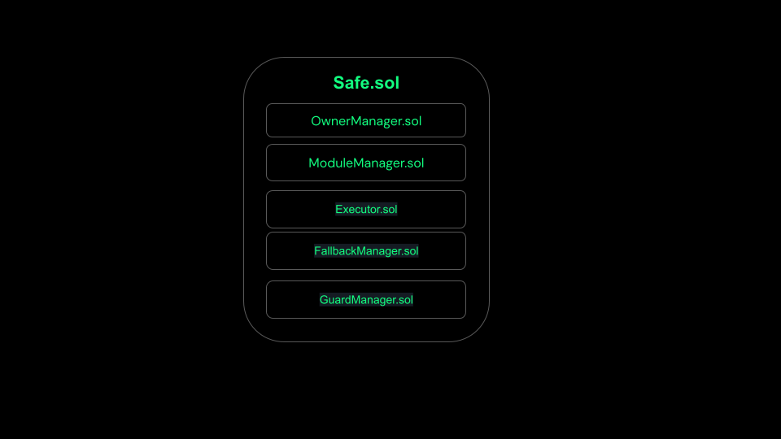
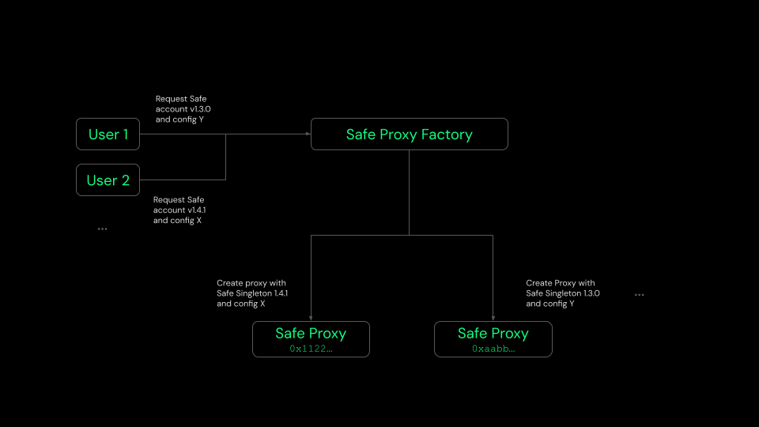

import SafeSmartAccount from '../../assets/svg/ic-smart-account.svg'

# How do Safe Smart Accounts work?

## EOAs

[EOAs](https://docs.safe.global/home/glossary#externally-owned-account) for short are Ethereum accounts that use traditional key pairs. That is, they consist of a single private key that can be used to make transactions and sign messages. If you gain access to that private key, you gain full control of the account. This means that your private key is a single point of failure that stands between you and your funds being lost.

## Smart accounts

The other type of Ethereum accounts are smart contract accounts. Like EOAs, smart contract accounts each have a unique public Ethereum address, and it is impossible to tell them apart from EOAs by looking at an Ethereum address. Smart contract accounts too can receive funds and make transactions like EOAs. Generally, the key difference is that no single private key is used to verify transactions. Instead, the logic behind how the account completes transactions is defined in the smart contract code. Smart contracts are programs that run on the Ethereum blockchain and execute when specific conditions are met. Their functionality within contract accounts means that such accounts, in contrast to EOAs, can, for example, implement access rights that specify by whom, how, and under which conditions transactions can be executed, as well as more complex logic.

# Difference between EOAs and Contract Accounts

## Safe Smart Account

Safe Smart Account is a contract account with multi-signature functionality at its core. It is a secure and flexible account that can be used to manage funds and execute transactions on the Ethereum blockchain.
The vision for Safe Smart Accounts is to become the standard core used in all smart contract-based wallets. It also aims to make the benefits of Account Abstraction accessible to users and developers.

The architectural design of Safe Smart Account keeps the following principles in mind.

- **Secure default**

  Uses a multi-signature logic where a threshold of owners must confirm a transaction before execution to provide a secure default without trusting any additional contract. For example, a module, guard, or fallback handler (explained below).

- **Maximum flexibility**

  Supports modules that execute transactions using alternative access patterns (instead of multi-signature). Also supports the `delegatecall` function, which introduces complex execution logic by loading instructions from other contracts and executing via a Safe Smart Account.

### Features

#### High Security

Safe's **multi-signature** functionality allows you to define a list of owner accounts and a threshold number of accounts required to confirm a transaction. Once the threshold of owner accounts have confirmed a transaction, the Safe transaction can be executed. Owners can either be EOAs, other smart contract accounts or even a passkey.

#### Advanced execution logic

It is possible to make use of different **Safe Library contracts** to perform complex transactions. A very common example of this is **batched transactions** where multiple simple Ethereum transactions are combined and executed at once. That means instead of having to sign several transactions sequentially, a user just needs to sign one batched transaction.

#### Advanced access management

You can add **Safe Modules** to your Safe which facilitates more fine-grained access management. For instance, it is possible to define a module that can only be used to **recover access** to a Safe under specific circumstances. Another example is **allowance modules** that allow owners of a Safe to grant limited execution permission, such as a daily limit to external accounts.

#### Token callback support

Many new tokens require wallet contracts to implement callbacks. Token standards like **ERC-721** and **ERC-1155** allow contracts to immediately react to receiving tokens through these and make it even possible to reject the transfer altogether.

#### Sponsored transactions

Another core functionality of the Safe is **token payment**. Generally, Ethereum transactions require ETH for paying transaction fees ("gas"). With the Safe, users can pay transaction fees in a number of supported ERC20 tokens. This is realized via a transaction relay service that accepts those tokens and submits the transactions to the blockchain, therefore paying the gas fee in ETH. With the same functionality, Ether-less transactions can be implemented, where a 3rd party pays transaction fees on behalf of a Safe via the same relay service.

### Architecture

#### Safe Singleton Factory

The Safe Singleton Factory is a contract that deploys all the Safe related contracts. This contract helps to deploy Safe contracts at same address across different networks and eventually also helps to deploy Safe proxies at same address across different networks.
For more information, refer to the [Safe Singleton Factory](https://github.com/safe-global/safe-singleton-factory) repository.

#### Safe Proxy Factory

The Safe proxy factory contract provides a simple way to create a new proxy contract pointing to a singleton and executing a setup function in the newly deployed proxy all in one transaction.

#### Safe

This is a singleton contract which is deployed only once and used by Safe Proxy to delegate calls. It is the main contract that holds the logic for signature verification, executing transactions, managing owners, modules, fallback handler.
Being a singleton contract, this contract cannot be used directly as a Safe account but only through a Safe Proxy contract.

The two types of Safe contracts are:
- Safe
- SafeL2: The version emits additional events and to be used for L2 chains that don't support tracing.

A Safe contract itself is composed of different contracts. The diagram below shows the main components of a Safe contract.

##### Owner Management

One core feature of a Safe account is to be operated by multiple accounts known as owners. `OwnerManager.sol` allows you to add, remove, and replace owners. Furthermore, a threshold number of owners required to confirm a transaction for it to be executed can be specified and modified. You can retrieve the list of owners. Events are emitted every time an owner is added or removed as well as whenever the threshold changes.

##### Module Management

Modules add additional functionalities to the Safe accounts. They are smart contracts which implement the Safe's functionality, while separating module logic from the Safe's core contract. Depending on the use case, modules could for instance allow the execution of transactions without requiring all confirmation. A basic Safe does not require any modules. Adding and removing a module requires confirmation from the required threshold of owners. Modules are very security-critical, so they need to be as secure as all other Safe contracts.

Some of the modules that are available are:
- [Allowance Module](https://github.com/safe-global/safe-modules/tree/main/modules/4337)
- [Recovery Module](https://github.com/safe-global/safe-modules/tree/main/modules/recovery)
- [4337 Module](https://github.com/safe-global/safe-modules/tree/main/modules/4337)
- [Passkey Module](https://github.com/safe-global/safe-modules/tree/main/modules/passkey)

##### Executor

This contract contains the logic to execute `call` or `delegatecall` to external address.

##### Fallback Manager

Ethereum fallback functions are executed when a called function signature does not match any defined function. Certain use cases require those fallback functions to contain some logic. EVM limits the size of a Smart contract to 24KB. The Fallback Manager contract allows you to extend the functionality of the Safe contract by adding additional logic to the fallback function and overcome the contract size limit.

##### Guard Management

Guards are used to check if a transaction should be executed or rejected based on the logic defined in the guard. A Guard Manager contract allows you to add, remove, and replace guards. Guards are security critical as a malicious guard could prevent transactions from being executed and block access to funds stored in the Safe. Events are emitted whenever a guard is updated.

#### SafeProxy

A Safe Proxy is a contract that delegates all calls to the Safe Singleton. By deploying a Proxy the cost to create a Safe account gets reduced as the byte code size of proxy contract is lesser than deploying the actual Safe contract code.

### Concepts

#### Owners

Each Safe account maintains it own list of owners in the storage in the form of Ethereum addresses. Owners can be added or removed by other owners.

#### Threshold

Safe Smart Account maintains a **threshold** which is the minimum number of owners required to confirm a transaction before it gets executed. The threshold of owners required to confirm a transaction is also stored in the Safe storage. Owners of a Safe account can change the threshold value as well. A Safe account can have any number of owners and the threshold value can be set to any value between one and the total number of owners.

#### Signature verification

Safe account being a contract account, does not have a private key to sign transactions and EVM cannot verify incoming transactions to a contract account. Hence, a contract account has to do the authentication and authorization in its own code. When a transaction is submitted to a Safe account, it is first verified by the Safe account to ensure that the transaction is valid. If the transaction has been signed by the required number of owners, the transaction allowed to be executed. If the transaction has not been signed by the required number of owners, the transaction reverts in the signature validation step.
A Safe account verifies if each signer is an owner of the Safe account and verifies signature based on the signature type. To learn more about the signature types supported by Safe and encoding, refer to the [Signatures](/smart-account-signatures) page.

#### Transaction flow

Transactions through a Safe account can be primarily divided into two types:

##### Safe Transaction

Safe Smart Account contract provides `execTransaction` function to submit and execute a Safe transaction which is signed by the owners of the Safe account.

To execute a transaction with the Safe the `execTransaction` methods needs to be called with the following parameters:

- `to`: The recipient address of the transaction.
- `value`: The amount of Ether (in wei) to send with the transaction.
- `data`: The data payload of the transaction, typically used to call a function on the recipient contract.
- `operation`: The Safe supports `CALL` and `DELEGATECALL`.
- `safeTxGas`: Gas that should be used for the Safe transaction.
- `baseGas`: This is the amount of gas that is independent of the specific Safe transactions, but used for general things such as signature checks and the base transaction fee. `SafeTxGas` and `baseGas` combined are comparable to the gas limit of a regular transaction.
- `gasPrice`: Same like for a regular Ethereum transaction. Setting the gas price to 0 means that no refund is paid out.
- `gasToken`: For regular Ethereum transactions, gas is paid in ether, always. A Safe enables users to pay in ERC20 tokens or ether. The desired token is specified here. If `0x0` then Ether is used. Gas costs are calculated by `(baseGas + txGas) * gasPrice`.
- `refundReceiver`: The refund does not necessarily have to go to the account submitting the transaction but can be paid out to any account specified here. If set to `0`, `tx.origin` will be used.
- `signatures`: All parameters are used to generate a transaction hash and signed by the owners of the Safe. A list of hex encoded signatures is expected (`execTransaction` expects that the signatures are sorted by owner address. This is required to easily validate no confirmation duplicates exist).

##### Module Transaction

Safe Smart Account contract provides `execTransactionFromModule` and `execTransactionFromModuleReturnData` functions to accept transactions from modules. A module is can be any Ethereum address and can bypass signature verification logic for executing transactions through a Safe account.

- `to`: The recipient address of the transaction.
- `value`: The amount of Ether (in wei) to send with the transaction.
- `data`: The data payload of the transaction, typically used to call a function on the recipient contract.
- `operation`: The type of operation to execute, either `CALL` or `DELEGATECALL`.

Here are some core components of a Safe Smart Account that you will learn about:

#### Safe Modules

[Safe Modules](smart-account-modules.mdx) are smart contracts that extend Safe's functionality with added custom features while the module logic remains separate from Safe's core contracts. 

#### Safe Guards

[Safe Guards](smart-account-guards.mdx) make checks before and after a Safe transaction.

#### Signatures

Safe contracts support alternative signature schemes such as [EIP-1271](https://eips.ethereum.org/EIPS/eip-1271) and [EIP-712](https://eips.ethereum.org/EIPS/eip-712) and relaying by making the confirmation/verification logic independent of `msg.sender`. Read more about the [signature schemes](https://github.com/safe-global/safe-smart-account/blob/main/docs/signatures.md) supported by Safe.
