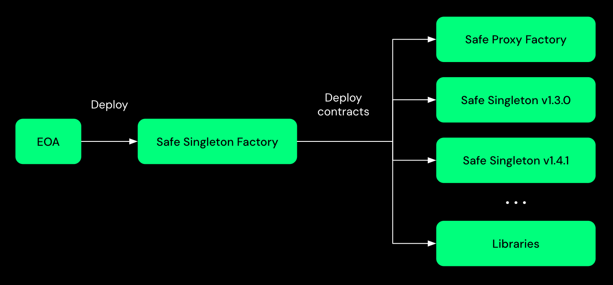
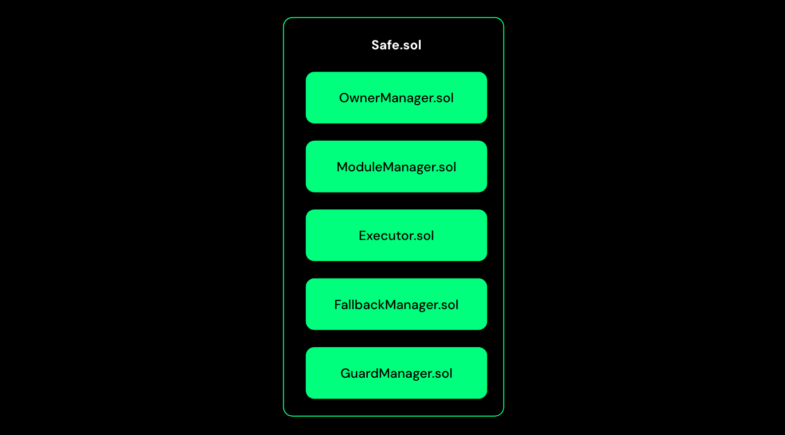

import SafeSmartAccount from '../../assets/svg/ic-smart-account.svg'

# How do Safe Smart Accounts work?

## EOAs

[EOAs](/home/glossary#externally-owned-account), for short, are Ethereum accounts that use traditional key pairs. That is, they consist of a single private key that can be used to make transactions and sign messages. If you gain access to that private key, you gain complete control of the account. This means that your private key is a single point of failure between you and your funds being lost.

## Smart Accounts

The other type of Ethereum account is a [Smart Account](/home/glossary#smart-account), also sometimes called Smart Contract Account. Like EOAs, smart contract accounts each have a unique public Ethereum address, and it is impossible to tell them apart from EOAs by looking at an Ethereum address. Smart contract accounts, too, can receive funds and make transactions like EOAs but cannot initiate them. Generally, the key difference is that no single private key is used to verify transactions. Instead, the smart contract code defines the logic behind how the account completes transactions. Smart contracts are programs that run on the Ethereum blockchain and execute when specific conditions are met. Their functionality within contract accounts means that such accounts, in contrast to EOAs, can, for example, implement access rights that specify by whom, how, and under which conditions transactions can be executed, as well as more complex logic.

# Difference between EOAs and Contract Accounts

## Safe Smart Account

Safe Smart Account is a Smart Account with multi-signature functionality at its core. It is secure and flexible, and it can be used to manage funds and execute transactions on the Ethereum blockchain.
The vision for Safe Smart Accounts is to become the standard core used in all smart contract-based wallets. It also aims to make the benefits of Account Abstraction accessible to users and developers.

The architectural design of Safe Smart Account keeps the following principles in mind.

- **Secure default**

 Uses a multi-signature logic where a threshold of owners must confirm a transaction before execution to provide a secure default without trusting any additional contract—for example, a module, guard, or fallback handler (explained below).

- **Maximum flexibility**

 Supports modules that execute transactions using alternative access patterns (instead of multi-signature). It also supports the `delegatecall` function, which introduces complex execution logic by loading instructions from other contracts and executing via a Safe Smart Account.

### Features

#### High Security

Safe's **multi-signature** functionality allows you to define a list of owner accounts and a threshold number of accounts required to confirm a transaction. Once the threshold of owner accounts have confirmed a transaction, the Safe transaction can be executed. Owners can be EOAs, other smart contract accounts, or even a passkey.

#### Advanced execution logic

It is possible to use different **Safe Library contracts** to perform complex transactions. A prevalent example is **batched transactions**, where multiple simple Ethereum transactions are combined and executed at once. That means instead of having to sign several transactions sequentially, a user just needs to sign one batched transaction.

#### Advanced access management

You can add **Safe Modules** to your Safe, which facilitates more fine-grained access management. For instance, defining a module that can only be used to **recover access** to a Safe under specific circumstances is possible. Another example is **allowance modules** that allow owners of a Safe to grant limited execution permission, such as a daily limit to external accounts.

#### Token callback support

Many new tokens require wallet contracts to implement callbacks. Token standards like **ERC-721** and **ERC-1155** allow contracts to immediately react to receiving tokens through these and make it even possible to reject the transfer altogether.

#### Sponsored transactions

Another core functionality of the Safe is **token payment**. Generally, Ethereum transactions require ETH to pay transaction fees ("gas"). With the Safe, users can pay transaction fees in several supported ERC20 tokens. This is realized via a transaction relay service that accepts those tokens and submits the transactions to the blockchain, paying the gas fee in ETH. With the same functionality, Ether-less transactions can be implemented, where a 3rd party pays transaction fees on behalf of a Safe via the same relay service.

### Architecture

#### Safe Singleton Factory

The Safe Singleton Factory is a contract that deploys all the Safe Smart Account related contracts. This contract helps to deploy Safe Smart Account contracts at the same address across different networks and eventually also helps to deploy Safe proxies at the same address across different networks.
For more information, refer to the [Safe Singleton Factory](https://github.com/safe-global/safe-singleton-factory) repository.

#### Safe Proxy Factory

The Safe proxy factory contract provides a simple way to create a new proxy contract pointing to a singleton and executing a setup function in the newly deployed proxy all in one transaction.

#### Safe

This is a singleton contract deployed only once and used by Safe Proxy to delegate calls. It is the main contract that holds the logic for signature verification, executing transactions, managing owners, modules, and the fallback handler.
As a singleton contract, it cannot be used directly as a Safe account but only through a Safe Proxy contract.

The two types of Safe Smart Accounts are:
- Safe
- SafeL2: The version emits additional events and is to be used for L2 chains that don't support tracing.

_Hint: For legacy reasons they are referred as Safe._

A Safe contract itself is composed of different contracts. The diagram below shows the main components of a Safe contract.

##### Owner Management

One core feature of a Safe account is that it can be operated by multiple accounts, known as owners. `OwnerManager.sol` allows you to add, remove, and replace owners. Furthermore, a threshold number of owners required to confirm a transaction for it to be executed can be specified and modified. You can retrieve the list of owners. Events are emitted every time an owner is added or removed and whenever the threshold changes.

##### Module Management

Modules add additional functionalities to the Safe accounts. They are smart contracts that implement Safe's functionality while separating module logic from Safe's core contract. Depending on the use case, modules could, for instance, allow the execution of transactions without requiring all confirmations. A basic Safe does not require any modules. Adding and removing a module requires confirmation from the required threshold of owners. Modules are very security-critical, so they need to be as secure as all other Safe contracts.

Some of the available modules are:
- [Allowance Module](https://github.com/safe-global/safe-modules/tree/main/modules/allowances)
- [Recovery Module](https://github.com/safe-global/safe-modules/tree/main/modules/recovery)
- [4337 Module](https://github.com/safe-global/safe-modules/tree/main/modules/4337)
- [Passkey Module](https://github.com/safe-global/safe-modules/tree/main/modules/passkey)

##### Executor

This contract contains the logic to execute `call` or `delegatecall` to external address.

##### Fallback Manager

Ethereum fallback functions are executed when a called function signature does not match any defined function. Specific use cases require those fallback functions to contain some logic. EVM limits the size of a Smart contract to 24KB. The Fallback Manager contract allows you to extend the functionality of the Safe contract by adding additional logic to the fallback function and overcoming the contract size limit.

##### Guard Management

Guards are used to check if a transaction should be executed or rejected based on the logic defined in the guard. A Guard Manager contract allows you to add, remove, and replace guards. Guards are security critical as a malicious guard could prevent transactions from being executed and block access to funds stored in the Safe. Events are emitted whenever a guard is updated.

#### SafeProxy

A Safe Proxy is a contract that delegates all calls to the Safe Singleton. Deploying a Proxy reduces the cost of creating a Safe account, as the proxy contract's byte code size is less than that of the actual Safe contract code.

