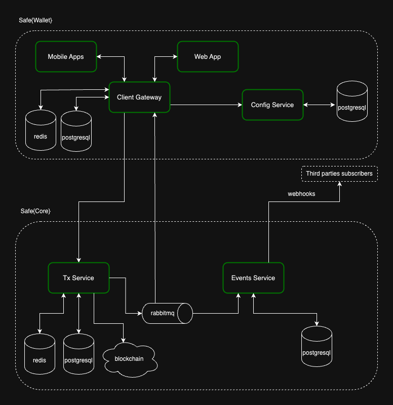

import { Grid } from '@mui/material'
import CustomCard from '../../components/CustomCard'
import SafeCoreSDK from '../../assets/svg/ic-sdk.svg'
import SafeCoreAPI from '../../assets/svg/ic-api.svg'

# Safe\{Core\} Infrastructure

The Safe\{Core\} Infrastructure consists of the following services:

<Grid
  container
  spacing={2}
  display='flex'
  alignContent='flex-start'
  mt={3}
>
  <Grid item xs={12} md={6}>
    <CustomCard
      title={'Safe Transaction Service'}
      description={'The Safe Transaction Service tracks transactions related to Safe contracts using tracing on Mainnet, Sepolia, and Gnosis Chain. It uses event indexing for the other chains. For each supported network there is one instance of the Transaction Service.'}
      url={'./transaction-service-overview'}
      icon={<SafeCoreAPI />}
      newTab={false}
    />
  </Grid>
  <Grid item xs={12} md={6}>
    <CustomCard
      title={'Safe Events Service'}
      description={'The Events Service handles Safe indexing events and delivers them as HTTP webhooks, connection to the events queue processed by the Transaction Service. The service\'s database stores the configuration of webhook destinations.'}
      url={'https://github.com/safe-global/safe-events-service'}
      icon={<SafeCoreSDK />}
      />
  </Grid>
</Grid>

## Architecture

Safe\{Wallet\} uses these services to offer functionality to end customers via the web and mobile applications. The [Safe Client Gateway](https://github.com/safe-global/safe-client-gateway-nest) acts as a facade between the end customer and the Safe\{Core\} services and the [Safe Config Service](https://github.com/safe-global/safe-config-service) stores all supported networks and chain-specific variables.

Safe's production setup consists of several instances of the Transaction Service orchestrated by the Config Service, which are later consumed by the Safe Client Gateway. The Events Service notifies the Safe Client Gateway when new events are indexed, helping to improve the user experience.

## Integration Flow for Safe\{Wallet\} and Safe\{Core\}

- The Client Gateway leverages the Config Service to find the Transaction Service instance required for a specific request.
- The Client Gateway forwards the request to the specified Transaction Service instance for the supported networks (determined by the Config Service).
- The Client Gateway transforms, aggregates, and caches information from the Config and Transaction Services, optimizing data for Safe's web and mobile clients.
- The Event Service provides information to the Client Gateway when the Transaction Service indexes an event using webhooks. The Client Gateway is then responsible for providing this information to the end clients.

Even though the Config Service and Transaction Service instances are reachable by clients that aren't the Client Gateway, this may change in the future. The Client Gateway is the outermost component of the Safe infrastructure and should be the single point of communication with any front-end client.

## Rate limits

For all Safe\{Core\} Infrastructure services we have a rate-limit of `5 req/s`.

## Running locally

[Safe Infrastructure](https://github.com/safe-global/safe-infrastructure) repository and the [running services locally](https://github.com/safe-global/safe-infrastructure/blob/main/docs/running_locally.md) guide show how to run Safe's infrastructure ([Safe\{Wallet\}](https://app.safe.global) and Safe\{Core\}). Note that these documents are examples of how these services run, and the configuration should adapt to the needs of a specific use case.
