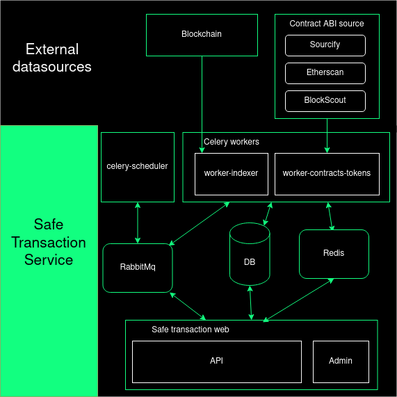
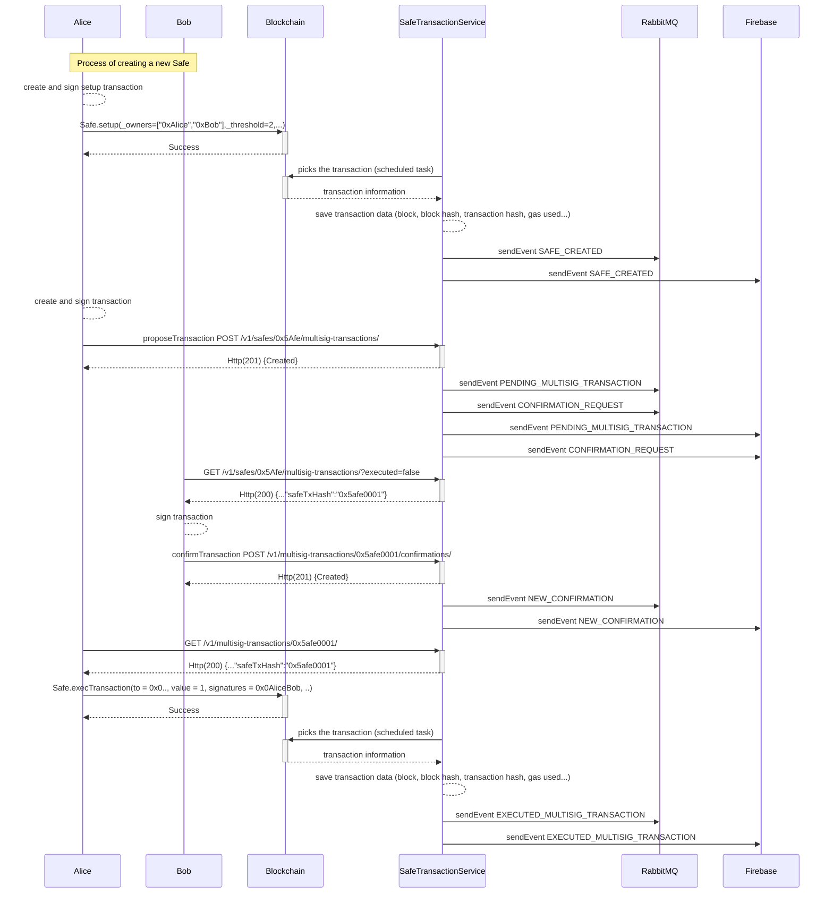
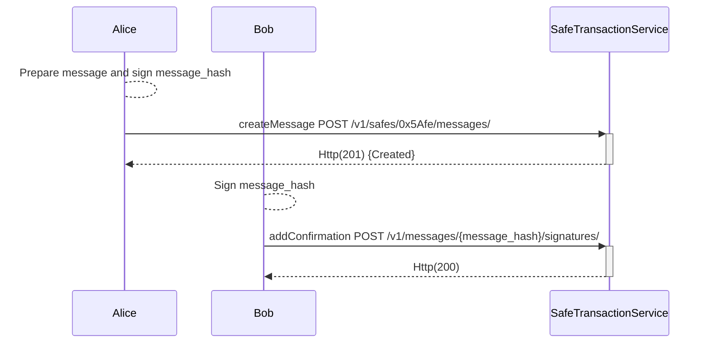

# Running the Safe Transaction Service

The Safe Transaction Service tracks transactions sent via Safe contracts. It indexes these transactions using events (L2 chains) and tracing (L1 chains) mechanisms.

## Key Features

- [Blockchain indexing](#blockchain-indexing): Executed transactions, configuration changes, ERC-20/721 transfers, and on-chain confirmations are automatically indexed from the blockchain.
- [Off-chain transaction signatures](#off-chain-transaction-signatures): Transactions can be sent to the service, enabling off-chain signature collection. This feature helps inform owners about pending transactions awaiting confirmation for execution.
- [Off-chain messages](#off-chain-messages): The service can collect off-chain signatures to confirm messages following [EIP-1271](https://eips.ethereum.org/EIPS/eip-1271).
- [Transaction decoding](#transaction-decoder): The service keeps getting source and ABIs from contracts that interact with Safe to decode these interactions.

## Technology stack overview

The Safe Transaction Service is a [Django](https://www.djangoproject.com/) app written in Python with the following architecture: 

- [Gunicorn](https://gunicorn.org/): A Python WSGI HTTP Server.
- [Celery](https://docs.celeryq.dev/en/stable/): A task queue with focus on real-time processing, while also supporting task scheduling. The Safe Transaction Service has a scheduler (for periodic tasks), a worker indexer to consume and execute indexing tasks, and a contracts worker mainly to get metadata from contracts.
- [RabbitMQ](https://www.rabbitmq.com/): A distributed message broker system Celery uses to share messages between the scheduler, workers, and the Django application.
- [PostgreSQL](https://www.postgresql.org/): An open source object-relational database system.
- [Redis](https://redis.com/): An open source, in-memory data structure store used for caching by the Safe Transaction Service.
- [safe-eth-py](https://github.com/safe-global/safe-eth-py): A library to interact with Safe and blockchains.



## Blockchain indexing 

The Safe Transaction Service can index automatically executed transactions, configuration changes, ERC-20/721 transfers, and on-chain confirmations.
The indexer is running on `worker-indexer` by different periodic [tasks](https://github.com/safe-global/safe-transaction-service/blob/master/safe_transaction_service/history/tasks.py). 

ERC-20 and ERC-721 are indexed using [`eth_getLogs`](https://ethereum.org/en/developers/docs/apis/json-rpc/#eth_getlogs) filtered by the Transfer topic `keccak('Transfer(address,address,uint256)')`.

Safe creation, executed transactions, configuration changes, and on-chain confirmations are indexed differently depending on whether the chain is L1 or L2. 

For L1 chains, the indexer calls tracing methods. For the oldest blocks, [`trace_filter`](https://openethereum.github.io/JSONRPC-trace-module#trace_filter) is used filtering by singleton address of Safe contracts, and for the latest blocks [`trace_block`](https://openethereum.github.io/JSONRPC-trace-module#trace_block) is used, as `trace_filter` takes longer to return updated information. `trace_block` will be used if the block depth is lower than `ETH_INTERNAL_TXS_NUMBER_TRACE_BLOCKS`. The environment variables indexing uses are defined [here](https://github.com/safe-global/safe-transaction-service/blob/master/config/settings/base.py#L433). 

For L2 chains, the indexing is by events with the [`eth_getLogs`](https://ethereum.org/en/developers/docs/apis/json-rpc/#eth_getlogs) method with the corresponding topics.  

From Safe creation, the Transaction Service stores each contract change on the `SafeStatus` model as `nonce`, `owners`, etc. The latest and current status of a Safe is stored as `SafeLastStatus` for easy database access and optimization.

### Endpoints

The following endpoints show the current indexing status of the Safe Transaction Service:

- `GET /v1/about/indexing/` 

Response example: 
```json
{
  "currentBlockNumber": 9773327, // Last block on the blockchain
  "erc20BlockNumber": 9773326,   // Last block indexed for erc20/721 events
  "erc20Synced": true,
  "masterCopiesBlockNumber": 9773327, // Last block indexed for executed transactions, ether transfers, configuration changes, etc.
  "masterCopiesSynced": true,
  "synced": true
}
```

### Reorgs handling  

Every block is marked as `not confirmed` during indexing unless it has some depth (configured via the `ETH_REORG_BLOCKS` environment variable). Unconfirmed blocks are checked periodically to see if the blockchain `blockHash` for that number changed before it reaches the desired number of confirmations. If that's the case, all blocks from that block and related transactions are deleted, and indexing is restarted to the last confirmed block.

**Note:** No off-chain signatures, transactions, or messages are lost in this process. Only on-chain data is removed.

## Off-chain transaction signatures

The Safe Transaction Service can collect off-chain transaction signatures, allowing the owners to share their signatures to reach the required threshold before executing a transaction and spending less gas than on-chain approvals.

### Endpoints

The following endpoints let us propose a transaction and collect every confirmation (off-chain signatures):

- `POST /v1/safes/{address}/multisig-transactions/`: Creates a new transaction and requires at least one signature.
- `POST /v1/multisig-transactions/{safe_tx_hash}/confirmations/`: Adds a new confirmation and needs the `safe_tx_hash`.
- `GET /v1/multisig-transactions/{safe_tx_hash}/`: Returns all the multi-signature transaction information.
- `GET /v1/multisig-transactions/{safe_tx_hash}/confirmations/`: Returns the list of all confirmations to a multi-signature transaction.

The following sequence diagram shows a use case for a Safe shared by Alice and Bob where at least one confirmation for each one is required:



**What's the `safe_tx_hash`?**
     
`safe_tx_hash` is the unique identifier for a Safe transaction and is calculated using the [EIP-712](https://eips.ethereum.org/EIPS/eip-712) standard:  
`keccak256(0x19 || 0x1 || domainSeparator || safeTxHashStruct)`  
where `safeTxHashStruct` is the `hashStruct` of a Safe transaction.

The following [Guides](../core-api/transaction-service-guides/transactions.mdx) show how to create and execute Safe transactions from the Safe Transaction Service.

## Off-chain messages 

The Safe Transaction Service can collect the necessary off-chain signatures to confirm a message using [EIP-1271](https://ethereum.org/pt/developers/tutorials/eip-1271-smart-contract-signatures/#example-eip-1271-implementation-safe).    
The message can be a string (EIP-191 is used to get the hash) or an object EIP-712.

### Endpoints

- `GET /v1/safes/{address}/messages/`: Returns the messages created for the given Safe address.
- `POST /v1/safes/{address}/messages/`: Creates a message with at least one signature.
- `GET /v1/messages/{message_hash}/`: Returns a message for a given message hash.
- `POST /v1/messages/{message_hash}/signatures/`: Adds another signature to the message with the given message hash.

The following sequence diagram shows a use case for a Safe shared by Alice and Bob where at least one signature for each one is required to confirm a message fully:



The following [Guides](../core-api/transaction-service-guides/messages.mdx) show how to create and sign messages from the Safe Transaction Service.

## Transaction decoder

The Safe Transaction Service can decode contract interactions. To achieve it, the service periodically gets source and ABIs from different sources like Sourcify, Etherscan, and Blockscout using the `safe-eth-py` library.   

The detection of contract interactions is done in a periodic task executed every hour for `multisig-transaction` and `module-transactions` or every six hours for `multisend-transactions` on `worker-contracts-tokens`.
For every new contract, the service tries to download the source, and the ABI requests it first to Sourcify, then Etherscan, and as a last chance, Blockscout. It's important to know that not all these data sources are supported or configured for every network on `safe-eth-py`.

Supported and configured networks on `safe-eth-py`:   

- [**Sourcify** supported networks](https://docs.sourcify.dev/docs/chains/)
- [**Etherscan** configured networks](https://github.com/safe-global/safe-eth-py/blob/master/gnosis/eth/clients/etherscan_client.py#L24)
- [**Blockscout** configured networks](https://github.com/safe-global/safe-eth-py/blob/master/gnosis/eth/clients/blockscout_client.py#L21)


The following [Guides](../core-api/transaction-service-guides/data-decoder.mdx) show how to decode contract interactions data of a transaction from the Safe Transaction Service.

## Running and Maintenance

In the [Safe Transaction Service](https://github.com/safe-global/safe-transaction-service) GitHub repository, under the [Setup for production (event indexing)](https://github.com/safe-global/safe-transaction-service?tab=readme-ov-file#setup-for-production-event-indexing) and [Setup for production (tracing mode)](https://github.com/safe-global/safe-transaction-service?tab=readme-ov-file#setup-for-production-tracing-mode) sections, it is shown how to run the service and retrieve events from any supported network type. Note that the configuration must be adapted to the needs of a specific use case.

In addition, the [Service maintenance](https://github.com/safe-global/safe-transaction-service?tab=readme-ov-file#service-maintenance) section shows how to deal with some common errors in the service operation.
