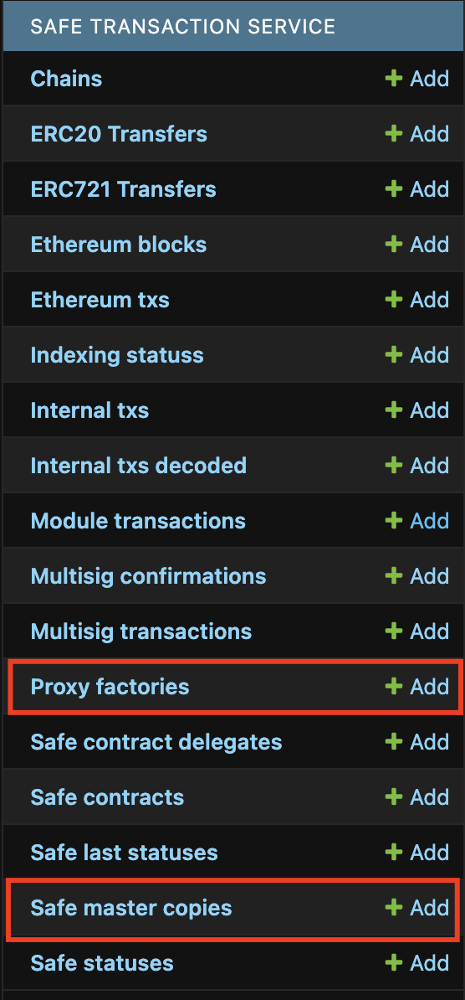
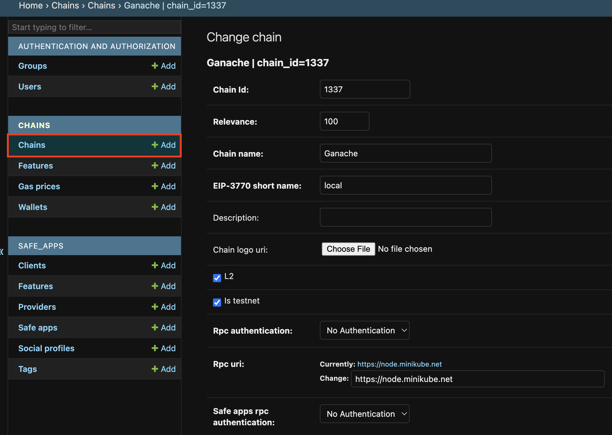

import { Callout, Steps, Tabs, Tab } from 'nextra/components'

# Safe\{Core\} Infrastructure deployment

Once you have deployed the [Safe\{Core\} contracts](./safe-contracts-deployment.mdx), you must deploy the off-chain components of the Safe\{Core\} Stack, including backend and frontend services. 

You have three options for deploying the Safe stack, depending on your needs.

## Option 1: Safe Core Contributor Platform-as-a-Service

We roll out new networks quarterly, depending on our internal capacity, and only for medium to large chains based on a strict scoring framework. 

If you want to submit your chain for assessment in the next quarter, please fill out this [form](https://noteforms.com/forms/request-safe-ui-and-infra-support-4weugt).

### Hard requirements

- EVM-compatible chain.
- At least two dedicated RPC node providers, with preference for at least one Tier 1 provider of Infura, Alchemy, Quicknode. You can find more on RPC nodes [here](./api-safe-transaction-service/rpc-requirements.md).

## Option 2: Third-party integrators

We are happy to introduce you to our integrators. Please contact [valens@safe.global](mailto:valens@safe.global).

## Option 3: Self-hosting

If you have engineering and cloud resources, you can also deploy the different components of the stack by following one of the procedures below. 

You can find [docker images for a majority of platforms](https://hub.docker.com/u/safeglobal). 

### Requirements

#### Hardware

These are the hardware requirements to run the different services required.


| Network | Transaction Service | Client Gateway | Config Service | Database |
| --- | --- | --- | --- | --- |
| Small (new chain with low traffic) | CPU: 2 vCPU RAM: 8GiB | CPU: 2 vCPU RAM: 8 GiB | CPU: 2 vCPU RAM: 8 GiB | CPU: 2 vCPU RAM: 8GiB |
| Standard | CPU: 4 vCPU RAM: 16GiB | CPU: 2 vCPU RAM: 8 GiB | CPU: 2 vCPU RAM: 8 GiB | CPU: 4 vCPU RAM: 16GiB |
| Large (large chain with high-traffic) | CPU: 8 vCPU RAM: 32GiB | CPU: 2 vCPU RAM: 8 GiB | CPU: 2 vCPU RAM: 8 GiB | CPU: 16 vCPU RAM: 64GiB |


#### RPC

For support, please refer to the [RPC requirements](./api-safe-transaction-service/rpc-requirements.md#what-are-the-rpc-requirements). Safe (L1) requires tracing for indexing, while Safe (L2) supports events/logs.

### Docker-compose deployment

Our docker-compose files are available on the [safe-infrastructure](https://github.com/safe-global/safe-infrastructure) repository.

```bash
git clone git@github.com:safe-global/safe-infrastructure.git
cd safe-infrastructure
```

#### Prerequisites

- [Docker](https://docs.docker.com/guides/) v20.10+
- [Docker-compose](https://docs.docker.com/compose/) 2.x.x+
- Running [Ethereum JSON RPC client](https://ethereum.org/en/developers/docs/apis/json-rpc/)

#### Configuration

```bash
cp .env.sample .env
vi .env
REVERSE_PROXY_PORT=8000
CFG_VERSION=latest
CGW_VERSION=latest
TXS_VERSION=latest
UI_VERSION=latest
EVENTS_VERSION=latest
RPC_NODE_URL=<REPLACE BY YOUR RPC ENDPOINT>
```

#### Run

```bash
sh scripts/run_locally.sh
# will ask to set up username/password for config-service and transactions-service
```

This command runs seventeen Docker containers from the [docker-compose.yml](https://github.com/safe-global/safe-infrastructure/blob/main/docker-compose.yml):

- Nginx reverse proxy
- Postgres 14.x database (x3 for Transaction Service, Config Service, and Events Service)
- Redis database (x2 for Transaction Service and Client Gateway)
- RabbitMQ message queue (x2 for Transaction Service and General)
- Transaction Service workers & scheduler (x4)
- Transaction Service web
- Config Service web
- Client Gateway web
- Events service web
- Wallet web

### Kubernetes deployment

<Callout type="info" emoji="⚠️">
    Our [Helm Charts](https://github.com/5afe/safe-helm-charts) are currently in alpha version, use them at your own risk and do not hesitate to share feedback.
</Callout>

An official helm chart creates all the necessary manifests, including the service account and RBAC entities needed for service discovery.

```bash
helm repo add safe https://5afe.github.io/safe-helm-charts/charts/packages
helm repo update
helm install [RELEASE_NAME] safe/safe-stack -f your_values.yaml [-n NAMESPACE]
```

The helm chart allows you to inline all the configurations directly in your `values.yaml`:

```bash
helm show values safe/safe-stack
```

### Configuration

After all the components are up and running, you need to configure the Transaction Service and config service to start indexing data and connect to your chain from Safe\{Wallet\}.

#### Transaction Service

By default, Transaction Service will automatically setup `MasterCopies` and `Proxy Factories` for [a list of known networks](https://github.com/safe-global/safe-eth-py/blob/main/safe_eth/safe/addresses.py). 

If your network is not supported you have to add the addresses manually in `http://YOUR_TRANSACTION_SERVICE_DOMAIN/admin/` in **Proxy Factories** and also in **Safe master copies** section.



#### Config Service

Open `http://YOUR_CONFIG_SERVICE_DOMAIN/admin` to configure your chain:



Well done! You now have the Safe Contracts deployed on your chain and the Safe infrastructure up and running.