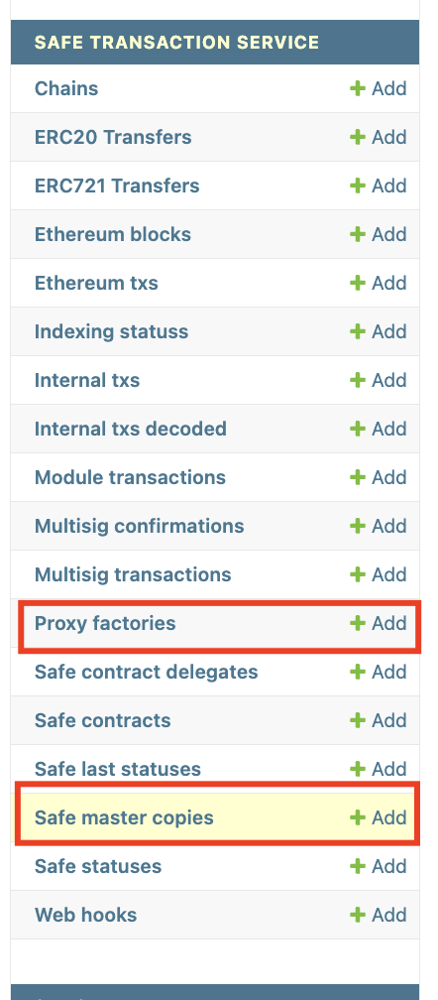
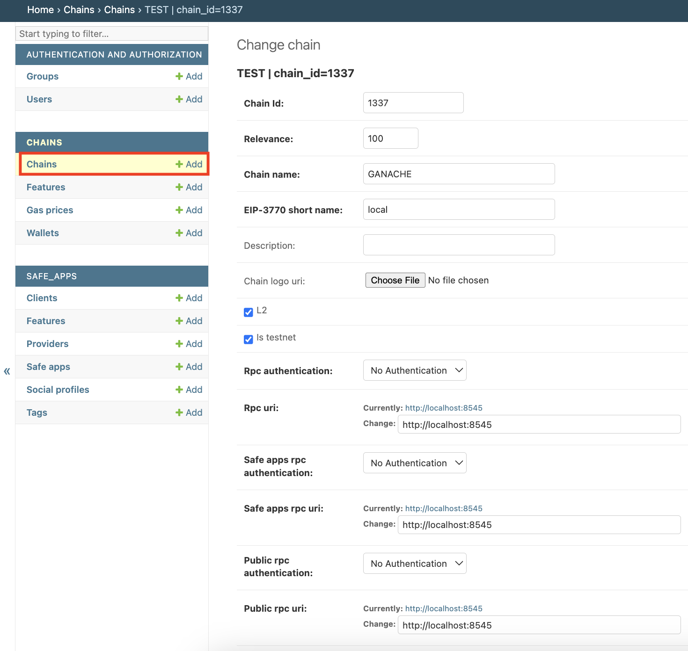

import { Callout } from 'nextra/components'

# Safe\{Stack\} Installation guide

## Safe\{Core\} contracts deployment

The first step consists of deploying on-chain the necessary smart contracts.

<Callout type="info" emoji="ℹ️">
All Safe contract deployments on any network follow the same procedure to ensure a deterministic address for all singleton contracts (proxy-factory, mastercopy, libs, etc.) and validate the deployment.
</Callout>

### A. Prerequisites

1. Ensure your chain is listed on [**chainlist.org**](https://chainlist.org/) (open a PR on [https://github.com/ethereum-lists/chains](https://github.com/ethereum-lists/chains) if not).

### B. Singleton-Factory contract deployment

1. **Create a new GitHub issue** on our [`safe-singleton-factory` GitHub repository](https://github.com/safe-global/safe-singleton-factory/issues/new?assignees=&labels=&projects=&template=new_chain.yml&title=%5BNew+chain%5D%3A+) and add the required information (incl. Chain name, RPC endpoint, and BlockExplorer URL).
2. Once the GitHub issue is created, a bot will reply to the issue with the deployer address (`0x914...3d7`) and the amount of **native token** you need to send to this address.
3. Once funded, mark the checkbox on the issue ✅.
4. **Every two weeks**, our team reviews each ✅ issue, performs the deterministic deployment of the singleton-factory contract, and publishes a new NPM release of [@safe-global/safe-singleton-factory](https://www.npmjs.com/package/@safe-global/safe-singleton-factory).

<Callout type="info" emoji="ℹ️">
 If your network is based on a rollup framework including Safe pre-installed (for example OP Stack), you do not need to perform these tasks.

</Callout>

### C. Singleton contracts deployment 

Recommended version: v1.3.0

Follow these steps, also described on our [`safe-smart-account`](https://github.com/safe-global/safe-smart-account/tree/v1.3.0-libs.0?tab=readme-ov-file#deploy) [GitHub repository](https://github.com/safe-global/safe-smart-account/tree/v1.3.0-libs.0?tab=readme-ov-file#deployments):

1. Clone the repository `https://github.com/safe-global/safe-smart-account@<version>` (for example `version=v1.3.0-libs.0`).
    
    → We have a script to deploy all the singleton contracts on a network in one command.
    
2. Configure the script
a. If the network is supported by [Infura](https://www.infura.io/), configure the following environment variables in a `.env` file.

```
MNEMONIC=<funded account on this network>
INFURA_KEY=<your Infura Project API key>
```

      b. If the network isn't supported by [Infura](https://www.infura.io/), configure the following environment variables in a `.env` file.

```
MNEMONIC=<funded account on this network>
NODE_URL=<RPC endpoint for this network>
```

1. Get the latest version of [@safe-global/safe-singleton-factory](https://www.npmjs.com/package/@safe-global/safe-singleton-factory).
    - Execute `npm i --save-dev @safe-global/safe-singleton-factory`

<Callout type="warn" emoji="⚠️">
    Make sure the latest version includes your safe-singleton-factory deployment from the [previous part](https://www.notion.so/Safe-Core-New-network-procedure-e0641b646a41442b9e4206cfd6c18ed6?pvs=21)
</Callout>

2. Execute the script
a. If the network is supported by [Infura](https://www.infura.io/), execute `npm run deploy-all <network>`
b. If the network isn't supported by [Infura](https://www.infura.io/), execute `npm run deploy-all custom` 
3. The script should successfully deploy all the singleton contracts (9 contracts in total)

<Callout type="info" emoji="✍️">
Write down each address (example addresses for v1.3.0 could look like):

- *compatibility_fallback_handler: `0x017062a1dE2FE6b99BE3d9d37841FeD19F573804`*
- *create_call: `0xB19D6FFc2182150F8Eb585b79D4ABcd7C5640A9d`*
- *gnosis_safe: `0x69f4D1788e39c87893C980c06EdF4b7f686e2938`*
- *gnosis_safe_l2: `0xfb1bffC9d739B8D520DaF37dF666da4C687191EA`*
- *multi_send: `0x998739BFdAAdde7C933B942a68053933098f9EDa`*
- *multi_send_call_only: `0xA1dabEF33b3B82c7814B6D82A79e50F4AC44102B`*
- *proxy_factory: `0xC22834581EbC8527d974F8a1c97E1bEA4EF910BC`*
- *sign_message_lib: `0x98FFBBF51bb33A056B08ddf711f289936AafF717`*
- *simulate_tx_accessor: `0x727a77a074D1E6c4530e814F89E618a3298FC044`*
</Callout>

<Callout type="info" emoji="ℹ️">
 If your network is based on a Rollup framework including Safe pre-installed (e.g. OP Stack), you do not need to perform these tasks.

</Callout>

### D. Record your contracts in our official registry

Finally, you need to share your singleton contract deployment addresses in our official public registry.
1. Fork our [`safe-deployments` GitHub Repository](https://github.com/safe-global/safe-deployments)
2. Go to `src/assets/<version>`, edit each JSON file according to their name (e.g `gnosis_safe.json`) with your network chain ID and the corresponding singleton address deployed previously.
3. Open a Pull Request.

```json
   "<chain_id>": "canonical"
```

<Callout type="info" emoji="ℹ️">
 Please look at this [PullRequest](https://github.com/safe-global/safe-deployments/pull/679) as an example.

</Callout>

## Safe\{Infrastructure\} Deployment

Once the Safe\{Core\} contracts are deployed on the chain, it is necessary to deploy the off-chain components of our Stack including Backend and Frontend services. 

You have a few options for deploying Safe\{Stack\}, depending on your needs.

### Option 1: Safe Core Contributor Platform-as-a-Service

Our team currently rollout new networks quarterly, depending on our internal capacity and only for medium to large chains based on a strict scoring framework. 

**Fill out the following [form](https://noteforms.com/forms/request-safe-ui-and-infra-support-4weugt) if you want us to assess your chain for next quarter.**

#### Hard requirements

- EVM compatible chain
- ≥ 2 dedicated RPC node providers, with preference for at least one Tier 1 provider of Infura, Alchemy, Quicknode. More on RPC nodes can be found [here](https://docs.safe.global/core-api/api-safe-transaction-service/rpc-requirements).

### Option 2: third-party integrators

Safe is working with official integrators we can refer to you to deploy the safe infrastructure for your chain.

List of official integrators

- integrator A | website | telegram | twitter
- integrator B | website | telegram | twitter
- integrator C | website | telegram | twitter

### Option 3: Self-hosting

If you have engineering and Cloud resources, you can also deploy the different components of the Stack by following one of the procedures below. 

We offer docker images for a majority of platforms. 

#### Requirements

**Hardware**

In the following, you can find the hardware requirements to run the different services required.


| Network | Tx Service | Client Gateway | Config Service | Database |
| --- | --- | --- | --- | --- |
| Small | CPU: 2 vCPU RAM: 8GiB | CPU: 2 vCPU RAM: 8 GiB | CPU: 2 vCPU RAM: 8 GiB | CPU: 1 cores/ 2 vCPU RAM: 8GiB |
| Standard | CPU: 4 vCPU RAM: 16GiB | CPU: 2 vCPU RAM: 8 GiB | CPU: 2 vCPU RAM: 8 GiB | CPU: 2 cores/ 4 vCPU RAM: 16GiB |
| Large | CPU: 8 vCPU RAM: 32GiB | CPU: 2 vCPU RAM: 8 GiB | CPU: 2 vCPU RAM: 8 GiB | CPU: 8 cores/ 16 vCPU RAM: 64GiB |


> **Small:** enough to get started for a brand new chain with low traffic
> 
> 
> **Standard:** default setup
> 
> **Large:** required for large chains with high traffic
> 

**RPC**

Please refer to the page [RPC Requirements](https://docs.safe.global/core-api/api-safe-transaction-service/rpc-requirements#what-are-the-rpc-requirements) if you need support **Safe (L1)** requiring tracing instead of **Safe (L2)** requiring events/logs subscription.

#### Docker-compose deployment

Please see [https://github.com/safe-global/safe-infrastructure](https://github.com/safe-global/safe-infrastructure) for all required information.

```bash
$ git clone git@github.com:safe-global/safe-infrastructure.git
$ cd safe-infrastructure
```

**Prerequisites**

- Docker v20.10+
- Docker-compose 2.x.x+
- Running Ethereum JSON RPC client

**Configuration**

```bash
$ cp .env.sample .env
$ vi .env
REVERSE_PROXY_PORT=8000
CFG_VERSION=latest
CGW_VERSION=latest
TXS_VERSION=latest
UI_VERSION=latest
EVENTS_VERSION=latest
RPC_NODE_URL=<REPLACE BY YOUR RPC ENDPOINT>
```

**Run**

```bash
$ sh scripts/run_locally.sh
# will ask to set up username/password for config-service and txs-service
```

<Callout type="info" emoji="📌">
Link to [docker-compose.yml](https://github.com/gjeanmart/safe-infrastructure/blob/main/docker-compose.yml) file

</Callout>

This command runs 17 Docker containers:

- Nginx reverse proxy
- Postgres 14.x database (x3 for Txs Service, Config Service, and Events Service)
- Redis database (x2 for Txs Service and Client Gateway)
- RabbitMQ message queue (x2 for Txs Service and General)
- Txs Service (txs) workers & scheduler (x4)
- Txs Service (txs) web
- Config Service (cfg) web
- Client Gateway (cgx) web
- Events service (events) web
- Wallet (ui) web

**Local Ganache node**

You can optionally use a local Ganache node (including Safe’s singleton contracts) for testing purposes

```bash
$ vi .env
REVERSE_PROXY_PORT=8000
CFG_VERSION=latest
CGW_VERSION=latest
TXS_VERSION=latest
UI_VERSION=latest
EVENTS_VERSION=latest
CHAIN_ID=1337 # we recommend using 1337 to ensure compatibility with official deployments
RPC_NODE_URL=http://node:8545
MNEMONIC="test test test test test test test test test test test junk" # used to deploy singleton contracts

$ sh ./scripts/run_locally.sh -f docker-compose.local.yml
```

#### Kubernetes deployment

<Callout type="info" emoji="🚧">
*Section under construction…*
</Callout>

There is an official helm chart that creates all the necessary manifests, including the service account and RBAC entities necessary for service discovery.

```bash
$ helm repo add safe https://safe/safe/safe
$ helm repo update
$ helm install <RELEASE_NAME> safe/stack -f values.yaml [-n <NAMESPACE>]
```

The helm chart allows for all the configurations to be inlined directly in your `values.yaml`:

```bash
TO BE COMPLETED
```

#### Configuration

**Tx Service**

By default, Txs service will auto-setup `MasterCopies` and `Proxy Factories` for [a list of known networks](https://github.com/safe-global/safe-eth-py/blob/main/gnosis/safe/addresses.py). 

If your network is not supported you have to add the addresses manually in [http://localhost:8000/txs/admin/](http://localhost:8000/txs/admin/) in **Proxy Factories** and **Safe master copies** section

ADD SCREENRECORDING INSTEAD OF SCREENSHOT



**Config Service**

Open [http://localhost:8000/cfg/admin](http://localhost:8000/cfg/admin) to configure your chain(s):

- Transaction service uri: Use `http://nginx:8000/txs`
- Vpc transaction service uri: Use `http://nginx:8000/txs`



**Events Service**

To Be Done

#### Troubleshoot

- **Frontend endpoint returns `502 Bad Gateway`**
    - NextJS can take up to 5-10min to generate all the pages, check the UI logs to ensure the process is properly finished with the log
    
    ```bash
    INFO  Accepting connections at [http://localhost:8080](http://localhost:8080/)
    ```
  

## FAQ

- To Be Done

## Release notes

- To Be Done