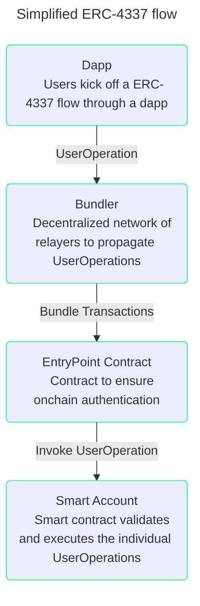

import { Grid } from '@mui/material'
import CustomCard from '../../components/CustomCard'

# What is ERC-4337?

[ERC-4337](../glossary.md#erc-4337) addresses the challenges associated with account abstraction without requiring changes to the consensus-layer protocol. It serves as a transaction relayer for smart accounts like Safe. It does so by introducing a pseudo-transaction object called a `UserOperation`, which sends a transaction on behalf of the user.

Nodes in Ethereum can act as a Bundler, which picks up multiple `UserOperation`(s) and packs them into a single transaction known as a bundle transaction. The bundle transactions are then sent to a global smart contract on Ethereum (of which there is only one) called the `EntryPoint`.

ERC-4337 enhances usability by introducing paymasters. This decentralized mechanism allows users to pay gas fees using ERC-20 tokens (like USDC) instead of native tokens like ETH or to seek a third party to cover their gas fees entirely.

ERC-4337 is currently under development and still needs to be finalized, so developers should pay attention to new changes that may occur.

## Why ERC-4337?

ERC-4337 provides a bunch of benefits along with all the inherent advantages of utilizing smart accounts:

<Grid container spacing={2} display="flex" alignContent="flex-start" mt={3}>
  <Grid item xs={12} md={4}>
    <CustomCard
      title={'Flexibility of payments'}
      description={
        'Users can decide how to pay the gas fees. Use native tokens like ETH, ERC-20 tokens, or even sponsored transactions.'
      }
      url=""
      newTab={false}
    />
  </Grid>
  <Grid item xs={12} md={4}>
    <CustomCard
      title={'Freedom of Authentication'}
      description={
        'It enables the use of different authentication mechanisms, such as multi-signature, passkeys, and future quantum-proof cryptography.'
      }
      url=""
      newTab={false}
    />
  </Grid>
  <Grid item xs={12} md={4}>
    <CustomCard
      title={'Decentralization'}
      description={
        "It's supported by various providers, avoiding lock-in to a single-relayer technology, offering an anti-fragile approach with no single point of failure."
      }
      url=""
      newTab={false}
    />
  </Grid>
</Grid>

## Further reading

- [Official documentation](https://www.erc4337.io)
- [EIP document](https://eips.ethereum.org/EIPS/eip-4337)
