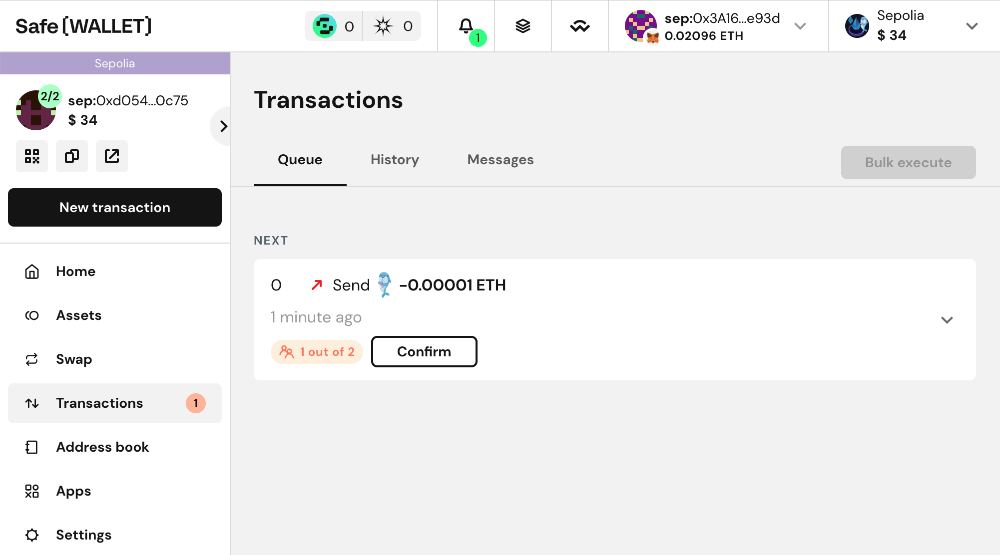
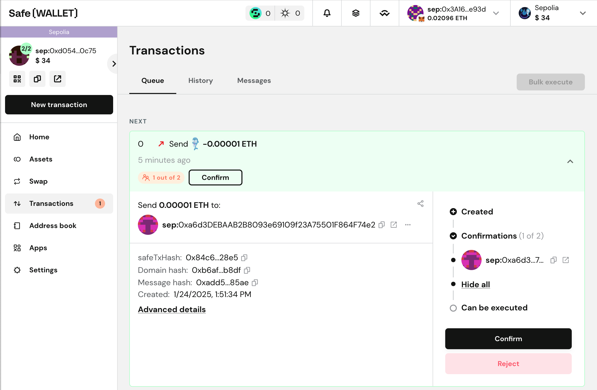

import { Steps } from 'nextra/components'

# Human approval for AI agent actions

This page describes a setup, where an autonomous agent proposes transactions, and one or more human signers approve and execute the transaction.

This setup benefits from increased security, as the Smart Account can not be compromised by convincing the agent to execute a malicious transaction.

On the other hand, it can take minutes or hours to collect the necessary approvals, which reduces the agility of this setup.

## Setup the Smart Account

For this setup, we recommend a 2-out-of-3, 3-out-of-5, or 5-out-of-7 threshold.
The important considerations are:

* The AI agent should be one signer
* The threshold should be two more, so at least one human approval is required
* The amount of signers should be higher than the threshold to make sure the Safe Smart Account is functional when one key is lost

<Steps>

Here is an example setup:

### Deploy Safe

You can add the AI agent as a signer in the [Safe Wallet](https://app.safe.global/).

You can also setup the Safe Smart Account programmatically like this:

```typescript
import Safe from '@safe-global/protocol-kit'

const AGENT_ADDRESS = // ...
const AGENT_PRIVATE_KEY = // ...
const HUMAN_SIGNER_1_ADDRESS = // ...
const HUMAN_SIGNER_2_ADDRESS = // ...
const RPC_URL = 'https://rpc.ankr.com/eth_sepolia'

const newSafe = await Safe.init({
  provider: RPC_URL,
  signer: AGENT_PRIVATE_KEY,
  safeOptions: {
    owners: [AGENT_ADDRESS, HUMAN_SIGNER_1_ADDRESS, HUMAN_SIGNER_2_ADDRESS],
    threshold: 2
  }
})
```

Here, the AI agent creates the Safe Smart Account and adds two human signers for a 2-out-of-3 setup.
The Smart Account will be deployed when the first transaction is executed.

### Assemble and propose a transaction

The AI agent can now propose transactions.
We recommend sending the transactions to the [Safe Transaction Service](./../../../core-api/transaction-service-overview.mdx).
By this, you make sure that the transactions show up in the Safe Wallet interface and can easily be checked, approved and executed by the human signers.

A simple example transaction to the zero address can be proposed like this:

```typescript
import SafeApiKit from '@safe-global/api-kit'

const apiKit = new SafeApiKit({
  chainId: 11155111n
})

const tx = await newSafe.createTransaction({
  transactions: [
    {
      to: '0x0000000000000000000000000000000000000000',
      data: '0x',
      value: '0'
    }
  ]
})

// Every transaction has a Safe (Smart Account) Transaction Hash different than the final transaction hash
const safeTxHash = await newSafe.getTransactionHash(tx)
// The AI agent signs this Safe (Smart Account) Transaction Hash
const signature = await newSafe.signHash(safeTxHash)

// Now the transaction with the signature is sent to the Transaction Service with the Api Kit:
await apiKit.proposeTransaction({
  safeAddress: safeAddress,
  safeTransactionData: tx.data,
  safeTxHash,
  senderSignature: signature.data,
  senderAddress: AGENT_ADDRESS
})
```

## Approve and execute the transactions

The transactions will now show up in the transaction interface of the [Safe Wallet](https://app.safe.global).
The human signers now have to connect their Metamask, and approve and/or execute the transactions with a click.
They can also use the [Mobile App](https://help.safe.global/en/articles/40844-sign-transactions) to sign the transactions.

In the Safe Wallet, the human signers will see the transaction in the queued transaction view:



And can either add a signature or execute the transaction when enough signatures were collected:



</Steps>

## Next steps
Now your AI agent is equipped with a Safe Smart Account and you are in full control of the transactions.
We are exited to see what you will build.

If you have a technical question, feel free to reach out on [Stack Exchange](https://ethereum.stackexchange.com/questions/tagged/safe-core) with the safe-core tag.