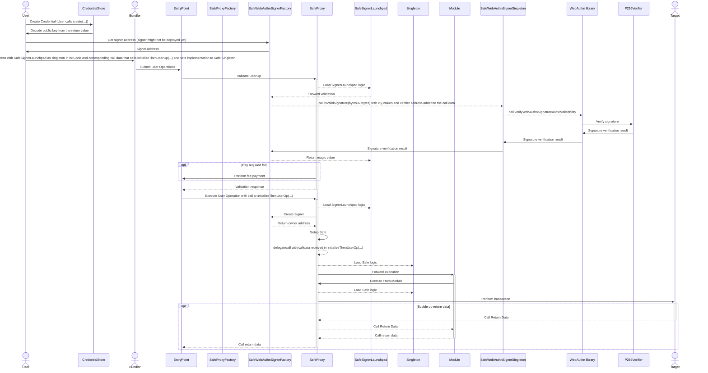

import { Callout } from 'nextra/components'

# Safe and Passkeys

<Callout type="info" emoji="ℹ️">
  Passkeys are compatible with Safe versions `>1.3.0`.
</Callout>

Safe's standard-agnostic nature allows adding or removing user flows, such as custom signature verification logic. This flexibility facilitates the integration of a Passkeys-based execution flow into a Safe. Safe passkey contracts conform to both ERC-1271 and WebAuthn standards, enabling the verification of signatures for WebAuthn credentials that use the `secp256r1` curve. 

These contracts can utilize EIP-7212 precompiles for signature verification on supported networks or alternatively employ any verifier contract as a fallback mechanism.

## Passkey contracts

<Callout type="info" emoji="ℹ️">
  This section covers implementation details of the passkeys with Safe. If you'd rather get straight to building, head over to our [guides](./passkeys-guides/safe-sdk) and [tutorials](./passkeys-tutorials/safe-passkeys-tutorial) sections.
</Callout>

### `SafeWebAuthnSignerProxy`

A proxy contract is uniquely deployed for each `Passkey` signer. The signer information, such as Public key coordinates, Verifier address, and Singleton address, is immutable. All calls to the signer are forwarded to the `SafeWebAuthnSignerSingleton` contract.

`SafeWebAuthnSignerProxy` provides gas savings compared to the whole contract deployment for each signer creation. 

`SafeWebAuthnSignerProxy` and `SafeWebAuthnSignerSingleton` use no storage slots to avoid storage access violations defined in ERC-4337. Check [this PR](https://github.com/safe-global/safe-modules/pull/370) for details on gas savings. This non-standard proxy contract appends signer information, like public key coordinates and verifier data, to the call data before forwarding the calls to the singleton contract.

### `SafeWebAuthnSignerSingleton`

`SafeWebAuthnSignerSingleton` is a singleton contract that implements the ERC-1271 interface to support signature verification. It enables signature data to be forwarded from a Safe to the `WebAuthn` library. This contract expects the caller to append public key coordinates and the verifier address (inspired by [ERC-2771](https://eips.ethereum.org/EIPS/eip-2771)).

### `SafeWebAuthnSignerFactory`

The `SafeWebAuthnSignerFactory` contract deploys the `SafeWebAuthnSignerProxy` contract with the public key coordinates and verifier information. The factory contract also supports signature verification for the public key and signature information without deploying the signer contract, which is used during the validation of ERC-4337 user operations by the experimental `SafeSignerLaunchpad` contract. 

New signers can be deployed using the [ISafeSignerFactory](https://github.com/safe-global/safe-modules/blob/466a9b8ef169003c5df856c6ecd295e6ecb9e99d/modules/passkey/contracts/interfaces/ISafeSignerFactory.sol) interface and this factory contract address.

### `WebAuthn`

This library generates a signing message, hashing it, and forwards the call to the verifier contract. The `WebAuthn` library defines a `Signature` struct containing `authenticatorData` and `clientDataFields`, followed by the ECDSA signature's `r` and `s` components. 

The `authenticatorData` and `clientDataFields` are required for generating the signing message. The `bytes` signature received in the `verifySignature(...)` function is cast to the `Signature` struct, so the caller has to take into account formatting the signature bytes as expected by the `WebAuthn` library.
The code snippet below shows signature encoding for verification using the WebAuthn library.

```
bytes authenticatorData = ...;
string clientDataFields = ...;
uint256 r = ...;
uint256 s = ...;
// Encode the signature data
bytes memory signature = abi.encode(authenticatorData, clientDataFields, r, s);
```

### `P256`

`P256` is a library for P256 signature verification with contracts that follow the EIP-7212 EC verify precompile interface. This library defines a custom type `Verifiers`, which encodes two addresses into a single `uint176`. The first address (2 bytes) is a precompile address dedicated to verification, and the second (20 bytes) is a fallback address. 

This setup allows the library to support networks where the precompile is not yet available. It seamlessly transitions to the precompile when it becomes active while relying on a fallback contract address in the meantime.

## Setup and execution flow



## Further reading

- [Passkeys module](https://github.com/safe-global/safe-modules/blob/466a9b8ef169003c5df856c6ecd295e6ecb9e99d/modules/passkey/README.md)
- [Safe and Passkeys demo application](https://github.com/safe-global/safe-modules/tree/main/examples/4337-passkeys)
- [4337 support for passkeys](https://github.com/safe-global/safe-modules/tree/main/modules/passkey/contracts/4337)