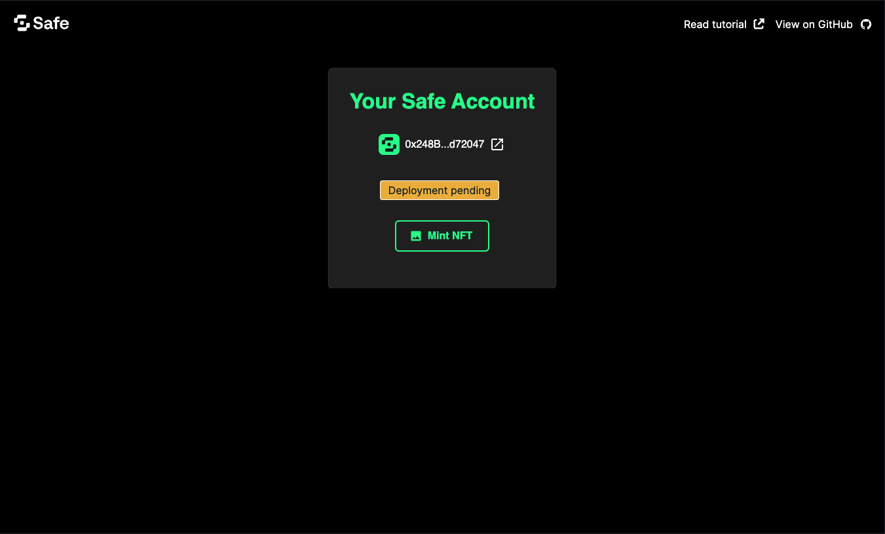

import { Callout } from 'nextra/components'

# How to build a Vue app with Safe and passkeys

An increasing number of applications rely on passkeys to authenticate users securely and with little friction. Security and user-friendliness are crucial to making web3 a reality for the next billion users.
Being able to unlock a Safe Smart Account with your fingerprints or Face ID, sending transactions without worrying about third-party wallet interfaces, phishing attempts, or securing seed phrases will bring new forms of ownership to the connected world.
Today, we'll learn how to make this a reality using [Safe\{Core\} SDK](../../sdk/overview.mdx), [Pimlico](https://www.pimlico.io/), and [Nuxt](https://nuxt.com/docs/getting-started/introduction).

This tutorial will demonstrate creating a web app for using [passkeys](../passkeys-overview.mdx) in your Safe. This app will allow you to:

- Create a new passkey secured by the user's device.
- Deploy a new Safe on Ethereum Sepolia for free.
- Sign a transaction to mint an NFT using the previously created passkey.


## **What you'll need**

**Prerequisite knowledge:** You will need some basic experience with [Vue](https://vuejs.org/guide/introduction.html), Nuxt, and [ERC-4337](../../advanced/erc-4337/overview.mdx).

Before progressing with the tutorial, please make sure you have:

- Downloaded and installed [Node.js](https://nodejs.org/en/download/package-manager) and [pnpm](https://pnpm.io/installation).
- Created an API key from [Pimlico](https://www.pimlico.io/).

**Note:** If you wish to follow along using the completed project, you can [check out the GitHub repository](https://github.com/5afe/safe-passkeys-nuxt) for this tutorial.

## 1. Setup a Nuxt application

Initialize a new Nuxt app using pnpm with the following command:

```bash
pnpm dlx nuxi@latest init safe-passkeys-nuxt -t ui
```

When prompted by the CLI, select `pnpm` and `yes` to initialize a Git repository.

### Install dependencies

For this project, we'll use the [Relay Kit](../../sdk/relay-kit.mdx) and [Protocol Kit](../../sdk/protocol-kit.mdx) from the Safe\{Core\} SDK to set up a Safe, sponsor a transaction, and use [viem](https://www.npmjs.com/package/viem) for a helper function to encode the dummy transaction. We will also use [`@pinia/nuxt`](https://pinia.vuejs.org/) for state management and node polyfills from [Vite](https://www.npmjs.com/package/vite-plugin-node-polyfillFs).

Run the following command to add all these dependencies to the project:

```bash
pnpm add @safe-global/protocol-kit @safe-global/relay-kit viem @pinia/nuxt vite-plugin-node-polyfills
```

Replace the content of `nuxt.config.ts` with the following code:

```ts
// from ../../../examples/passkeys-vue/nuxt.config.ts
```

Now, create a file named `.env` at the root of your project, and add your Pimlico API key to it:

```bash
echo "NUXT_PUBLIC_PIMLICO_API_KEY='your_pimlico_api_key_goes_here'" > .env
```

### Run the development server

Run the local development server with the following command:

```bash
pnpm dev
```

Go to `http://localhost:3000` in your browser to see the default Nuxt application.


## 2. Add project constants and utilities

Create a `utils` folder at the project root and add a file `constants.ts` containing common constants used throughout the project:

```bash
mkdir utils
cd utils
touch constants.ts
```

Add the following code to the `constants.ts` file:

```tsx
// from ../../../examples/passkeys-vue/utils/constants.ts
```

## 3. Add passkeys functionality

In the `utils` folder, create a file called `passkeys.ts`:

```bash
touch passkeys.ts
```

This file will contain all the logic required to operate passkey:

- Create and recover them using the user's device.
- Store and retrieve them from/to the local storage.

**Note:** You can also store the passkeys on a remote database or the user's device.

```tsx
// from ../../../examples/passkeys-vue/utils/passkeys.ts
```

In this file, we have four functions:

- `createPasskey`, which helps create a new passkey.
- `storePasskeyInLocalStorage`, which helps store it in the browser's local storage.
- `loadPasskeysFromLocalStorage`, which helps load a passkey from local storage.
- `getPublicKeyFromLocalStorage`, which helps find a passkey in the local storage corresponding to a given `rawId` and returns this passkey's public key.
- `getPasskeyFromRawId`, which helps reconstruct a full passkey from a `rawId` and a public key stored in local storage.

## 4. Add mint NFT functionality

Create a `mintNFT.ts` file in the `utils` folder to add functions to prepare and send a transaction minting an NFT from our yet-to-come Safe.

```tsx
touch mintNFT.ts
```

Add the following code to the `mintNFT.ts` file:

```tsx
// from ../../../examples/passkeys-vue/utils/mintNFT.ts
```

With this configuration, a new Safe will be created (but not yet deployed) when a passkey is selected. This Safe will be deployed when its first transaction is executed.

**Note:** Minting an NFT was chosen here just as an example, and any other transaction would have the same effect.

## 5. Add a state store

We will use Pinia to manage the state of our app. Pinia allows to gracefully handle state changes across wider applications, which is why we'll be using it for this tutorial.

Create a `stores` folder at the project root and add a file `safe.ts`:

```bash
cd ..
mkdir stores
cd stores
touch safe.ts
```

Add the following code to the `safe.ts` file:

```tsx
// from ../../../examples/passkeys-vue/stores/safe.ts
```

## 6. Add UI components

Let's add a user interface to create and store a passkey on the user's device, deploy a safe, and sign the NFT transaction.

In the `components` folder at the project root, create a file named `LoginWithPasskey.vue`:

```bash
cd ../components
touch LoginWithPasskey.vue
```

Add the following code to the `LoginWithPasskey.vue` file:

```tsx
// from ../../../examples/passkeys-vue/components/LoginWithPasskey.vue
```

This component is an authentication modal allowing users to either signing in by creating a new passkey, or logging in with an existing one.

Next, create a `SafeAccountDetails.vue` file in the same folder:

```bash
touch SafeAccountDetails.vue
```

Add the following code to the `SafeAccountDetails.vue` file:

```tsx
// from ../../../examples/passkeys-vue/components/SafeAccountDetails.vue
```

This component displays the details of the Safe account, including the Safe address, whether it is deployed, and a button to mint the NFT.

Lastly, replace the content of the `app.vue` file at the project root with this code:

```tsx
// from ../../../examples/passkeys-vue/app.vue
```

This UI will put everything we built in the previous steps into a coherent application with all the functionality required to let you create a passkey, select it, and use it to sign a transaction.

## 7. Add styling

Because a web app is nothing without good styling, let's add some Safe design to our project 💅.

Create a `layouts` folder, and inside it create a new file `default.vue` with this code:

```tsx
// from ../../../examples/passkeys-vue/layouts/default.vue
```

Finally, in the `public` folder, add three icons. You can also find them in the project's GitHub repository: [`safe.svg`](https://github.com/5afe/safe-passkeys-nuxt/blob/main/public/safe.svg), [`github.svg`](https://github.com/5afe/safe-passkeys-nuxt/blob/main/public/github.svg/), and [`external-link.svg`](https://github.com/5afe/safe-passkeys-nuxt/blob/main/public/external-link.svg).

## Testing your Safe passkeys app

That's it! You can find the source code for the example created in this tutorial [on GitHub](https://github.com/5afe/safe-passkeys-nuxt). You can now return to your browser and see the app displayed 🎉.


Click the **Create a new passkey** button to prompt a browser pop-up asking you to confirm the creation of a new passkey. This passkey will be stored in your browser's local storage and displayed in the list above the button.

This will create a new Safe object in the background, which will be deployed when you click the **Mint NFT** button. This will also mint an NFT using the passkey you created.



Click the link to Jiffy Scan to see the UserOp that was sent and more complete information.

## Best practices

Please be mindful of certain security considerations when dealing with passkeys. For the tutorial's simplicity, we created a 1/1 Safe with a passkey as the sole signer. This is not recommended for production setups, as passkeys are tied to a domain name, and they can also be tied to hardware manufacturers. For that reason, they might become inaccessible if not configured or saved properly. 

**Note:** Please always use a combination of passkeys and other authentication methods to ensure the security of your users' assets.

## Do more with Safe and passkeys

We learned how to use passkeys (create them, store them, and use them securely) and how they can interact with a Safe (deploy it and send transactions). We hope you enjoyed this tutorial and that the combination of passkeys and the ERC-4337 will unlock new forms of ownership for your project and users.

You can now integrate passkeys with more transactions and functionalities of the Safe ecosystem. You can read more about passkeys in our [overview](../passkeys-overview.mdx) or in the [WebAuthn API documentation](https://developer.mozilla.org/en-US/docs/Web/API/Web_Authentication_API).

Did you encounter any difficulties? Let us know by opening [an issue](https://github.com/5afe/safe-passkeys-nuxt/issues/new) or asking a question on [Stack Exchange](https://ethereum.stackexchange.com/questions/tagged/safe-core) with the `safe-core` tag.
