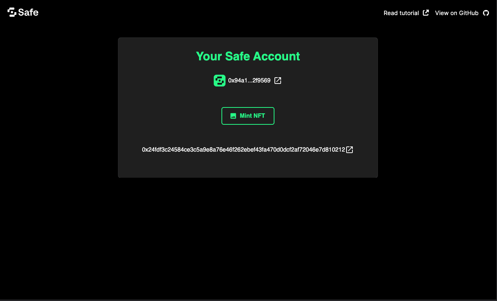

# How to build an app with Safe and passkeys

An increasing number of applications rely on passkeys to authenticate users securely and with little friction. Security and user-friendliness are crucial to making web3 a reality for the next billion users.
Being able to unlock a Safe Smart Account with your fingerprints or Face ID, sending transactions without worrying about third-party wallet interfaces, phishing attempts, or securing seed phrases will bring new forms of ownership to the connected world.
Today, we'll learn how to make this a reality using [Safe\{Core\} SDK](../../sdk/overview.mdx), [Pimlico](https://www.pimlico.io/), and [Next.js](https://nextjs.org/docs).

This tutorial will demonstrate creating a web app for using [passkeys](../passkeys-overview.mdx) in your Safe. This app will allow you to:
- Create a new passkey secured by the user’s device.
- Deploy a new Safe on Ethereum Sepolia for free.
- Sign a transaction to send USDC using the previously created passkey.

## **What you’ll need**

**Prerequisite knowledge:** You will need some basic experience with [React](https://react.dev/learn), Next.js, and [ERC-4337](https://docs.safe.global/home/4337-overview).

Before progressing with the tutorial, please make sure you have:

- Downloaded and installed [Node.js](https://nodejs.org/en/download/package-manager) and [pnpm](https://pnpm.io/installation).
- Created an API key from [Pimlico](https://www.pimlico.io/).

**Note:** If you wish to follow along using the completed project, you can [check out the GitHub repository](https://github.com/5afe/safe-passkeys-tutorial) for this tutorial.

## 1. Setup a Next.js application

Initialize a new Next.js app using pnpm with the following command:

```bash
pnpm create next-app
```

When prompted by the CLI:

- Select `yes` to TypeScript, ESLint, and App router.
- Select `no` to all other questions (Tailwind, `src` directory, and import aliases).

### Install dependencies

For this project, we’ll use the [Relay Kit from the Safe\{Core\} SDK](../../sdk/relay-kit.mdx) to set up a Safe, sponsor a USDC transaction, and use `viem` and `buffer` for some helper functions.

Run the following command to add all these dependencies to the project:

```bash
pnpm add @safe-global/relay-kit@3.1.0-alpha.0 buffer viem
```

Now, create a file named `.env.local` at the root of your project, and add your Pimlico API key to it:

```bash
echo "NEXT_PUBLIC_PIMLICO_API_KEY='your_pimlico_api_key_goes_here'" > .env.local
```

### Run the development server

Run the local development server with the following command:

```bash
pnpm dev
```

Go to `http://localhost:3000` in your browser to see the default Next.js application.


## 2. Add project constants and utilities

Create a `lib` folder at the project root and add a file `constants.ts` containing common constants used throughout the project:

```bash
mkdir lib
cd lib
touch constants.ts
```

Add the following code to the `constants.ts` file:

```tsx
export const STORAGE_PASSKEY_LIST_KEY = 'passkeyList' // Variable name that passkeys will be stored under in local storage
export const RPC_URL = 'https://ethereum-sepolia-rpc.publicnode.com'
export const CHAIN_NAME = 'sepolia'
export const usdcTokenAddress = '0x1c7D4B196Cb0C7B01d743Fbc6116a902379C7238' // SEPOLIA
export const paymasterAddress = '0x0000000000325602a77416A16136FDafd04b299f' // SEPOLIA
export const BUNDLER_URL = `https://api.pimlico.io/v1/${CHAIN_NAME}/rpc?apikey=${process.env.NEXT_PUBLIC_PIMLICO_API_KEY}`
export const PAYMASTER_URL = `https://api.pimlico.io/v2/${CHAIN_NAME}/rpc?apikey=${process.env.NEXT_PUBLIC_PIMLICO_API_KEY}`
```

In the same `lib` folder, create a `utils.ts` file:

```bash
touch utils.ts
```

Add the following code to the `utils.ts` file:

```tsx
import { Buffer } from 'buffer'

export const bufferToString = (buffer: ArrayBuffer): string =>
  Buffer.from(buffer).toString('hex')

export function hexStringToUint8Array(hexString: string): Uint8Array {
  const arr = []
  for (let i = 0; i < hexString.length; i += 2) {
    arr.push(parseInt(hexString.substr(i, 2), 16))
  }
  return new Uint8Array(arr)
}
```

This file contains two utilities for manipulating passkey objects from the native [`navigator.credentials`](https://developer.mozilla.org/en-US/docs/Web/API/Navigator/credentials) API:

- `bufferToString`: Helps us read the passkeys properties (returned by the browser) as strings.
- `hexStringToUint8Array`: Helps us pass string arguments to the `credentials` API.

## 3. Add passkeys functionality

In the `lib` folder, create a file called `passkeys.ts` :

```bash
touch passkeys.ts
```

This file will contain all the logic required to operate passkey:

- Create and recover them using the user’s device.
- Store and retrieve them from/to the local storage.

**Note:** You can also store the passkeys on a remote database or the user’s device.

```tsx
import { PasskeyArgType } from '@safe-global/protocol-kit'

import { STORAGE_PASSKEY_LIST_KEY } from './constants'
import { bufferToString, hexStringToUint8Array } from './utils'

export type PasskeyItemType = { rawId: string; publicKey: string }

export async function createPasskey(): Promise<PasskeyArgType> {
  const label = 'Safe Owner' // This can be customized to match, for example, a user name.
  // Generate a passkey credential using WebAuthn API
  const passkeyCredential = await navigator.credentials.create({
    publicKey: {
      pubKeyCredParams: [
        {
          // ECDSA w/ SHA-256: https://datatracker.ietf.org/doc/html/rfc8152#section-8.1
          alg: -7,
          type: 'public-key'
        }
      ],
      challenge: crypto.getRandomValues(new Uint8Array(32)),
      rp: {
        name: 'Safe SmartAccount'
      },
      user: {
        displayName: label,
        id: crypto.getRandomValues(new Uint8Array(32)),
        name: label
      },
      timeout: 60_000,
      attestation: 'none'
    }
  })

  if (!passkeyCredential) {
    throw Error('Passkey creation failed: No credential was returned.')
  }

  console.log('passkeyCredential: ', passkeyCredential)

  const passkey = passkeyCredential as PublicKeyCredential
  const attestationResponse =
    passkey.response as AuthenticatorAttestationResponse

  const rawId = passkey.rawId
  const publicKey = attestationResponse.getPublicKey()

  if (!publicKey) {
    throw new Error('getPublicKey error')
  }

  return {
    rawId,
    publicKey
  }
}

export function storePasskey(passkey: PasskeyArgType) {
  const passkeys = loadPasskeys()

  const newPasskeyItem = {
    rawId: bufferToString(passkey.rawId),
    publicKey: bufferToString(passkey.publicKey)
  }

  passkeys.push(newPasskeyItem)

  localStorage.setItem(STORAGE_PASSKEY_LIST_KEY, JSON.stringify(passkeys))
}

export function loadPasskeys(): PasskeyItemType[] {
  const passkeysStored = localStorage.getItem(STORAGE_PASSKEY_LIST_KEY)

  const passkeyIds = passkeysStored ? JSON.parse(passkeysStored) : []

  return passkeyIds
}

function getPublicKeyFromLocalStorage(passkeyRawId: string): ArrayBuffer {
  const passkeys = loadPasskeys()

  const { publicKey } = passkeys.find(
    (passkey: PasskeyItemType) => passkey.rawId === passkeyRawId
  )!

  return hexStringToUint8Array(publicKey)
}

export async function getPasskeyFromRawId(
  passkeyRawId: string
): Promise<PasskeyArgType> {
  const passkeyCredentials = (await navigator.credentials.get({
    publicKey: {
      allowCredentials: [
        {
          id: hexStringToUint8Array(passkeyRawId),
          type: 'public-key'
        }
      ],
      challenge: crypto.getRandomValues(new Uint8Array(32)),
      userVerification: 'required'
    }
  })) as PublicKeyCredential

  const publicKey = getPublicKeyFromLocalStorage(passkeyRawId)

  const passkey = {
    rawId: passkeyCredentials.rawId,
    publicKey
  }

  return passkey
}
```

In this file, we have four functions:

- `createPasskey`, which helps create a new passkey.
- `storePasskeyInLocalStorage`, which helps store it in the browser’s local storage.
- `loadPasskeysFromLocalStorage`, which helps load a passkey from local storage.
- `getPublicKeyFromLocalStorage`, which helps find a passkey in the local storage corresponding to a given `rawId` and returns this passkey’s public key.
- `getPasskeyFromRawId`, which helps reconstruct a full passkey from a `rawId` and a public key stored in local storage.

## 4. Add USDC transaction functionality

Create a `usdc.ts` file in the `lib` folder to add functions to prepare and send a transaction transferring USDC from our yet-to-come safe.

```tsx
touch usdc.ts
```

Add the following code to the `usdc.ts` file:

```tsx
import { encodeFunctionData, parseAbi } from 'viem'
import { Safe4337Pack } from '@safe-global/relay-kit'
import { PasskeyArgType } from '@safe-global/protocol-kit'

import {
  BUNDLER_URL,
  CHAIN_NAME,
  PAYMASTER_URL,
  RPC_URL,
  paymasterAddress,
  usdcTokenAddress
} from '../constants'

const paymasterOptions = {
  isSponsored: true,
  paymasterAddress,
  paymasterUrl: PAYMASTER_URL
}

const generateTransferCallData = (to: `0x${string}`, value: bigint) => {
	const abi = parseAbi([”function transfer(address _to, address _from) returns (bool)”])
  return encodeFunctionData({
    abi,
    functionName: 'transfer',
    args: [to, value]
  })
}

export const executeUSDCTransfer = async ({
  signer,
  safeAddress
}: {
  signer: PasskeyArgType
  safeAddress: string
}) => {
  const safe4337Pack = await Safe4337Pack.init({
    provider: RPC_URL,
    rpcUrl: RPC_URL,
    signer,
    bundlerUrl: BUNDLER_URL,
    paymasterOptions,
    options: {
      owners: [
        /* Other owners... */
      ],
      threshold: 1
    }
  })

  const usdcAmount = 100_000n // 0.1 USDC

  const transferUSDC = {
    to: usdcTokenAddress,
    data: generateTransferCallData(safeAddress!, usdcAmount),
    value: '0'
  }

  const safeOperation = await safe4337Pack.createTransaction({
    transactions: [transferUSDC]
  })

  const signedSafeOperation = await safe4337Pack.signSafeOperation(
    safeOperation
  )

  console.log('SafeOperation', signedSafeOperation)

  const userOperationHash = await safe4337Pack.executeTransaction({
    executable: signedSafeOperation
  })

  console.log(
    `https://jiffyscan.xyz/userOpHash/${userOperationHash}?network=${CHAIN_NAME}`
  )
}
```

With this configuration, a new Safe will be created (but not yet deployed) when a passkey is selected. This Safe will be deployed when its first transaction is executed.

**Note:** Transferring USDC was chosen here just as an example, and any other transaction would have the same effect.

## 5. Add UI components

Let’s add a user interface to create and store a passkey on the user’s device, deploy a safe, and sign the USDC transaction.

Create a `components` folder at the project root with a file named `PasskeyList.tsx`:

```bash
cd ..
mkdir components
cd components
touch Passkeylist.tsx
```

Add the following code to the `PasskeyList.tsx` file:

```tsx
import { useEffect, useState } from 'react'

import {
  createPasskey,
  loadPasskeysFromLocalStorage,
  storePasskeyInLocalStorage,
  type PasskeyItemType
} from '../lib/passkeys'

type Props = {
  selectPasskeySigner: (rawId: string) => void
}

function PasskeyList ({ selectPasskeySigner }: Props) {
  const [passkeyList, setPasskeyList] = useState<PasskeyItemType[]>()

  async function handleSubmit () {
    const passkey = await createPasskey()
    storePasskeyInLocalStorage(passkey)
    refreshPasskeyList()
  }

  function refreshPasskeyList () {
    const passkeys = loadPasskeysFromLocalStorage()
    setPasskeyList(passkeys)
  }

  useEffect(() => {
    refreshPasskeyList()
  }, [])

  return (
    <>
      <h3>Create new Passkey</h3>
      <button onClick={handleSubmit}>Add New Passkey</button>{' '}
      <h2>Passkey List</h2>
      {passkeyList?.map(passkey => (
        <div
          style={{ overflow: 'hidden', textOverflow: 'ellipsis' }}
          key={passkey.rawId}
        >
          Id: {passkey.rawId}{' '}
          <button onClick={() => selectPasskeySigner(passkey.rawId)}>
            Select
          </button>
        </div>
      ))}
    </>
  )
}

export default PasskeyList

```

This component displays a list of previously created passkeys and a button for creating new ones.

Lastly, replace the content of the `page.tsx` file, within the `app` folder, with this code:

```tsx
'use client'

import { useState } from 'react'
import { Safe4337Pack } from '@safe-global/relay-kit'
import Img from 'next/image'

import PasskeyList from '../components/PasskeyList'
import { executeUSDCTransfer } from '../lib/usdc'
import { getPasskeyFromRawId, type PasskeyArgType } from '../lib/passkeys'
import { BUNDLER_URL, CHAIN_NAME, RPC_URL } from '../lib/constants'
import { bufferToString } from '../lib/utils'

function Create4337SafeAccount () {
  const [selectedPasskey, setSelectedPasskey] = useState<PasskeyArgType>()
  const [safeAddress, setSafeAddress] = useState<string>()
  const [isSafeDeployed, setIsSafeDeployed] = useState<boolean>()
  const [userOp, setUserOp] = useState<string>()

  const selectPasskeySigner = async (rawId: string) => {
    console.log('selected passkey signer: ', rawId)

    const passkey = await getPasskeyFromRawId(rawId)

    const safe4337Pack = await Safe4337Pack.init({
      provider: RPC_URL,
      rpcUrl: RPC_URL,
      signer: passkey,
      bundlerUrl: BUNDLER_URL,
      options: {
        owners: [],
        threshold: 1
      }
    })

    const safeAddress = await safe4337Pack.protocolKit.getAddress()
    const isSafeDeployed = await safe4337Pack.protocolKit.isSafeDeployed()

    setSelectedPasskey(passkey)
    setSafeAddress(safeAddress)
    setIsSafeDeployed(isSafeDeployed)
  }

  return (
    <>
      <div
        style={{
          width: '50%'
        }}
      >
        {selectedPasskey && (
          <>
            <h2>Passkey Selected</h2>

            <div style={{ overflow: 'hidden', textOverflow: 'ellipsis' }}>
              {bufferToString(selectedPasskey.rawId)}
            </div>
          </>
        )}
        <PasskeyList selectPasskeySigner={selectPasskeySigner} />
      </div>
      {safeAddress && (
        <div
          style={{
            width: '50%'
          }}
        >
          <h2>Safe Account</h2>

          <div style={{ overflow: 'hidden', textOverflow: 'ellipsis' }}>
            Address: {safeAddress}
          </div>
          <div>
            Is deployed?:{' '}
            {isSafeDeployed ? (
              <a
                href={`https://app.safe.global/transactions/history?safe=sep:${safeAddress}`}
                target='_blank'
                rel='noreferrer'
              >
                Yes{' '}
                
              </a>
            ) : (
              'No'
            )}
          </div>
          <div>
            {' '}
            <a
              href='https://faucet.circle.com/'
              target='_blank'
              rel='noreferrer'
            >
              Get some test USDC for your Safe{' '}
              
            </a>
          </div>
          {selectedPasskey && (
            <button
              onClick={async () =>
                await executeUSDCTransfer({
                  signer: selectedPasskey,
                  safeAddress
                }).then(userOpHash => {
                  setUserOp(userOpHash)
                  setIsSafeDeployed(true)
                })
              }
            >
              Sign transaction with passkey
            </button>
          )}
          {userOp && isSafeDeployed && (
            <>
              <div>
                Done! Check the transaction status on{' '}
                <a
                  href={`https://jiffyscan.xyz/userOpHash/${userOp}?network=${CHAIN_NAME}`}
                  target='_blank'
                  rel='noreferrer'
                >
                  Jiffy Scan{' '}
                  
                </a>
              </div>
            </>
          )}
        </div>
      )}
    </>
  )
}

export default Create4337SafeAccount

```

This UI will put everything we built in the previous steps into a coherent application with all the functionality required to let you create a passkey, select it, and use it to sign a transaction.

## 6. (Optional) Add styling to the app

Because a web app is nothing without good styling, let’s add some Safe design to our project 💅.

Still within the `app` folder, replace the existing content of the file `layout.ts`with this code:

```tsx
import type { Metadata } from 'next'
import { Inter } from 'next/font/google'
import Img from 'next/image'
import './globals.css'

const inter = Inter({ subsets: ['latin'] })

export const metadata: Metadata = {
  title: 'Safe Tutorial: Passkeys',
  description: 'Generated by create next app'
}

export default function RootLayout ({
  children
}: Readonly<{
  children: React.ReactNode
}>) {
  return (
    <html lang='en'>
      <body className={inter.className}>
        <nav
          style={{
            display: 'flex',
            justifyContent: 'space-between',
            padding: '1rem'
          }}
        >
          <a href='https://safe.global'>
            
          </a>
          <div style={{ display: 'flex' }}>
            <a
              href='https://docs.safe.global/home/passkeys-tutorials/safe-passkeys-tutorial'
              style={{
                display: 'flex',
                alignItems: 'center',
                marginRight: '1rem'
              }}
            >
              Read tutorial{' '}
              
            </a>
            <a
              href='https://github.com/5afe/tutorial-passkeys'
              style={{ display: 'flex', alignItems: 'center' }}
            >
              View on GitHub{' '}
              
            </a>
          </div>
        </nav>
        <div style={{ width: '100%', textAlign: 'center' }}>
          <h1>Passkeys tutorial</h1>

          <div>Create a new 4337 compatible Safe Account using passkeys</div>
        </div>
        <div
          style={{
            display: 'flex',
            alignItems: 'flex-start',
            justifyContent: 'space-between',
            marginLeft: '40px',
            marginRight: '40px'
          }}
        >
          {children}
        </div>
      </body>
    </html>
  )
}

```

In the same folder, add some margin to the titles, by adding this code at the end of the `globals.css` file:

```css
h1,
h2,
h3 {
  margin-top: 40px;
  margin-bottom: 10px;
}

button {
  cursor: pointer;
  border: none;
  background: #00E673;
  color: black;
  padding: 10px 20px;
  border-radius: 5px;
  margin: 10px 0;
}
```

Finally, in the `public` folder, add these three icons. You can find them in the project’s GitHub repository:

- [`safe.svg`](https://github.com/5afe/safe-passkeys-tutorial/blob/main/public/safe.svg)
- [`github.svg`](https://github.com/5afe/safe-passkeys-tutorial/blob/main/public/github.svg/)
- [`external-link.svg`](https://github.com/5afe/safe-passkeys-tutorial/blob/main/public/external-link.svg)

## Testing your Safe passkeys app

That’s it! You can find the source code for the example created in this tutorial [on GitHub](https://github.com/5afe/safe-passkeys-tutorial). You can now return to your browser and see the app displayed 🎉.


Click the **Add New Passkey** button to prompt a browser pop-up asking you to confirm the creation of a new passkey. This passkey will be stored in your browser’s local storage and displayed in the list above the button.

Once confirmed, select this passkey by clicking **Select** next to it. This will prompt another pop-up window, this time asking to confirm the use of the previously created passkey.



At this stage, the app will have created a safe object awaiting deployment. Send some USDC to your future safe by clicking the link to [Circle's USDC faucet](https://faucet.circle.com/) for Sepolia and entering the Safe's address. By clicking **Sign transaction with passkey**, the deployment of this safe will then be embedded in a batch transaction, along with the transfer of USDC.
Open the console to see the UserOp that was sent or click the link provided to Jiffy scan for more complete information.


## Do more with Safe and passkeys

Today, we learned how to use passkeys (create them, store them, and use them securely) and how they can interact with a Safe (deploy it and send transactions). We hope you enjoyed this tutorial and that the combination of passkeys and 4337 will unlock new forms of ownership for your project and users.

You can now integrate passkeys with more transactions and functionalities of the Safe ecosystem. You can read more about passkeys in our [overview](https://docs.safe.global/home/passkeys-overview) or in the [WebAuthn API documentation on MDN](https://developer.mozilla.org/en-US/docs/Web/API/Web_Authentication_API).

Did you encounter any problems? Any difficulties? Let us know by opening [an issue](https://github.com/5afe/tutorial-passkeys/issues/new) or asking a question on [Stack Exchange](https://ethereum.stackexchange.com/questions/tagged/safe-core) with the safe-core tag.
