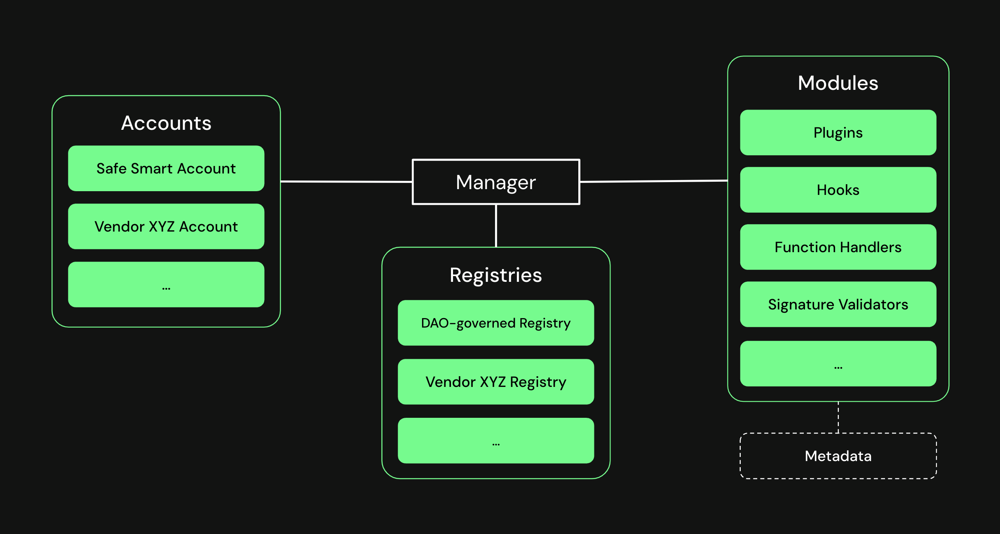

# Safe\{Core\} Protocol

Safe\{Core\} Protocol is an open, modular framework to make smart accounts secure, portable, and composable.

Safe\{Core\} Protocol aims to create a comprehensive system to enhance user interactions' safety and flexibility within the smart account ecosystem. The protocol provides a common framework for building more tools, encourages the composition of various modules, and supports different types of smart accounts. The protocol enforces rules within the smart account ecosystem to achieve interoperability and security.

## Architecture

The architecture of the Safe\{Core\} Protocol comprises several integral components, each carrying its unique responsibilities. The protocol separates these elements by defining explicit interfaces, thus allowing independent expansion and iteration of each part. This modularity ensures the sustainable growth and evolution of the smart account ecosystem.

### Manager

At the heart of the protocol is the `Manager`, ensuring adherence to the prescribed rules set by the `Registry`. The `Manager` is an intermediary layer coordinating communication and interactions between `Accounts` and `Modules`.

### Accounts

`Accounts` are smart-contract-based user accounts (or Smart Accounts). The Safe\{Core\} Protocol is account-agnostic, meaning it's not tied to a specific account implementation.

### Modules

`Modules` extend the functionality of `Accounts` in different ways. Initial `Modules` are `Plugins`, `Hooks`, `Function Handlers`, and `Signature Verifiers`.

### Registry

The `Registry` is critical in maintaining and enforcing standards and security guarantees. The `Manager` will recognize and manage only the `Modules` that adhere to these guidelines.

### Metadata

Giving `Metadata` is crucial to offer a coherent context to the various parts and their interactions. This information helps developers add context to interactions, enhancing user understanding and transparency.

## Further reading
- [Safe\{Core\} Protocol Specification](https://github.com/safe-global/safe-core-protocol-specs)
- [Safe\{Core\} Protocol Implementation](https://github.com/5afe/safe-core-protocol)
- [Safe\{Core\} Protocol Demo Application](https://github.com/5afe/safe-core-protocol-demo/)
