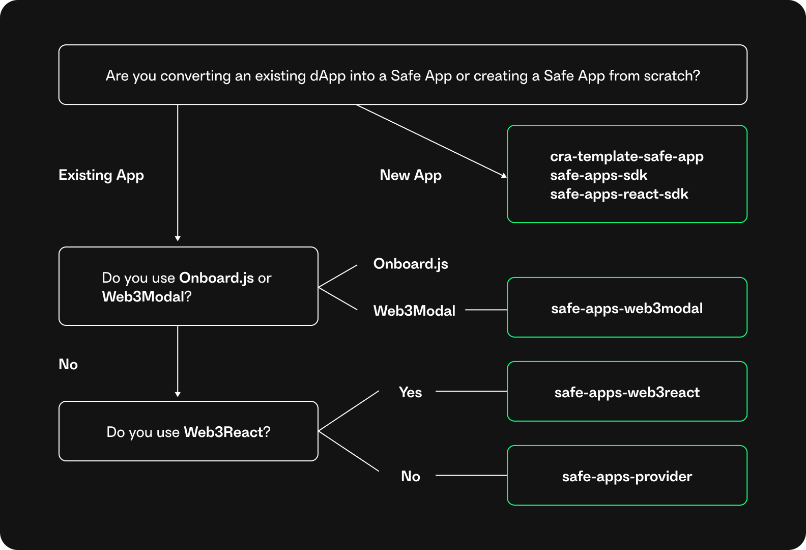

import { Callout } from 'nextra/components'

# Safe Apps SDK

The Safe Apps SDK helps developers to build their dapps into the Safe\{Wallet\}. It turns a dapp into an HTML iframe component that can be accessed through Safe. This SDK provides extensive developer tooling to make it easy to create, test, and integrate Safe Apps into Safe. This includes a design system, reusable components, and a Safe App SDK that facilitates communication between the Safe App and Safe.

## Packages

Here are several packages to make it easier to integrate third-party applications (Safe Apps) with [Safe](https://app.safe.global). Check the following diagram to see which package is suitable for you:

| Package                                                                                                          | Version                                                                                                                                 | Description                                                                                                                                                                                                                                                                                         |
| ---------------------------------------------------------------------------------------------------------------- | --------------------------------------------------------------------------------------------------------------------------------------- | --------------------------------------------------------------------------------------------------------------------------------------------------------------------------------------------------------------------------------------------------------------------------------------------------- |
| [cra-template-safe-app](https://github.com/safe-global/safe-apps-sdk/tree/main/packages/cra-template-safe-app)   |                                                                                                                                         | CRA (Create React App) template to bootstrap a Safe App. Use this package to start a new Safe App from scratch using React.                                                                                                                                                                         |
| [safe-apps-react-sdk](https://github.com/safe-global/safe-apps-sdk/tree/main/packages/safe-apps-react-sdk)       |  | A wrapper of [safe-apps-sdk](https://github.com/safe-global/safe-apps-sdk/tree/main/packages/safe-apps-sdk) with helpful React Hooks.                                                                                                                                                               |
| [safe-apps-sdk](https://github.com/safe-global/safe-apps-sdk/tree/main/packages/safe-apps-sdk)                   |              | JavaScript SDK. This is the base package for all integrations.                                                                                                                                                                                                                                      |
| [safe-apps-provider](https://github.com/safe-global/safe-apps-sdk/tree/main/packages/safe-apps-provider)         |    | A generic provider that can be used with common web3 libraries. For example, web3.js or Ethers.                                                                                                                                                                                                     |
| [safe-apps-web3modal](https://github.com/safe-global/safe-apps-sdk/tree/main/packages/safe-apps-web3modal)       |  | A wrapper around [Web3Modal](https://github.com/Web3Modal/web3modal) that would automatically connect to the Safe when the app is loaded in the Safe Apps section.                                                                                                                                  |
| [safe-apps-wagmi](https://github.com/safe-global/safe-apps-sdk/tree/main/packages/safe-apps-wagmi)               |                                                                                                                                         | A [wagmi](https://github.com/wagmi-dev/wagmi) connector for Safe Apps.                                                                                                                                                                                                                              |
| [@web3-onboard/gnosis](https://github.com/blocknative/web3-onboard/tree/v2-web3-onboard-develop/packages/gnosis) |                                                                                                                                         | Blocknative included Safe App support in [@web3-onboard](https://github.com/blocknative/web3-onboard) v1.26.0. If you are already using this package, you can [check here](https://github.com/blocknative/web3-onboard/blob/v2-web3-onboard-develop/packages/gnosis/README.md) how to configure it. |
| [@web3-react/gnosis-safe](https://github.com/Uniswap/web3-react/tree/main/packages/gnosis-safe)                  |                                                                                                                                         | [web3-react](https://github.com/Uniswap/web3-react) already includes a connector for Safe Apps by default. You can check their docs on how to use it.                                                                                                                                               |

<Callout type="warning" emoji="⚠️">
Safe Apps aren't owned, controlled, maintained, or audited by Safe. Safe can list or delist apps from Safe\{Wallet\} at its sole discretion.
</Callout>
