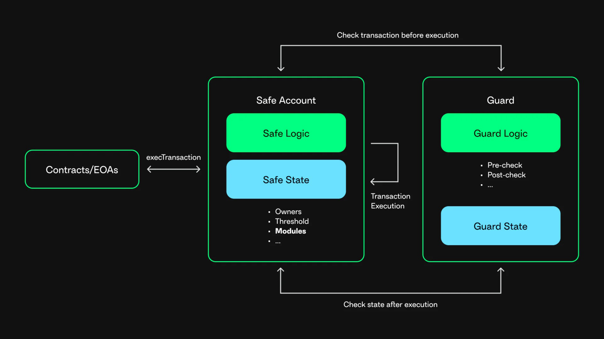

# Safe Guards


Safe Guards are introduced with [Safe contracts version 1.3.0](https://github.com/safe-global/safe-contracts/blob/v1.3.0/CHANGELOG.md).


Safe Guards are used when there are restrictions on top of the `n`-out-of-`m` scheme.

Safe Guards can make checks before and after a Safe transaction. The check before a transaction can programmatically check all the parameters of the respective transaction before execution. The check after a transaction is called at the end of the transaction execution and can be used to perform checks on the final state of the Safe.

To read about different examples of Safe Guards, see the implementations from [Zodiac](https://github.com/gnosis/zodiac-guard-scope) and [Yearn](https://mirror.xyz/yearn-finance-engineering.eth/9uInM_sCrogPBs5qkFSNF6qe-32-0XLN5bty5wKLVqU).

<figure></figure>


**Important:** Since a Safe Guard has full power to block Safe transaction execution, a broken Guard can cause a denial of service for a Safe. Make sure to audit the Guard code and pay attention to recovery mechanisms.

