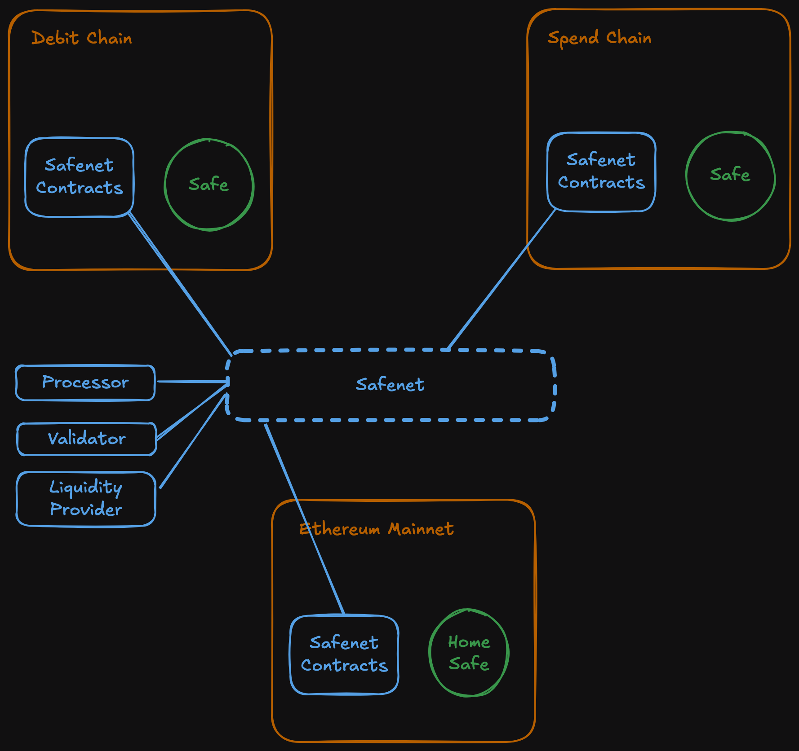

# Safenet Architecture

Safenet is a hybrid network that combines on-chain smart contracts across [multiple blockchains](./chains.mdx) and rollups with a decentralized network of off-chain actors that process transactions across these chains. 

Safenet is composed of the following key components:

### Safe Smart Accounts
Each Safenet Account is spread across multiple blockchains, with one Safe Smart Account per chain. 
Every Safenet Account is anchored by a [Home Safe Smart Account](./protocol/home-safe.mdx) deployed on the Ethereum mainnet.

### Safenet Smart Contracts
These contracts are deployed on every supported chain, with the Ethereum mainnet as the primary hub for configuration and coordination.

### Decentralized off-chain actors
Safenet introduces several key roles for off-chain transaction processing:
    * **[Processors](./core-components/processor.mdx)**: Handle the heavy lifting of processing, signing, and [settling](./concepts/settlement.mdx) [transactions](./safenet-transaction.mdx).
    * **[Validators](./core-components/validator.mdx)**: Ensure the security and correctness of transactions by validating the work of processors.
    * **[Liquidity Providers](./core-components/liquidity-provider.mdx)**: Supply liquidity on-chain to facilitate seamless transactions across different blockchains.

### External Bridges
External bridges are only used for dispute resolution when a validator challenges a Safenet transaction.

