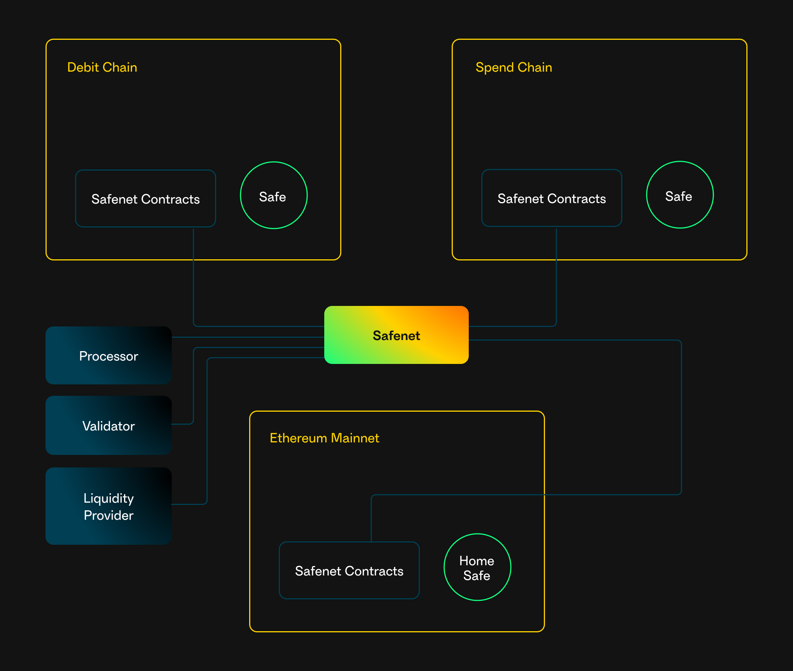

# Safenet Architecture

Safenet is a hybrid network combining on-chain smart contracts across [multiple blockchains](./chains.mdx) and rollups, alongside a decentralized network of off-chain actors that process transactions across these chains. 

Safenet is composed of the following key components:

* **Safe Smart Accounts**: Each Safenet Account is spread across multiple blockchains, with one Safe Smart Account per chain. 
Every Safenet Account is anchored by a [Home Safe Smart Account](./protocol/home-safe.mdx) deployed on Ethereum mainnet.
* **Safenet Smart Contracts**: These contracts are deployed on every supported chain, with Ethereum mainnet serving as the primary hub for configuration and coordination.
* **Decentralized off-chain actors**: Safenet introduces several key roles for off-chain transaction processing:
    * **[Processors](./core-components/processor.mdx) and [Validators](./core-components/validator.mdx)**: Handle the heavy lifting of processing, signing, validating and [settling](./concepts/settlement.mdx) [transactions](./safenet-transaction.mdx) off-chain.
    * **[Liquidity Providers](./core-components/liquidity-provider.mdx)**: Supply liquidity on-chain to facilitate seamless transactions across different blockchains.
* **External Bridges**: External bridges are only used if a validator challenges a Safenet transaction.

