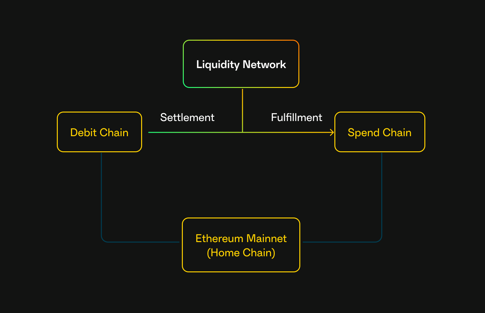

# Chains

Safenet provides a unified user experience over multiple blockchains.
Safenet connects the liquidity of multiple chains, enabling users to spend their assets on any supported chain without the need for traditional bridging.
A Safenet transaction can happen on one or multiple chains.
In a [Safenet transaction](./safenet-transaction.mdx), chains can take up the following roles:

### Spend Chain

This is where the user wants to execute an action.
Safenet makes sure the required funds are available instantly on the spend chain.
Another name is *target chain*.

### Debit Chain

This is where a user owns the required assets for the action.
The user does not have to select the debit chain, as Safenet finds the required funds over all connected chains.
Another name is *source chain*.

### Home Chain

Safenet uses Ethereum Mainnet as the home chain for configuration and coordination.
For example, the configurable set of safety guarantees for a user's Safenet account is stored on Ethereum Mainnet.

## Chains vary per transaction

For example, when a user wants to execute a transaction to spend funds on Optimism, while the funds are on Gnosis Chain, the spend chain will be Optimism, and the debit chain will be Gnosis Chain for this particular transaction.

When a user wants to execute a transaction on the same chain where the funds are, the spend chain and debit chain are the same.

Ethereum mainnet will always be Safenet's home chain.