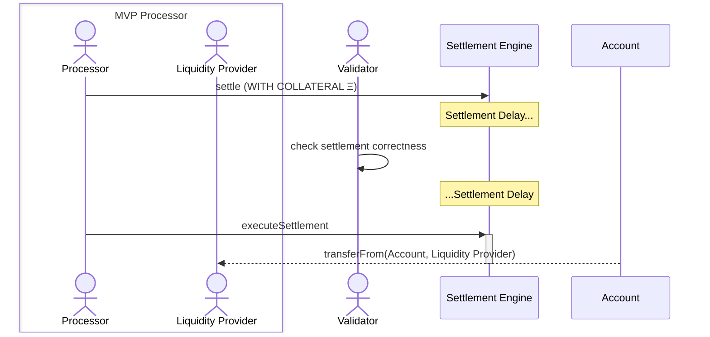
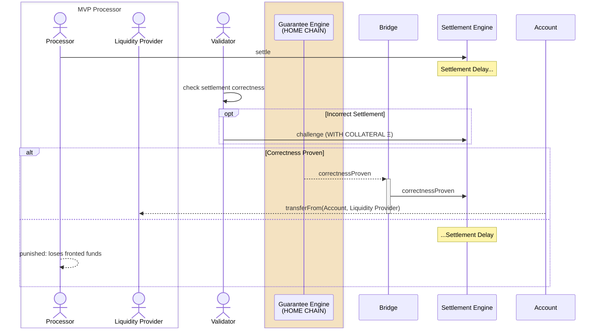
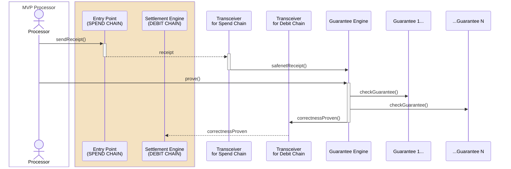

import { Callout, Steps, Tabs } from 'nextra/components'

# Settlement

Settlement is the process by which a [processor](../core-components/processor.mdx) debits funds from a [Safenet account](../core-components/safenet-account.mdx) to repay the [liquidity provider](../core-components/liquidity-provider.mdx) for the short-term loan (pre-funding) used in a [Safenet transaction](../safenet-transaction.mdx).

The [settlement engine](../protocol/settlement-engine.mdx) handles debit requests on the debit [chain](../chains.mdx) by transferring funds from the Safenet Safe to a [beneficiary](../protocol/beneficiary.mdx) designated by the liquidity provider. 
This occurs after the liquidity provider has fronted funds on the spend chain.

Once settlement is initiated, a delay period begins, during which [validators](../core-components/validator.mdx) can verify the settlement's correctness and challenge it if necessary. 
If no challenge is made during this period, the processor completes the settlement, debiting the Safe and transferring the funds to the beneficiary, which includes repayment of the liquidity provision and relayer fees.

If a validator [challenges](../concepts/challenge.mdx) the settlement, the cross-chain challenge process begins:

## Challenge Process

<Steps>

### Challenge Initiation
The validator initiates a transaction with the settlement engine to start a challenge on the debit chain, with a separate challenge delay. 
During this delay, the processor must prove the settlement's correctness.

### Correctness Proof
The processor sends an [attestation](./attestation.mdx) from the spend chain (where the Safenet transaction was executed) to the home chain to validate the settlement.

### Challenge Resolution
The processor proves the settlement's validity to the guarantee engine on the home chain, which then informs the settlement contract on the debit chain:
    * If the settlement is validated, the settlement can proceed immediately, bypassing the remaining settlement delay.
    * If the processor fails to prove the settlement's validity, the challenge delay expires, and the settlement is deemed invalid, meaning it can never be executed.
</Steps>

## Flow Diagrams

### Happy Flow

The happy flow diagram illustrates the process of a successful settlement. 
The processor initiates the settlement process by debiting the Safe and transferring funds to the beneficiary. 
The validator verifies the settlement's correctness and, if no challenge is made, the settlement is completed.

### Sad Flow

The sad flow diagram illustrates the process of a failed settlement. 
The validator challenges the settlement, and the processor must prove the settlement's validity. 
If the processor fails to provide proof, the settlement is deemed invalid, and the funds are not transferred.

### Correctness Proof (Attestation)

The correctness proof diagram illustrates the process of proving the settlement's validity. 
The processor sends information from the spend chain to the home chain, where the guarantee engine validates the settlement. 
If the settlement is proven correct, the settlement can proceed immediately.

The processor can voluntarily provide the attestation at the moment of settlement to bypass the challenge delay and ensure a faster settlement process.