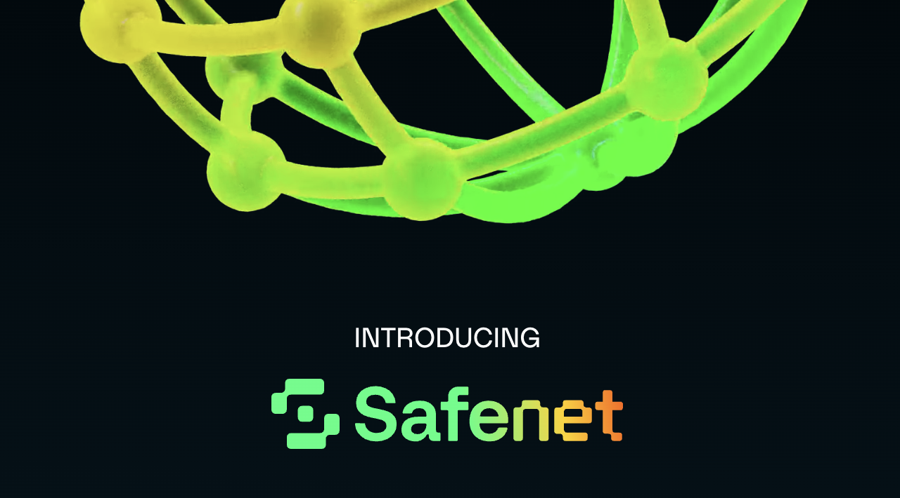

# Safenet Docs Overview

These docs provide an explanation of Safenet. They consist of four sections. 

**User and investors** are recommended to focus on the first section to get a high-level understanding in quickly. **Developers and builders** should start with the first section and then dive into the other parts to get a deeper understanding of the system.

The sections can be found on the left side of this page (on desktop), or the mobile navigation (on mobile).

Safenet is under active development and is prone to design changes. The current state of implementation and future plans can be found in the [roadmap](./roadmap.mdx). 

## Sections

**[Introduction](./introduction.mdx)**: Provides a basic understanding of what Safenet is and why it is build. This page is the entry point of the Introduction.

**[Core Components](./core-components/processor.mdx)**: Describes every part of Safenet that is not a smart contract, including the new operator roles that Safenet introduces.

**[Concepts](./concepts/settlement.mdx)**: Describes Actions and Objects of Safenet, that are used by the core components and the smart contracts.

**[Protocol](./protocol/overview.mdx)**: Describes the smart contracts deployed on the different chains.

## Next steps

It is recommended to use the arrow buttons at the bottom of this page to read the introduction section page by page. For the first-reading, readers should not follow the links, but read the introduction in the given order.