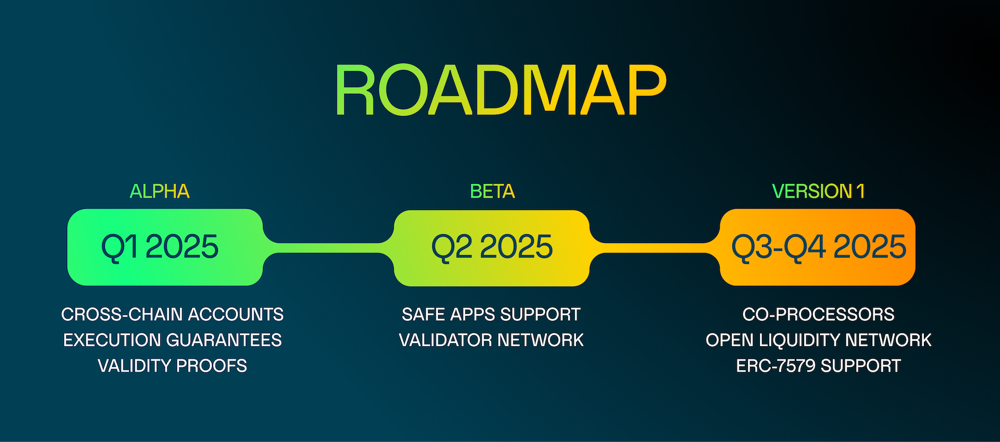

# Roadmap

A first **alpha version** of Safenet is scheduled to be released in **Q1 2025**. which includes the basic ability to generate cross-chain [accounts](./safenet-account.mdx). 
Safenet will initially be limited to certain assets and transfer limit as the liquidity network is bootstrapped.

Future development and implementation of Safenet will be subject to [SafeDAO's](./protocol/safe-dao.mdx) ratification, with the envisioned approach outlined as follows:

In **Q2 2025**, Safenet will be made compatible with apps that have integrated the [Safe Apps SDK](../sdk/overview.mdx). 

In the **second half of 2025** the focus will shift to **scaling the liquidity network and introducing third-party processors** that will unlock the real power of Safenet.
Making Safenet compatible with ERC-7579 will further increase its reach and composability.