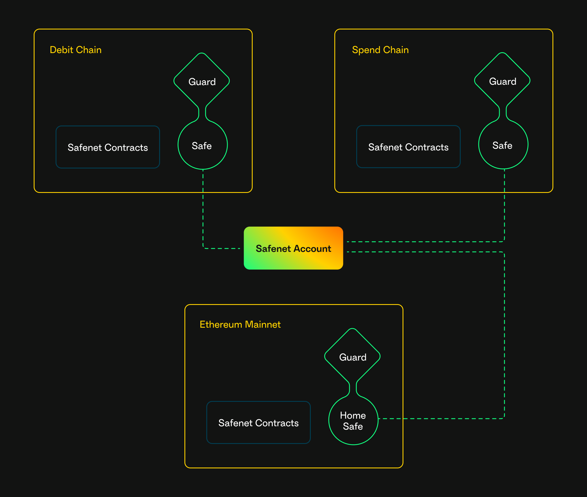

# Safenet Account

A Safenet account is a network of [Safe Smart Accounts](../home/what-is-safe.mdx) deployed on multiple [chains](./chains.mdx).
A Safe Smart Account is connected to a Safenet account by adding the Safenet [Guard](./protocol/guard.mdx) as a co-signer.

Initially, one Safe Smart Account can be added per chain. In later phases of the roadmap, multiple Safe Smart Accounts can be added per chain.

