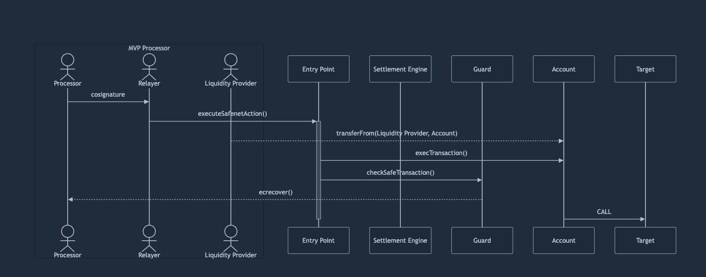

# Safenet Transaction

To provide a high-level overview of Safenet, this page describes the flow of a Safenet transaction.
Further details on the components and roles involved in a Safenet transaction are covered in the [Core Components](core-components/processor.mdx) section.

A Safenet transaction consists of three main phases:

### 1. Simulation

In the first phase, security checks are performed off-chain to ensure that the transaction is valid.

1. The processor previews security checks.
2. User signs transactions. This involves signing a Safe transaction with enough owners of the Safe.
3. The transaction is published to Safenet pool. 

### 2. Fulfillment

This it the main part of the transaction, that the user is interested in. This part enables the users to send a transaction on the spend chain, as if they would posses the required funds on the spend chain.

1. A resource lock is issued on the Safe Smart Account on the debit chain. This ensures prevents the user from moving out the funds from the Safe Smart Account on the debit chain before the liquidity provider is reimbursed.
2. The `liquidity provider` send funds to the user's Safe Smart Account on the spend chain (pre-funding).
3. The user's Smart Account executes the intended transaction on the spend chain with the funds.

### 3. The settlement

In the last phase, the settlement is executed on the debit chain. 
This phase ensures that the liquidity provider gets reimbursed for the pre-funding plus a fee.

1. The processor requests a settlement on the debit chain. 
2. The settlement request has a challenge delay, in which any `validator` can challenge the settlement request.
3. When the settlement is not challenged, the settlement is executed. The liquidity provider receives funds from the Safe Smart Account on the debit chain, and the Safe Smart Account is unlocked.

When the settlement is challenged, the processors has to prove that the validity of the transaction. This is described in the [Settlement](concepts/settlement.mdx) section.

## Flow Diagram

This flow diagram illustrates the first two phases of a Safenet transaction:

