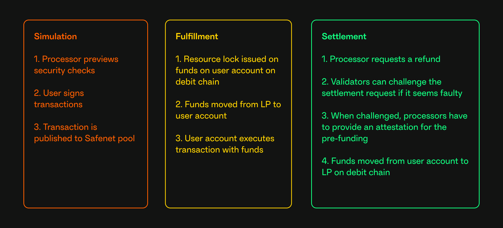

# Safenet Transaction

This page describes the flow of a Safenet transaction.
The [Core Components](core-components/processor.mdx) section provides further details on the components and roles involved in a Safenet transaction.

A Safenet transaction consists of three main phases:

### 1. Simulation

In the first phase, security checks are performed off-chain to ensure the transaction is valid.

1. The [processor](./core-components/processor.mdx) previews security checks.
2. The [End User](./core-components/end-user.mdx) signs the transactions. This involves signing a Safe transaction with enough Safe owners.
3. The transaction is published to [Safenet Transaction pool](./core-components/transaction-service.mdx).

### 2. Fulfillment

This is the main part of the transaction that the user is interested in. This part enables the users to send a transaction on the [spend chain](./chains.mdx) as if they possess the required funds on the spend chain.

1. A [resource lock](./concepts/resource-lock.mdx) is issued on the Safe Smart Account on the debit chain. This prevents the user from withdrawing funds from the Safe Smart Account on the debit chain before the [liquidity provider](./core-components/liquidity-provider.mdx) is reimbursed.
2. The liquidity provider sends funds to the user's Safe Smart Account on the spend chain (pre-funding).
3. The user's Smart Account executes the intended transaction on the spend chain with the funds.

### 3. The settlement

In the last phase, the [settlement](./concepts/settlement.mdx) is executed on the debit chain. 
This phase ensures the liquidity provider gets reimbursed for the pre-funding plus a fee.

1. The processor requests a settlement on the debit chain. 
2. The settlement request has a challenge delay, in which any [validator](./core-components/validator.mdx) can challenge the settlement request.
3. When the settlement is not challenged, the settlement is executed. The liquidity provider receives funds from the Safe Smart Account on the debit chain, and the Safe Smart Account is unlocked.

When the settlement is [challenged](./concepts/challenge.mdx), the processors must prove the validity of the transaction.

## Flow Diagram

This flow diagram illustrates the first two phases of a Safenet transaction:

