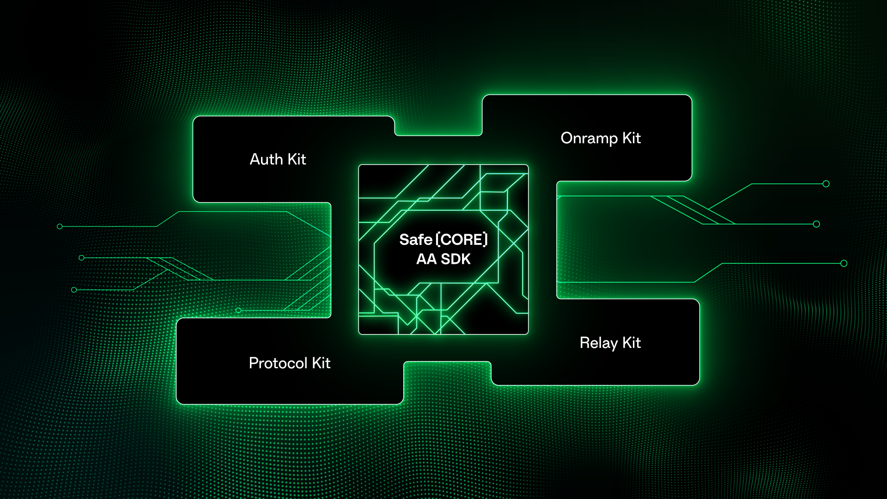

# Safe\{Core\} Account Abstraction SDK

The Safe\{Core\} Account Abstraction (AA) SDK aims to bring Account Abstraction to life by integrating Safe with different third parties. This SDK helps developers to abstract the complexity of setting up a smart contract account.

## Architecture

The SDK groups its functionality into five different kits.

### Auth Kit

The Auth Kit creates externally owned accounts and authenticates them using an email address, a social media account, or a crypto wallet account.

### Protocol Kit

The Protocol Kit helps interact with the Safe contracts. It enables the creation of new Safe accounts, updating their configuration, and signing and executing transactions, among other features.

### Onramp Kit

The Onramp Kit helps users buy cryptocurrencies with fiat money to fund a Safe account via a credit card or other payment methods.

### Relay Kit

The Relay Kit relays Safe transactions, allowing you to get them sponsored by a third party or paid with any supported ERC-20 token.

### API Kit

The API Kit helps interact with the Safe Transaction Service API. It helps share transactions among the signers and get information from a Safe account. For example, the configuration or transaction history.

## Resources
- [Safe\{Core\} Account Abstraction SDK on GitHub](https://github.com/safe-global/safe-core-sdk)
- [Safe\{Core\} Account Abstraction SDK demo application](https://github.com/5afe/account-abstraction-demo-ui)
