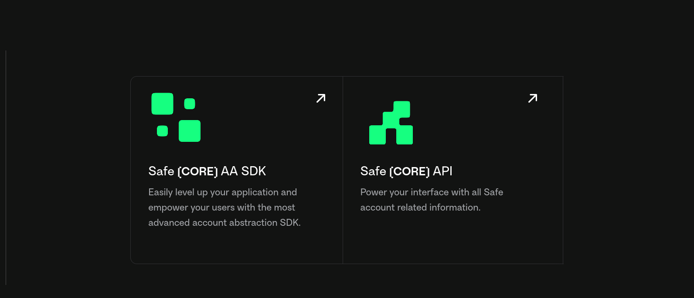

# Safe

[Safe](https://safe.global) brings digital ownership of accounts to everyone by building universal and open contract standards for the custody of digital assets, data, and identity.

Safe is at the forefront of modular smart account infrastructure, paving the way for developers to create various applications and wallets.

Safe\{Core\} consists of three components:

## Safe\{Core\} Protocol

The [Safe\{Core\} Protocol](./safe-core-protocol-overview) is an open, modular framework to make smart accounts secure, portable, and composable.

This section in the documentation has information and relevant links about the Safe\{Core\} Protocol and the different elements involved.

## Safe\{Core\} AA SDK

The [Safe\{Core\} Account Abstraction SDK](./safe-core-sdk-overview) is a set of developer kits that help integrate Safe with different external service providers. The SDK offers developers the ability to abstract the complexity that comes with operating a smart contract account.

This section in the documentation has relevant information and tutorials on the SDK kits and how to integrate them.

## Safe\{Core\} API

The [Safe\{Core\} API](./api-supported-networks.md) refers to all the Safe infrastructure needed to power interfaces with all Safe account related information. This includes the Safe Transaction Service, Safe Events Service, etc.

This section in the documentation has information related to the services architecture.
