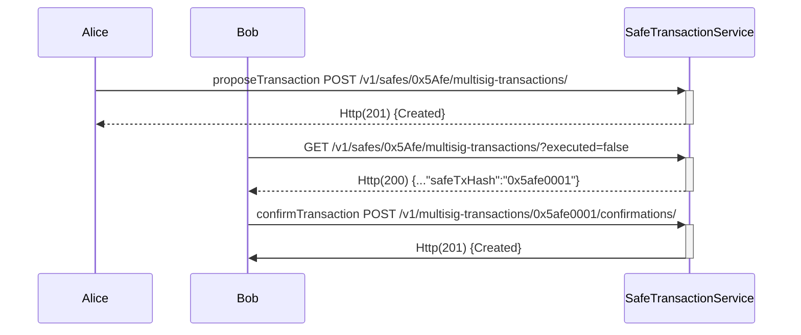
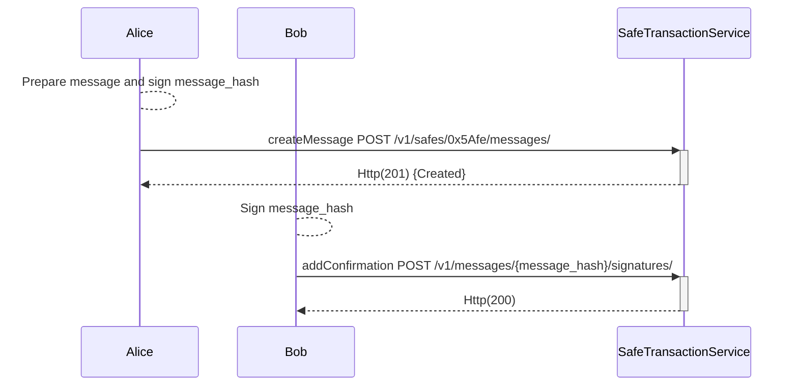

# Safe Transaction service
## Overview

Safe transaction service keeps track of transactions sent via Safe contracts. It utilizes events (L2 chains) and tracing (L1 chains) mechanisms to index these transactions.

**Key Features:**  

- [**Blockchain Indexing**]() executed transactions, configuration changes, erc20/721 transfers, onchain confirmations… are automatically indexed from blockchain.
- [**Offchain transaction signatures**](#offchain-transaction-signatures): transactions can also be sent to the service, enabling off-chain signature collection. This feature is useful for informing owners about pending transactions that are awaiting confirmation to be executed.
- [**Offchain messages**](#offchain-messages): service can collect offchain signatures to confirm messages following [EIP-1271](https://eips.ethereum.org/EIPS/eip-1271).
- [**Transactions decode**](#transactions-decode): the service keeps getting source and ABI’s from contracts that interact with safe to be able to decode this interactions.

**Technology Stack Overview**

Safe transaction service is a [Django](https://www.djangoproject.com/) app written on python that follows a very common architecture: 

- [Gunicorn](https://gunicorn.org/): it is a python WSGI HTTP Server.
- [Celery](https://docs.celeryq.dev/en/stable/): It’s a task queue with focus on real-time processing, while also supporting task scheduling. Safe transaction service currently have a scheduler (to beat periodic tasks), a worker indexer to consume and execute indexing tasks and contracts worker mainly to get contracts metadata.
- [RabbitMq](https://www.rabbitmq.com/): It is is a distributed message broker system used by celery to share the messages between scheduler, workers and django app.
- [PostgreSql](https://www.postgresql.org/): it is an open source object-relational database system.
- [Redis](https://redis.com/): it an open source, in-memory data structure store that can be used as a database, cache, message broker, and streaming engine. It is the cache of safe transaction service.
- [safe-eth-py](https://github.com/safe-global/safe-eth-py) library to interact with Safe and blockchain.

<figure></figure>

## Offchain transaction signatures
The transaction service can collect off-chain transaction signatures, allowing the owners to share their signatures between them to reach the required threshold before execute a transaction and spending less gas than on-chain approvals.

The following endpoints let us to propose a transaction and collect every confirmation (off-chain signatures):

- `POST /v1/safes/{address}/multisig-transactions/` create a new transaction, at least one signature is required
- `POST /v1/multisig-transactions/{safe_tx_hash}/confirmations/` add a new confirmation, the `safe_tx_hash` is needed
- `GET /v1/multisig-transactions/{safe_tx_hash}/` return all the multisig-transaction information
- `GET /v1/multisig-transactions/{safe_tx_hash}/confirmations/` return the list of all confirmations to a multisig-transaction

The following sequence diagram shows an use case from a Safe shared by Alice and Bob where at least 1 confirmation for each one is required:

**What is the safe_tx_hash?**
     
`safe_tx_hash` is the unique identifier for a safe transaction and is calculated following [EIP-712](https://eips.ethereum.org/EIPS/eip-712) standard:  
`keccak256(0x19 || 0x1 || domainSeparator || safeTxHashStruct)`  
where `safeTxHashStruct` is the hashStruct of a safe transaction.

The following example shows how to get a `safe_tx_hash` with [safe-eth-py](https://pypi.org/project/safe-eth-py/) with the parameter of the next transaction [0x34ae46cf7d884309a438a7e9a3161fa05dfc5068681ac3877a947971af845a18](https://safe-transaction-goerli.safe.global/api/v1/multisig-transactions/0x34ae46cf7d884309a438a7e9a3161fa05dfc5068681ac3877a947971af845a18/)
```python
from gnosis.safe.safe_tx import SafeTx
from gnosis.eth.ethereum_client import EthereumClient
eth_client = EthereumClient("https://rpc.goerli.eth.gateway.fm")
safe_tx = SafeTx(eth_client, "0x4127839cdf4F73d9fC9a2C2861d8d1799e9DF40C", "0xc6b82bA149CFA113f8f48d5E3b1F78e933e16DfD",10000000000000000,"",0,0,0,0,"0x0000000000000000000000000000000000000000","0x0000000000000000000000000000000000000000", safe_nonce=206)
print(safe_tx.safe_tx_hash.hex())
```
**Output**
``` 
0x34ae46cf7d884309a438a7e9a3161fa05dfc5068681ac3877a947971af845a18
```

## Offchain messages 
Safe transaction service is able to collect the necessary offchain signatures to confirm a message  following [EIP1271](https://ethereum.org/pt/developers/tutorials/eip-1271-smart-contract-signatures/#example-eip-1271-implementation-safe).    
The message can be a string (EIP-191 is used to get the hash) or an object EIP-712.    

**Messages endpoints**
- `GET /v1/safes/{address}/messages/` return the messages created for given safe address.
- `POST /v1/safes/{address}/messages/` create a message with at least one signature
- `GET /v1/messages/{message_hash}/`  return a message for a given message hash
- `POST /v1/messages/{message_hash}/signatures/` add another signature to message with given message hash

The following sequence diagram shows an use case from a Safe shared by Alice and Bob where at least 1 signature for each one is required to fully confirm a message:

**Message string example**    
**Python**  
safe-eth-py is required for this example.
```python
from gnosis.eth.ethereum_client import EthereumClient
from gnosis.safe.safe import Safe 
from eth_account.messages import defunct_hash_message
from eth_account import Account
import requests

alice = Account.from_key("Alice_key")

# Message that we want to confirm 
message = "Hello SafeMessages"
# Hash EIP-191
message_hash = defunct_hash_message(text=message)
# get message hash from safe
eth_client = EthereumClient("https://rpc.goerli.eth.gateway.fm")
safe_address = "TheAliceAndBobSafeAddress"
safe = Safe(safe_address, eth_client)
safe_message_hash = safe.get_message_hash(message_hash)

# Alice is going to create the message on safe transaction service
# First sign the safe_message_hash
signature_alice = alice.signHash(safe_message_hash)

# Create the request
body = {
    "message": message,
    "safeAppId": 0,
    "signature": signature_alice.signature.hex()
}
requests.post(f'https://safe-transaction-goerli.safe.global/api/v1/safes/{safe_address}/messages/',json=body)

# Message was created, let's request by message hash
response =  requests.get(f'https://safe-transaction-goerli.safe.global/api/v1/messages/{safe_message_hash.hex()}/')
print(response.json())

# Adding Bob confirmation
bob = Account.from_key("Bob_key")
signature_bob = bob.signHash(safe_message_hash)

# Create the request
body = {
    "signature": signature_bob.signature.hex()
}
requests.post(f'https://safe-transaction-goerli.safe.global/api/v1/messages/{safe_message_hash.hex()}/signatures/',json=body)

```

## Transactions decode
Safe transaction service is able to decode contract interactions, to achive it, the service is periodically getting source and ABI's from different sources (Sourcify, etherscan and blockscout) using the `safe-eth-py` library.   
The detection of contract interactions is done in a periodic task that is executed every hour for `multisig-transaction` and `module-transactions` or every 6 hours for `multisend-transactions` on `worker-contracts-tokens`.
For every new contract the service try to download the source and the ABI requesting it first to `soucify`, then `etherscan` and as last chance `blockscout`. It's important to know that not all this datasources are supported or configured for every network on `safe-eth-py`.   
Supported and configured networks on `safe-eth-py`:   
- [**Sourcify** supported networks](https://docs.sourcify.dev/docs/chains/)
- [**Etherscan** configured networks](https://github.com/safe-global/safe-eth-py/blob/master/gnosis/eth/clients/etherscan_client.py#L24)
- [**Blockscout** configured networks](https://github.com/safe-global/safe-eth-py/blob/master/gnosis/eth/clients/blockscout_client.py#L21)


**Transaction decoder endpoint** 
- `POST /v1/data-decoder/` decode a transaction `data` passed on body for a `to` contract address.


**Example transaction decoder**
```bash
curl -X 'POST' \
  'https://safe-transaction-goerli.safe.global/api/v1/data-decoder/' \
  -H 'accept: application/json' \
  -H 'Content-Type: application/json' \
  -H 'X-CSRFToken: Gx1aRa8kIJGIAfReLAWwr9Q6dHv22dFt7VprdipLryHcxpfhk9aV0UDAhNz8gGYz' \
  -d '{
  "data": "0x095ea7b3000000000000000000000000e6fc577e87f7c977c4393300417dcc592d90acf8ffffffffffffffffffffffffffffffffffffffffffffffffffffffffffffffff",
  "to": "0x4127839cdf4F73d9fC9a2C2861d8d1799e9DF40C"
}'
```
Output:
```
{
  "method": "approve",
  "parameters": [
    {
      "name": "spender",
      "type": "address",
      "value": "0xe6fC577E87F7c977c4393300417dCC592D90acF8"
    },
    {
      "name": "value",
      "type": "uint256",
      "value": "115792089237316195423570985008687907853269984665640564039457584007913129639935"
    }
  ]
}
```

This decoded data is also included as `dataDecoded` in `GET` of `multisig-transactions`, `module-transactions` and `all-transactions` endpoints. 