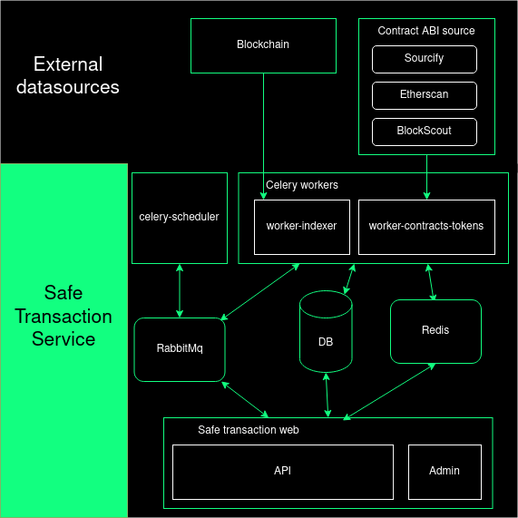
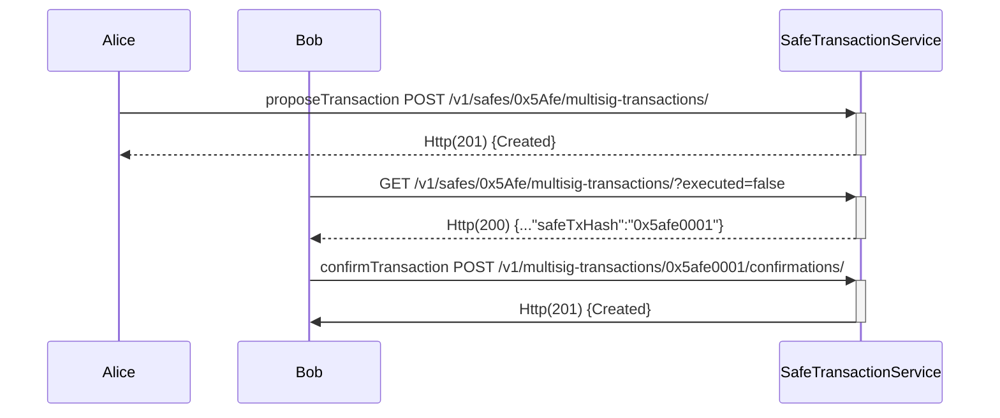

# Safe Transaction service
## Overview

Safe transaction service keeps track of transactions sent via Safe contracts. It utilizes events (L2 chains) and tracing (L1 chains) mechanisms to index these transactions.

**Key Features:**  

- [**Blockchain Indexing**]() executed transactions, configuration changes, erc20/721 transfers, onchain confirmations… are automatically indexed from blockchain.
- [**Offchain transaction signatures**](#offchain-transaction-signatures): transactions can also be sent to the service, enabling off-chain signature collection. This feature is useful for informing owners about pending transactions that are awaiting confirmation to be executed.
- [**Offchain messages**](): service can collect offchain signatures following [EIP-1271](https://eips.ethereum.org/EIPS/eip-1271).
- [**Transactions decode**](): the service keeps getting source and ABI’s from contracts that interact with safe to be able to decode this interactions.

**Technology Stack Overview**

Safe transaction service is a [Django](https://www.djangoproject.com/) app written on python that follows a very common architecture: 

- [Gunicorn](https://gunicorn.org/): it is a python WSGI HTTP Server.
- [Celery](https://docs.celeryq.dev/en/stable/): It’s a task queue with focus on real-time processing, while also supporting task scheduling. Safe transaction service currently have a scheduler (to beat periodic tasks), a worker indexer to consume and execute indexing tasks and contracts worker mainly to get contracts metadata.
- [RabbitMq](https://www.rabbitmq.com/): It is is a distributed message broker system used by celery to share the messages between scheduler, workers and django app.
- [PostgreSql](https://www.postgresql.org/): it is an open source object-relational database system.
- [Redis](https://redis.com/): it an open source, in-memory data structure store that can be used as a database, cache, message broker, and streaming engine. It is the cache of safe transaction service.


<figure></figure>

## Offchain transaction signatures
The transaction service can collect off-chain transaction signatures, allowing the owners to share their signatures between them to reach the required threshold before execute a transaction and spending less gas than on-chain approvals.

The following endpoints let us to propose a transaction and collect every confirmation (off-chain signatures):

- `POST /v1/safes/{address}/multisig-transactions/` create a new transaction, at least one signature is required
- `POST /v1/multisig-transactions/{safe_tx_hash}/confirmations/` add a new confirmation, the `safe_tx_hash` is needed
- `GET /v1/multisig-transactions/{safe_tx_hash}/` return all the multisig-transaction information
- `GET /v1/multisig-transactions/{safe_tx_hash}/confirmations/` return the list of all confirmations to a multisig-transaction

The following sequence diagram shows an use case from a Safe shared by Alice and Bob where at least 1 confirmation for each one is required:

**What is the safe_tx_hash?**
     
`safe_tx_hash` is the unique identifier for a safe transaction and is calculated following [EIP-712](https://eips.ethereum.org/EIPS/eip-712) standard:  
`keccak256(0x19 || 0x1 || domainSeparator || safeTxHashStruct)`  
where `safeTxHashStruct` is the hashStruct of a safe transaction.

The following example shows how to get a `safe_tx_hash` with [safe-eth-py](https://pypi.org/project/safe-eth-py/) with the parameter of the next transaction [0x34ae46cf7d884309a438a7e9a3161fa05dfc5068681ac3877a947971af845a18](https://safe-transaction-goerli.safe.global/api/v1/multisig-transactions/0x34ae46cf7d884309a438a7e9a3161fa05dfc5068681ac3877a947971af845a18/)
```python
from gnosis.safe.safe_tx import SafeTx
from gnosis.eth.ethereum_client import EthereumClient
eth_client = EthereumClient("https://rpc.goerli.eth.gateway.fm")
safe_tx = SafeTx(eth_client, "0x4127839cdf4F73d9fC9a2C2861d8d1799e9DF40C", "0xc6b82bA149CFA113f8f48d5E3b1F78e933e16DfD",10000000000000000,"",0,0,0,0,"0x0000000000000000000000000000000000000000","0x0000000000000000000000000000000000000000", safe_nonce=206)
print(safe_tx.safe_tx_hash.hex())
```
**Output**
``` 
0x34ae46cf7d884309a438a7e9a3161fa05dfc5068681ac3877a947971af845a18
```
