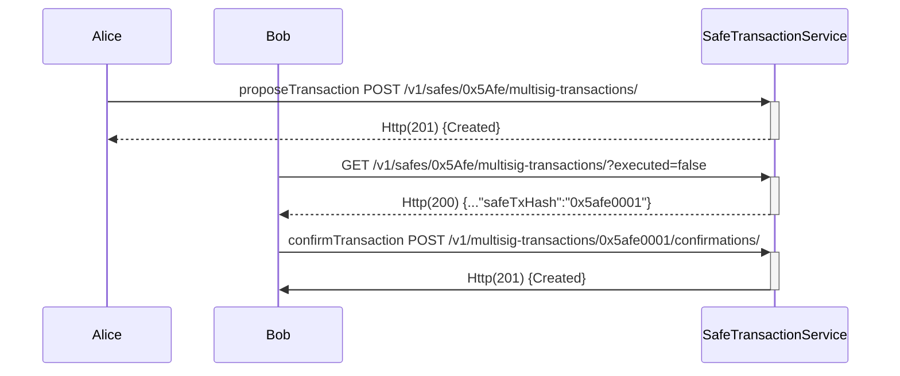
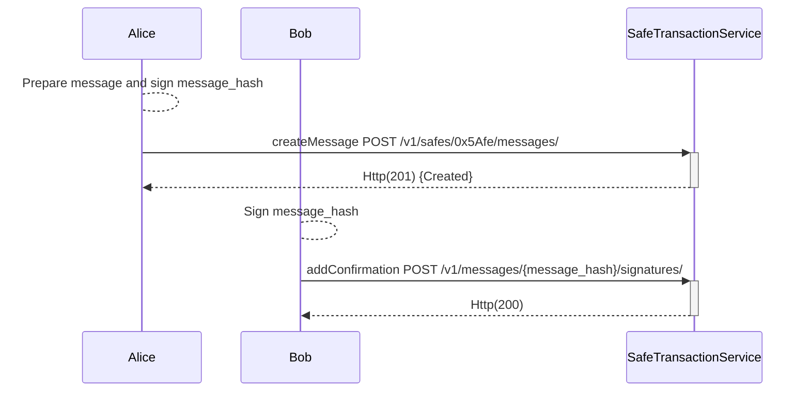

# Safe Transaction Service
## Overview

Safe transaction service keeps track of transactions sent via Safe contracts. It indexes these transactions by using events (L2 chains) and tracing (L1 chains) mechanisms.

**Key Features:**  

- [**Blockchain Indexing**](): Executed transactions, configuration changes, ERC20/721 transfers, and onchain confirmations are automatically indexed from the blockchain.
- [**Offchain transaction signatures**](#offchain-transaction-signatures): Transactions can be sent to the service, enabling off-chain signature collection. This feature helps inform owners about pending transactions that are awaiting confirmation to be executed.
- [**Offchain messages**](#offchain-messages): The service can collect offchain signatures to confirm messages following [EIP-1271](https://eips.ethereum.org/EIPS/eip-1271).
- [**Transactions decode**](#transactions-decode): The service keeps getting source and ABIs from contracts that interact with Safe to decode these interactions.

**Technology Stack Overview**

Safe transaction service is a [Django](https://www.djangoproject.com/) app written in Python that follows a very common architecture: 

- [Gunicorn](https://gunicorn.org/): A Python WSGI HTTP Server.
- [Celery](https://docs.celeryq.dev/en/stable/): A task queue with focus on real-time processing, while also supporting task scheduling. Safe transaction service currently has a scheduler (for periodic tasks), a worker indexer to consume and execute indexing tasks, and a contracts worker mainly to get metadata from contracts.
- [RabbitMQ](https://www.rabbitmq.com/): A distributed message broker system Celery uses to share messages between the scheduler, workers, and the Django application.
- [PostgreSQL](https://www.postgresql.org/): An open source object-relational database system.
- [Redis](https://redis.com/): An open source, in-memory data structure store that can be used as a database, cache, message broker, and streaming engine. It is used for caching by the Safe transaction service.
- [safe-eth-py](https://github.com/safe-global/safe-eth-py): A library to interact with Safe and blockchains.

<figure></figure>

## Offchain Transaction Signatures
The transaction service can collect offchain transaction signatures, allowing the owners to share their signatures to reach the required threshold before executing a transaction and spending less gas than onchain approvals.

The following endpoints let us propose a transaction and collect every confirmation (offchain signatures):

- `POST /v1/safes/{address}/multisig-transactions/`: Create a new transaction. At least one signature is required.
- `POST /v1/multisig-transactions/{safe_tx_hash}/confirmations/`: Add a new confirmation. The `safe_tx_hash` is needed.
- `GET /v1/multisig-transactions/{safe_tx_hash}/`: Return all the multisig transaction information.
- `GET /v1/multisig-transactions/{safe_tx_hash}/confirmations/`: Return the list of all confirmations to a multisig transaction.

The following sequence diagram shows a use case for a Safe shared by Alice and Bob where at least one confirmation for each one is required:

**What is the safe_tx_hash?**
     
`safe_tx_hash` is the unique identifier for a Safe transaction and is calculated using the [EIP-712](https://eips.ethereum.org/EIPS/eip-712) standard:  
`keccak256(0x19 || 0x1 || domainSeparator || safeTxHashStruct)`  
where `safeTxHashStruct` is the hashStruct of a Safe transaction.

The following example shows how to get a `safe_tx_hash` with [safe-eth-py](https://pypi.org/project/safe-eth-py/) with the parameter of the next transaction [0x34ae46cf7d884309a438a7e9a3161fa05dfc5068681ac3877a947971af845a18](https://safe-transaction-goerli.safe.global/api/v1/multisig-transactions/0x34ae46cf7d884309a438a7e9a3161fa05dfc5068681ac3877a947971af845a18/)
```python
from gnosis.safe.safe_tx import SafeTx
from gnosis.eth.ethereum_client import EthereumClient
eth_client = EthereumClient("https://rpc.goerli.eth.gateway.fm")
safe_tx = SafeTx(eth_client, "0x4127839cdf4F73d9fC9a2C2861d8d1799e9DF40C", "0xc6b82bA149CFA113f8f48d5E3b1F78e933e16DfD",10000000000000000,"",0,0,0,0,"0x0000000000000000000000000000000000000000","0x0000000000000000000000000000000000000000", safe_nonce=206)
print(safe_tx.safe_tx_hash.hex())
```
**Output**
``` 
0x34ae46cf7d884309a438a7e9a3161fa05dfc5068681ac3877a947971af845a18
```

## Offchain Messages 
Safe transaction service can collect the necessary offchain signatures to confirm a message using [EIP-1271](https://ethereum.org/pt/developers/tutorials/eip-1271-smart-contract-signatures/#example-eip-1271-implementation-safe).    
The message can be a string (EIP-191 is used to get the hash) or an object EIP-712.

**Messages endpoints**
- `GET /v1/safes/{address}/messages/`: Return the messages created for the given Safe address.
- `POST /v1/safes/{address}/messages/`: Create a message with at least one signature.
- `GET /v1/messages/{message_hash}/`: Return a message for a given message hash.
- `POST /v1/messages/{message_hash}/signatures/`: Add another signature to the message with the given message hash.

The following sequence diagram shows a use case for a Safe shared by Alice and Bob where at least one signature for each one is required to confirm a message fully:

**Message string example**    
**Python**  
safe-eth-py is required for this example.
```python
from gnosis.eth.ethereum_client import EthereumClient
from gnosis.safe.safe import Safe 
from eth_account.messages import defunct_hash_message
from eth_account import Account
import requests

alice = Account.from_key("Alice_key")

# Message that we want to confirm 
message = "Hello SafeMessages"
# Hash EIP-191
message_hash = defunct_hash_message(text=message)
# get message hash from safe
eth_client = EthereumClient("https://rpc.goerli.eth.gateway.fm")
safe_address = "TheAliceAndBobSafeAddress"
safe = Safe(safe_address, eth_client)
safe_message_hash = safe.get_message_hash(message_hash)

# Alice is going to create the message on safe transaction service
# First sign the safe_message_hash
signature_alice = alice.signHash(safe_message_hash)

# Create the request
body = {
    "message": message,
    "safeAppId": 0,
    "signature": signature_alice.signature.hex()
}
requests.post(f'https://safe-transaction-goerli.safe.global/api/v1/safes/{safe_address}/messages/',json=body)

# Message was created, let's request by message hash
response =  requests.get(f'https://safe-transaction-goerli.safe.global/api/v1/messages/{safe_message_hash.hex()}/')
print(response.json())

# Adding Bob confirmation
bob = Account.from_key("Bob_key")
signature_bob = bob.signHash(safe_message_hash)

# Create the request
body = {
    "signature": signature_bob.signature.hex()
}
requests.post(f'https://safe-transaction-goerli.safe.global/api/v1/messages/{safe_message_hash.hex()}/signatures/',json=body)

```

## Transaction Decoder
The Safe transaction service can decode contract interactions. To achieve it, the service periodically gets source and ABIs from different sources like Sourcify, etherscan, and blockscout using the `safe-eth-py` library.   
The detection of contract interactions is done in a periodic task executed every hour for `multisig-transaction` and `module-transactions` or every six hours for `multisend-transactions` on `worker-contracts-tokens`.
For every new contract, the service tries to download the source, and the ABI requests it first to Sourcify, then Etherscan, and as a last chance, Blockscout. It's important to know that not all these data sources are supported or configured for every network on `safe-eth-py`.   
Supported and configured networks on `safe-eth-py`:   
- [**Sourcify** supported networks](https://docs.sourcify.dev/docs/chains/)
- [**Etherscan** configured networks](https://github.com/safe-global/safe-eth-py/blob/master/gnosis/eth/clients/etherscan_client.py#L24)
- [**Blockscout** configured networks](https://github.com/safe-global/safe-eth-py/blob/master/gnosis/eth/clients/blockscout_client.py#L21)


**Transaction decoder endpoint** 
- `POST /v1/data-decoder/` decode a transaction `data` passed on body for a `to` contract address.


**Example transaction decoder**
```bash
curl -X 'POST' \
  'https://safe-transaction-goerli.safe.global/api/v1/data-decoder/' \
  -H 'accept: application/json' \
  -H 'Content-Type: application/json' \
  -H 'X-CSRFToken: Gx1aRa8kIJGIAfReLAWwr9Q6dHv22dFt7VprdipLryHcxpfhk9aV0UDAhNz8gGYz' \
  -d '{
  "data": "0x095ea7b3000000000000000000000000e6fc577e87f7c977c4393300417dcc592d90acf8ffffffffffffffffffffffffffffffffffffffffffffffffffffffffffffffff",
  "to": "0x4127839cdf4F73d9fC9a2C2861d8d1799e9DF40C"
}'
```
Output:
```
{
  "method": "approve",
  "parameters": [
    {
      "name": "spender",
      "type": "address",
      "value": "0xe6fC577E87F7c977c4393300417dCC592D90acF8"
    },
    {
      "name": "value",
      "type": "uint256",
      "value": "115792089237316195423570985008687907853269984665640564039457584007913129639935"
    }
  ]
}
```

This decoded data is also included as `dataDecoded` in `GET` of `multisig-transactions`, `module-transactions` and `all-transactions` endpoints. 