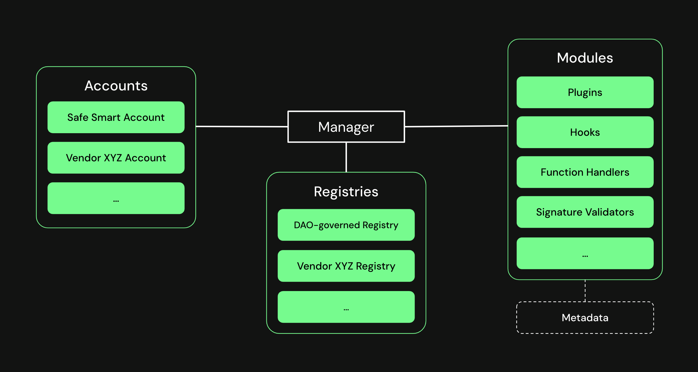

# Safe{Core} Protocol

Safe{Core} Protocol is an open, modular framework to make smart accounts secure, portable, and composable.

Links of interest:
- [Safe{Core} Protocol Specification](https://github.com/safe-global/safe-core-protocol-specs)
- [Safe{Core} Protocol Implementation](https://github.com/5afe/safe-core-protocol)
- [Safe{Core} Protocol Demo Application](https://github.com/5afe/safe-core-protocol-demo/)

## Objectives

The goal is to create a comprehensive system, designed to enhance the safety and flexibility of user interactions within the smart account ecosystem. The protocol provides a common framework for building additional tools, encourages the composition of various integrations, and supports different types of smart accounts. In order to achieve interoperability and security, the protocol enforces a set of rules within the smart account ecosystem.

## Architecture

The architecture of the Safe{Core} Protocol is composed of several integral components, each carrying its unique responsibilities. The protocol is designed to distinctly separate these elements by defining explicit interfaces, thus allowing independent expansion and iteration of each part. This modularity ensures the sustainable growth and evolution of the smart account ecosystem.

### Manager

At the heart of the protocol is the `Manager`, ensuring adherence to the prescribed rules set by the `Registry`. The `Manager` serves as an intermediary layer coordinating communication and interactions between `Accounts` and `Integrations`.

### Accounts

`Accounts` are smart-contract based user accounts (or "smart accounts"). The Safe{Core} Protocol is account-agnostic, meaning that it is not tied to a specific account implementation.

### Integrations

`Integrations` extend the functionality of `Accounts` in different ways. Initial integrations are plugins, hooks, function handlers and signature verifiers, but additional integrations can be added to the Safe{Core} Protocol at a later point.

### Registry

The `Registry` plays a critical role in maintaining and enforcing standards and security guarantees. Only the `Integrations` that adhere to these guidelines will be recognized and managed by the `Manager`.

### Metadata

To provide a coherent context to the various parts and their interactions, the provision of `Metadata` is crucial. This information allows developers to append additional context to interactions, enhancing user understanding and interaction transparency.
