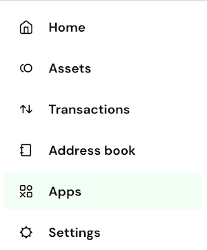
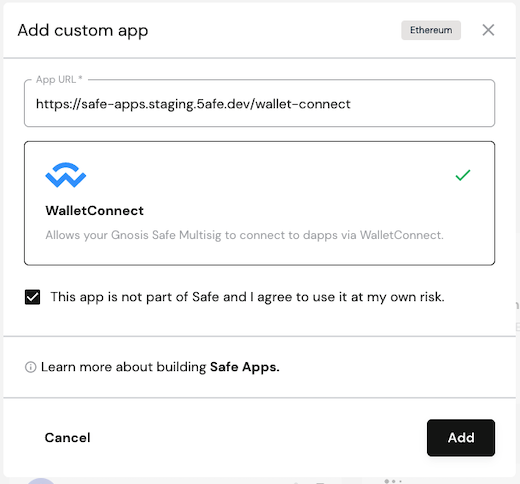

# Launching your Safe App

Once your Safe App is ready after developing and testing, you can let some actual users test it. To beta test, simply share the hosted Safe App link with them and guide them on adding it as a Custom App. For instructions on how to add custom apps, refer to [this guide](https://help.safe.global/en/articles/40859-add-a-custom-safe-app)

## Get your Safe App listed in the Safe

If you would like your Safe App to appear on Safe, you need to ensure that it meets the following criteria:

1. **Smart contracts must be audited**: Security is a top priority. Ensure that the smart contracts used in your Safe App have undergone a security audit. If your Safe App includes smart contracts of your own, you should provide an external audit result document. If they were created by a third party, you should use smart contracts that are properly audited.

2. **Include a manifest.json file:** Your Safe App must include a manifest.json file in the root directory. The file should contain the following information:

```json
{
  "name": "Name of your Safe App",
  "iconPath": "your_logo.svg",
  "description": "Brief description of your Safe App"
}
```

- **Name**: The name of your Safe App, limited to a maximum of 50 characters.
- **Icon**: A relative file path to your App's logo. The logo must be a square SVG image with dimensions of at least 128 by 128 pixels
- **Description**: A brief description of your application, limited to a maximum of 200 characters.

You can find an example manifest file on [Github](https://github.com/safe-global/safe-apps-sdk/blob/main/packages/cra-template-safe-app/template/public/manifest.json) . Also, check out an example Safe App on IPFS [here](https://ipfs.io/ipfs/QmTgnb1J9FDR9gimptzvaEiNa25s92iQy37GyqYfwZw8Aj/).

:::info
Please ensure that **CORS** settings in the `manifest.json` are configured correctly to allow the fetching of information, as [mentioned here](./get-started.md#cors).
:::

3. **Ensure your app auto-connects to Safe**: When a user opens the app, it should automatically select Safe as a wallet. However, check out for any instances where users might have opened the app with another wallet outside of Safe.

4. **Submit your app for Review by Safe Team**: While we may not conduct a formal audit for your Safe App, we would appreciate the opportunity to review its source code to identifying potential issues and suggest improvements. Whether your Safe App is open-source or closed-source, please share with us a **link to the public repository or extend an invitation to the private code repository.** For a functional review, please provide us with a **high-level test plan/feature list** or video walkthroughs to enable our QA team to make sure everything works as intended in production for a functional review.

:::info
The requirement doesn't apply for battle-tested applications hosted on the same domain as the main dApp.
:::

5. **Decode your Safe App transactions**: We want to display interactions with Safe Apps as human-readable as possible. You'll need to provide the contract ABI of the contracts that your Safe App interacts with. The ideal way to do this would be to verify your contracts via [Sourcify](https://github.com/ethereum/sourcify), which we can leverage to decode transactions interacting with those contracts. Alternatively, you can provide us with the ABIs as JSON files or the links to the verified contracts on Etherscan, so we can implement transaction decoding for your Safe App interactions.

6. **Create an Issue in Our Repository**: Once you've verified that your app meets these requirements, create an issue in our [Safe default apps list](https://github.com/5afe/safe-apps-list) repository.

## The official launch and beyond

After we have reviewed and integrated your Safe App, the App will first be available in the [staging environment](https://safe-wallet-web.staging.5afe.dev) of the Safe for you to do a final review. We would then approach you to coordinate the launch and a joint announcement.

At any point after the launch, if you or your users encounter issues with the Safe App, or you want to release an update to an existing Safe App, please get in touch with us via [Discord](https://chat.safe.global).

While developing your Safe App you can directly use [our production interface](https://app.safe.global) for testing it. Some testnets like Goerli are also available there.

Once your app is live, even if you are running it locally, you can import it to the Safe application as a custom app. To do so, you should 

- Select the **Apps** tab

<figure></figure>

- Use the `Add custom app` button and add your app using a link

<figure></figure></figure>
