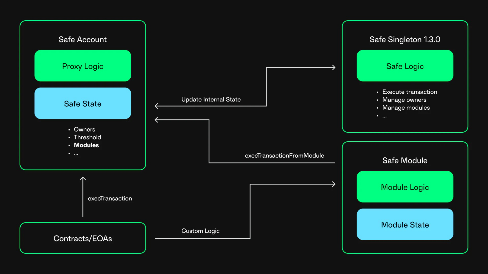

# Safe Modules

Safe Modules add custom features to Safe contracts. They are smart contracts that implement Safe's functionality while separating module logic from Safes core contracts. A basic Safe does not require any module. Adding and removing a module requires confirmation from the configured threshold number of owners. Events are emitted whenever a module is added or removed, and a module transaction succeeds or fails.

Safe Modules can include daily spending allowances, amounts that can be spent without the approval of other owners, recurring transactions modules, standing orders that are performed on a recurring set date, e.g. paying your rent, and social recovery modules, which may allow you to recover a Safe if you lose access to owner accounts. These are just a few examples of how to use modules, but there are many more.

<figure></figure>

## How to create a Safe Module

A great way to understand how Safe Modules work is by creating one. A great place to start is [Gnosis Safe 🛠 Safe modding 101: Create your own Safe Module](https://www.youtube.com/watch?v=nmDYc9PlAic).


Watch on Youtube


## Examples

1. [Safe Modules](https://github.com/safe-global/safe-modules)
2. [Zodiac-compliant modules](https://zodiac.wiki/index.php/Introduction:_Zodiac_Standard#Modules)


Safe Modules are a security risk since they can execute arbitrary transactions, so only trusted and audited modules should be added to a Safe. A malicious module can completely takeover a Safe.

