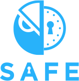

The Gnosis Safe is the most secure way to manage your crypto funds. Our goal is to deliver the highest level of security combined with great user experience for anyone holding Ether and/or ERC20 tokens.
Transparency and security are our core principles. This is why our smart contracts, services, mobile apps & web-clients are open source. 
The Gnosis Safe is also the first smart contract-based Ethereum wallet on mobile. As a contract wallet, the Gnosis Safe has a wide range of functionalities that are often not possible with traditional crypto and blockchain wallets. 

----

You can use the Gnosis Safe to easily receive, store and send cryptocurrency (Ether and ERC-20 tokens).
You can use it also to interact with decentralized applications via WalletConnect_.

----

Secure by design
================

- 2-Factor Authentication: Use the Gnosis Safe Authenticator to further increase the security of your wallet.
- `Formal Verification`_: While our code is always audited, we’ve gone one step further and formally verified the Gnosis Safe smart contracts.
- `Bug Bounty`_: Because we trust in the security of our smart contracts, we have created one of the biggest bug bounty programs in the history of Ethereum. 

----

Crypto without the hassle
=========================

- WalletConnect_: Interaction with dApps made easy. With WalletConnect you can connect to dApps securely within seconds.
- Fee Payment: The Gnosis Safe allows you to save your ETH and pay network fees with ERC-20 tokens.
- ENS_ Integration: Send funds to names, rather than cryptic addresses.

----

You are in control
==================

* Self-custody: Nobody else, including Gnosis, will ever be able to access, modify or freeze your funds.
* Multiple Safes: Manage different portfolios under designated Gnosis Safes.
* `Open Source`_: The Gnosis Safe source code is fully available under the GNU GPLv3 license. Dig into the code or add custom modules to your Safe.

-----

The Gnosis Safe mobile wallet supports: Ethereum (ETH) and ERC20 tokens, such as Binance Coin (BNB), Basic Attention Token (BAT), 0x (ZRX), Maker DAI (DAI), OmiseGO (OMG), Wrapped Ether (WETH). If you are missing an ERC20 token, please get in touch.

The Gnosis Safe mobile wallet does not support: Bitcoin (BTC), Bitcoin Cash (BCH), Ripple (XRP), Stellar Lumens (XLM), Litecoin (LTC), Zcash (ZEC), Tron (TRX)

----

Gnosis Safe for Teams
---------------------

The Gnosis Safe *for Teams* is the most secure way to manage your crypto funds *collectively*. 
It is geared to wards teams managing shared crypto funds and the direct successor of the popular `Gnosis MultiSig`_. 
It leverages the redesigned Gnosis Safe smart contracts, which have cheaper setup and transaction costs. 
The contracts are upgradeable and easier extendable via modules.  

Links
-----

- `Gnosis Safe Website`_

**Download**

- `Gnosis Safe for Android`_
- `Gnosis Safe for iOS`_
- `Gnosis Safe Authenticator`_ (Chrome extension)
  
**Get in touch & support**

- `Gitter`_
- `Telegram`_
- `Twitter`_

**Reads**

- `Smart contract wallet are here`_
- `The State of Storing Funds on Ethereum`_
- `More blog posts`_

.. _WalletConnect: https://walletconnect.org
.. _`Open Source`: https://github.com/gnosis/
.. _`Formal verification`: https://blog.gnosis.pm/formal-verification-a-journey-deep-into-the-gnosis-safe-smart-contracts-b00daf354a9c
.. _`Bug Bounty`: https://blog.gnosis.pm/announcing-the-gnosis-safe-bug-bounty-10e147e719c4
.. _`ENS`: https://ens.domains
.. _`Gnosis MultiSig`: https://github.com/gnosis/MultiSigWallet/releases
.. _`Gnosis Safe Website`: https://safe.gnosis.io
.. _`Gnosis Safe for Android`: https://play.google.com/store/apps/details?id=pm.gnosis.heimdall
.. _`Gnosis Safe for iOS`: https://appstore.com/gnosissafesmartwallet
.. _`Gnosis Safe Authenticator`: https://chrome.google.com/webstore/detail/iecodoenhaghdlpodmhooppdhjhmibde
.. _`Gitter`: https://gitter.im/gnosis/Safe
.. _`Telegram`: https://t.me/gnosisSafe
.. _`Twitter`: https://twitter.com/gnosisSafe
.. _`More blog posts`: https://blog.gnosis.pm/tagged/safe
.. _`Smart contract wallet are here`: https://blog.gnosis.pm/smart-wallets-are-here-121d44519cae
.. _`The State of Storing Funds on Ethereum`: https://blog.gnosis.pm/the-state-of-storing-funds-on-Ethereum-fdb4c9a09388

.. toctree::
   :maxdepth: 2
   :caption: Content
   
   Introduction <self>
   contracts/index
   services/index
   clients/index
