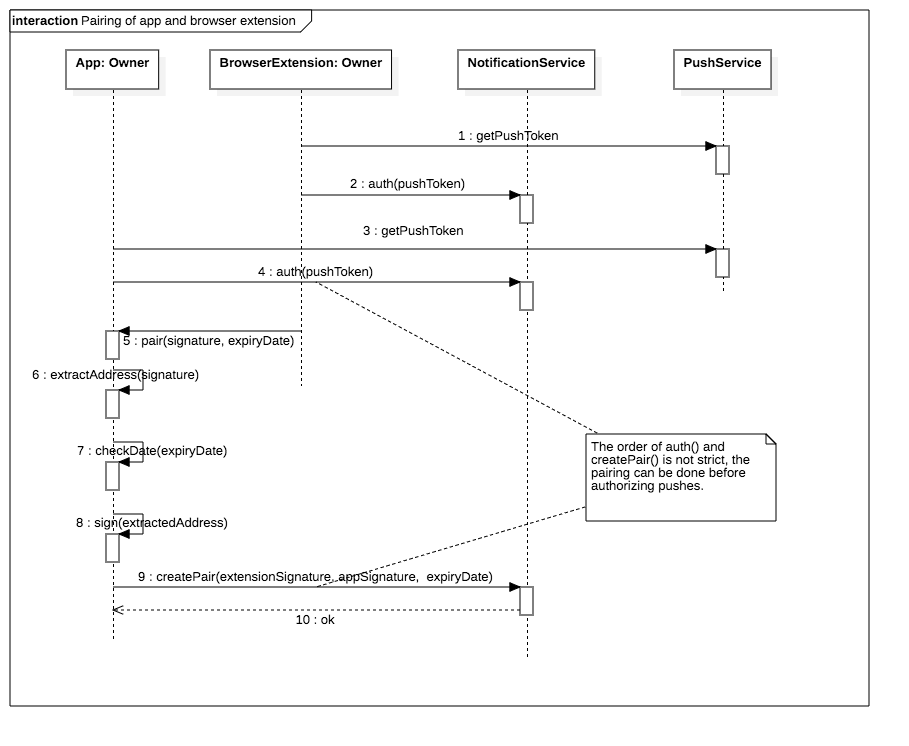

# Notification Service
Allows users to send signed transaction messages between devices taking part in the signing process.

[Show on GitHub](https://github.com/gnosis/safe-notification-service)

[Show on Swagger](https://safe-notification.gnosis.pm/)

## Database model
### Device:
* pushToken (char, unique)
* owner (char, primary key)

### DevicePair:
* authorizingDevice
* authorizedDevice 

Primary key: both together


## Pairing
Before a chrome extension can send push notifications to the phone a channel has to be established. Both, the chrome extension and the mobile app request a token from a notification service like firebase. They sign the token with their private key and submit the token to the notification service. To pair the chrome extension with a mobile app a QR code containing an expiry date and a signature are generated and displayed in the chrome extension. This QR contains a expiry date and a signature signing the expiry date:

```js
{
    "expirationDate": "<date>",
    "signature": { // signs sha3("GNO" + <expirationDate>)
        "v": "<integer>",
        "r": "<string>", // stringified int (decimal)
        "s": "<string>" // stringified int (decimal)
    }
}
```

Note: The QR is a stringified object.
The mobile app can scan the QR code and use the message to add itself as authorized device. It is then allowed to send push notifications to the chrome extension.


# Endpoints
## v2/auth/ POST
### Pre-requirements:
* Generate local private key
* Ask firebase for push token 
* Authorize notification service to send notifications to authorizing device.
* Request contains a expiry date. Notification service will only accept request in case expiry date is not in the past.

### Request
```js
{
	"pushToken": "<string>",
  "buildNumber": "<integer>",
  "versionName": "<string>",
  "client": "[android | ios | extension]",
  "bundle": "<string>",
	"signatures": [{ // signs sha3("GNO" + <pushToken> + <buildNumber> + <versionName> + <client> + <bundle>)
        "v": "<integer>",
        "r": "<string>", // stringified int
        "s": "<string>" // stringified int
    }],
}
```
### Response
If no previous owner exists, we create a new entry with push token and owner param
Otherwise, update current Device entry.

> Returns HTTP 201 if OK
```js
{
	"pushToken": "<string>",
	"owner": "<string>"
}
```

Use https://firebase.google.com/docs/cloud-messaging/ in the clients to get push token

## v1/pairing/ POST
Allows to authorize pairing of two devices. The signature of the expiry date signed by the Chrome extension is sent together with the signature of the Chrome extension ethereum account address signed by the mobile app. Pairing is only successful if expiry date is not expired.

### Request
```js
{
    "temporaryAuthorization": {
    "expirationDate": "<date>",
    "signature": { // signs sha3("GNO" + <expirationDate>)
        "v": "<integer>",
        "r": "<string>", // stringified int
        "s": "<string>" // stringified int
    },
    },
    "signature": { // signs sha3("GNO" + <chrome-extension-address>)
        "v": "<integer>",
        "r": "<string>", // stringified int
        "s": "<string>" // stringified int
    }
}
```

**IMPORTANT: addresses must be in checksum and date in ISO format without microseconds and with timezone (you must use UTC)**

Example date: 2018-04-18T14:46:09+00:00

### Response
We create two entries for DevicePair, in both directions.

> Returns HTTP 201 if OK
```js
{
    "devicePair": [
        "<string>", "<string>"
    ]
}
```



## v1/pairing/ DELETE
Allows to delete an authorization for a device for sending push notifications.

### Request
```js
{
    "device": "<address>",
    "signature": { // signs sha3("GNO" + <address>)
        "v": "<integer>",
        "r": "<string>", // stringified int
        "s": "<string>" // stringified int
    }
}
```
We remove the DevicePair where authorized  
* device = address and authorizing = signer address
* authorizing = address and device = signer address

### Response
> Returns HTTP 204 if OK

## v1/notifications/ POST
Allows to send notifications to multiple devices. If one of the pairs is not allowed, the service sends notifications to the others anyways.

Signature address cannot be contained in devices list.
### Request
```js
{
	"devices": ["<checksumed_address>", ...],
	"message": "<string>",
	"signature": { // signs sha3("GNO" + <message>)
        "v": "<integer>",
        "r": "<string>", // stringified int
        "s": "<string>" // stringified int
    }
}
```
### Response
 * HTTP 204 if at least one notification is sent
 * HTTP 404 if no device pair is found

## Push Notification Types (message parameter)

### Send Safe address to Chrome Extension
```js
{
  "type": "safeCreation",
  "safe": "<address>",
}
```
### Send transaction from chrome extension to app
```js
{
  "type": "sendTransaction",
  "hash": "<hex-string>", // Hash of the safe transaction
  "safe": "<address>",
  "to": "<address>",
  "value": "<stringified-int>",
  "data": "<hex-string>",
  "operation": "<stringified-int>",
  "txGas": "<stringified-int>",
  "dataGas": "<stringified-int>",
  "operationalGas": "<stringified-int>",
  "gasPrice": "<stringified-int>",
  "gasToken": "<address>",
  "nonce": "<stringified-int>",
  // Signature of hash (DO NOT USE the GNO prefix or any additional hashing as this signature is used with the safe smart contract)
  "r": "<stringified-int>",
  "s": "<stringified-int>",
  "v": "<stringified-int>"
}
```
The parameters txGas, dataGas, operationalGas and gasPrice can be retrieved from the Relay Service
operationalGas is just used to display a more accurate estimate.
gasToken is address(0) for ETH or the token that should be used

### Request confirmation from chrome extension
```js
{
  "type": "requestConfirmation",
  "hash": "<hex-string>", // Hash of the safe transaction
  "safe": "<address>",
  "to": "<address>",
  "value": "<stringified-int>",
  "data": "<hex-string>",
  "operation": "<stringified-int>",
  "txGas": "<stringified-int>",
  "dataGas": "<stringified-int>",
  "operationalGas": "<stringified-int>",
  "gasPrice": "<stringified-int>",
  "gasToken": "<address>",
  "nonce": "<stringified-int>"
}
```

Once the extension receives this push it can validate the hash and sign it. The signature then can be send back to the app

The transaction hash can be calculated with:
```js
keccak256(byte(0x19), byte(0), this, to, value, data, operation, safeTxGas, dataGas, gasPrice, gasToken, nonce)
```

### Confirm transaction from chrome extension
```js
{
  "type": "confirmTransaction",
  "hash": "<hex-string>", // Hash of the safe transaction
  // Signature of hash (DO NOT USE the GNO prefix or any additional hashing as this signature is used with the safe smart contract)
  "r": "<stringified-int>",
  "s": "<stringified-int>",
  "v": "<stringified-int>"
}
```
### Reject transaction from chrome extension
```js
{
  "type": "rejectTransaction",
  "hash": "<hex-string>", // Hash of the safe transaction
  // Signature of sha3(GNO + hash + type)
  "r": "<stringified-int>",
  "s": "<stringified-int>",
  "v": "<stringified-int>"
}
```
### Send Transaction Hash
```js
{
  "type": "sendTransactionHash",
  "hash": "<hex-string>", // Hash of the safe transaction
  "chainHash": "<hex-string>" // Hash of transaction on chain
}
```
