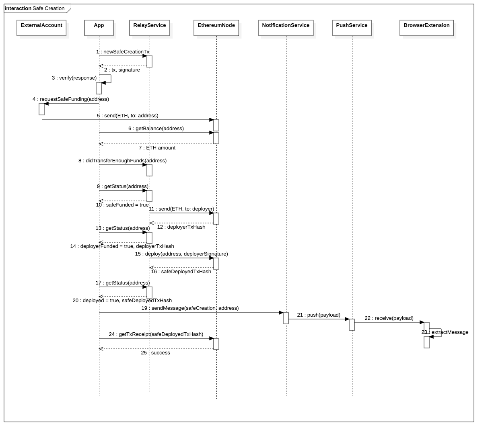

# Relay Service
This service allows us to have owners of the Safe contract that don’t need to hold any ETH on those owner addresses. How is this possible? The transaction relay service acts as a proxy, paying for the transaction fees and getting it back due to the transaction architecture we use. It also enables the user to pay for ethereum transactions using **ERC20 tokens**.

Our target user hold crypto in a centralized exchange (or on another Ethereum address) and wants to move it to a secure account. We don’t want the user to trust us, for moving the funds and deploying the smart contract on their behalf. We on the other side want to prevent users from spamming our services, there shouldn't be a need to trust the user either. The process for this is descriped in the [contracts deployment section](../contracts/deployment.html).

[GitHub](https://github.com/gnosis/safe-relay-service)

[Releases](https://github.com/gnosis/safe-relay-service/releases)

[Swagger (Mainnet version)](https://safe-relay.gnosis.io/)

[Swagger (Rinkeby version)](https://safe-relay.rinkeby.gnosis.io/)

[Safe Contracts and addresses on networks](https://github.com/gnosis/safe-contracts/releases)

## Setup
### For development (using ganache)
This is the recommended configuration for developing and testing the Relay service. `docker-compose` is required for running the project.

Configure the parameters needed on `.env_ganache`. By default the private keys of the accounts are the ones from
Ganache, and the contract addresses are calculated to be the ones deployed by the Relay when the application starts,
so there's no need to configure anything.

More parameters can be added to that file like:
- `SAFE_FIXED_CREATION_COST`: For fixed price in wei for deploying a Safe. If you set `0` you allow Safes to be
deployed for free.
- `SAFE_CONTRACT_ADDRESS` to change the Safe's master copy address.
- For more parameters check `base.py` file.

Then:
```bash
docker-compose -f docker-compose.yml -f docker-compose.dev.yml build --force-rm
docker-compose -f docker-compose.yml -f docker-compose.dev.yml up
```

### For production
This is the recommended configuration for running a production Relay. `docker-compose` is required
for running the project.

Configure the parameters needed on `.env`. These parameters **need to be changed**:
- `ETHEREUM_NODE_URL`: Http/s address of a ethereum node.
- `SAFE_FUNDER_PRIVATE_KEY`: Use a private key for an account with ether on that network. It's used to deploy new Safes.
- `SAFE_TX_SENDER_PRIVATE_KEY`: Same as the `SAFE_FUNDER_PRIVATE_KEY`, but it's used to relay all transactions.

Another parameters can be configured like:
- `SAFE_CONTRACT_ADDRESS`: If you are not using default Gnosis Safe Master Copy.
- `SAFE_FIXED_CREATION_COST`: For fixed price in wei for deploying a Safe. If you set `0` you allow Safes to be
deployed for free
- For more parameters check `base.py` file.

Then:
```bash
docker-compose build --force-rm
docker-compose up
```

## Flows

### Safe creation old flowchart (without CREATE2, deprecated)



### Transaction execution flowchart


## API Endpoints

---
### Types
`address` - hexadecimal string which represents an address with checksum and 0x prefix
`hex` - hexadecimal string starting by 0x prefix
`stringified-int` - stringified int, base 10

---
### /api/v3/safes/ POST
Creates new Safe Creation Transaction with random signature, generated by user and server, so no one knows the private key of the deployer address.

**Note:** We don’t use a Chain ID to facilitate testing on different chains (cf. [EIP-155](https://github.com/Ethereum/EIPs/issues/155). We don’t need the replay protection,
as the [ProxyFactory](https://github.com/gnosis/safe-contracts/blob/master/contracts/proxies/ProxyFactory.sol) will deploy the Safe with the owners configured.
The only "attack vector" would be deploying a user Safe in another network for free in case it hadn't been deployed before.
The [Proxy](https://github.com/gnosis/safe-contracts/blob/master/contracts/proxies/Proxy.sol) is used in this process.
Furthermore, we use "fast" from our gas station. Payments can use `ether` or supported ERC20 tokens setting `paymentToken`. The payment will be returned in wei.

More info about the signature values in appendix F of the [Ethereum Yellow Paper](https://ethereum.github.io/yellowpaper/paper.pdf).

#### Request:
```js
{
    "owners": ["<address>"],
    "threshold": "int", // Min: 1 - Max: length(owners)
    "saltNonce": "stringified-int", // random Uint256. Same `saltNonce`, `threshold` and `owners` will always deploy the same Safe
    "paymentToken": "<address>", // optional, address of ERC20 token that should be used for paying the contract deployment
}
```

#### Returns
> HTTP 201
```js
{
    "deployer": "<address>",
    "funder": "<address>",
    "gasEstimated": "<stringified-int>", // it’s what the service gets as refund
    "gasPriceEstimated": "<stringified-int>", // it’s what the service gets as refund
    "masterCopy": "<address>",
    "payment": "<stringified-int>", // it’s what the service gets as refund
    "paymentReceiver": "<address>", // if NULL_ADDRESS (0x00...000) receiver would be the address sending the transaction
    "paymentToken": "<address>", // if no gasToken was specified in the request this will be address(0) for ETH
    "proxyFactory": "<address>",
    "safe": "<address>",
    "setupData": "<hex>",  // Setup data that will be used as `initializer` for the ProxyFactory `createProxyWithNonce` method
}
```

> HTTP 400 not valid values submitted

**Note:** Gnosis Safe contracts can be found on [releases](https://github.com/gnosis/safe-contracts/releases)

Clients should verify the server’s response with the following process:
1. Verify that `paymentReceiver` is *NULL_ADDRESS*
2. Verify that `proxyFactory` and `masterCopy` addresses are right
3. Call [calculateCreateProxyWithNonceAddress](https://github.com/gnosis/safe-contracts/blob/master/contracts/proxies/ProxyFactory.sol#L94) in the
[ProxyFactory](https://github.com/gnosis/safe-contracts/blob/master/contracts/proxies/ProxyFactory.sol) using the `saltNonce` provided in the request, `masterCopy` and `setupData`
as initializer to check that the returned address should be equal to `safe`.
4. Decode `setupData` using [GnosisSafe](https://github.com/gnosis/safe-contracts/blob/master/contracts/GnosisSafe.sol#L76) `setup` method and check:
   - `fallbackHandler` address is right.
   - `owners` and `threshold` match the ones provided.
   - `payment` is not abusive and `paymentReceiver` is *NULL_ADDRESS*
   - `paymentToken` should be the one provided or *NULL_ADDRESS* in case it was not
   - `to` and `data` must be empty in the current implementation. `to` and `data` could be used, e.g., to give permission to a `Safe Module` to access your funds.

If all checks pass, then Safe address is valid and the user can transfer at least the `payment` amount of ETH (if `paymentToken` is address `0x0`) or the corresponding amount of `paymentToken` tokens (if the `paymentToken` is a valid token address) to the Safe address. Please take a look at the [api/v1/tokens/?gas=True](relay.html#tokens-get) endpoint to see which tokens are accepted for payment by our service.

Otherwise, the response is not valid or it is compromised, and it should not be used any further.

In the context of the Gnosis Safe and our relay services:
- The `MasterCopy`, `ProxyFactory` and `FallbackHandler` should be addresses of a valid deployment of the `GnosisSafe` contracts.
- The initializer is the ABI encoded call to `GnosisSafe.setup(...)` ([smart contract function](https://github.com/gnosis/safe-contracts/blob/master/contracts/GnosisSafe.sol#L76)).

---
### /api/v3/safes/estimates/ POST
Estimate the cost of a new Safe deployment. Could vary on time because of `gas price` fluctuations.

#### Request:
```js
{
    "numberOwners": "<int>"
}
```

#### Returns
> HTTP 200
Estimated cost of Safe creation for every token supported by the Relay.
```js
[
    {
        "gas": "<stringified-int>",
        "gasPrice": "<stringified-int>",
        "payment": "<stringified-int>",
        "paymentToken": "<address>" // Address(0) for Ethereum
    },
]
```

---
### /api/v1/safes/\<address\>/ GET
Get info about a deployed Safe querying the blockchain.

#### Returns:
> HTTP 200
```js
{
    "address": "<address>",
    "fallbackHandler": "<address>",
    "masterCopy": "<address>",
    "nonce":  "<int>",
    "owners": ["<address>"],
    "threshold": "<string>",
    "version": "<string>"  // Safe MasterCopy semantic version
}
```

---
### /api/v2/safes/\<address\>/funded/ PUT
Signal funds were transferred, start Safe creation

#### Returns:
> HTTP 202

**Note:** Creation is done asynchronously through a queue. Status can be check using next endpoint

---
### /api/v2/safes/\<address\>/funded/ GET
Get info about Safe's funding status

#### Returns:
> HTTP 200
```js
{
    "blockNumber": "<string>",  // Block number where the tx has been included (if mined)
    "txHash":  "<hex>"  // Transaction hash
}
```

---
### /api/v1/gas-station/ GET
Similar to ETH Gas Station but with reliable availability and sufficient rate limits
#### Returns:
> HTTP 200
```js
{
    "safeLow": "<stringified-int>", // wei
    "standard": "<stringified-int>", // wei
    "fast": "<stringified-int>", // wei
    "fastest": "<stringified-int>", // wei
}
```

---
### /api/v2/safes/\<address\>/transactions/estimate/ POST
Estimates the gas and gasPrice for the requested Safe transaction. Safe contract needs to exist previously. To estimate transaction cost, use the following formula:

> gasCosts = (safeTxGas + dataGas) * gasPrice
#### Request:
```js
{
    "to": "<address>",
    "value": "<stringified-int>", // wei
    "data": "<string>", // prefixed or unprefixed hex string
    "operation": "<integer>", // enumerated (0 - call, 1 - delegateCall)
    "gasToken": "<address>", // optional, address of ERC20 token that should be used for gas payment
}
```

#### Returns:
> HTTP 200
```js
{
    "safeTxGas": "<integer>",
    "baseGas": "<integer>",
    "dataGas": "<integer>",  // Deprecated
    "operationalGas": "<integer>",  // Deprecated
    "gasPrice": "<integer>",
    "lastUsedNonce": "<integer>",  // Current nonce of Safe
    "gasToken": "<address>", // If no gasToken was specified in the request this will be address(0) for ETH
}
```

---
### /api/v1/safes/\<address>\/transactions/ POST
Allows to send and pay transactions via the Transaction Relay Service. The Safe contract the tx is directed to must have enough ETH to pay tx fees and be created through the tx relay service. Safe contract needs to exist previously.

#### Request:
```js
{
    "to": "<address>",
    "value": "<stringified-int>", // wei
    "data": "<string>", // prefixed or unprefixed hex string
    "operation": "<integer>", // enumerated (0 - call, 1 - delegateCall)
    "signatures": [{
        "v": "<integer>",
        "r": "<string>",
        "s": "<string>"
    }, ...], // Sorted lexicographically by owner address (comparision done on the number value of an address)
    "safeTxGas": "<stringified-int>",
    "dataGas": "<stringified-int>",
    "gasPrice": "<stringified-int>",
    "nonce": "<stringified-int>",
    "gasToken": "<address>",
}
```

#### Returns:
> HTTP 201
```js
{
    "ethereumTx": "<dictionary>",
	"transactionHash": "<string>"
}
```

**Note:** Atomic operation.
---
## /api/v1/tokens/ GET
Returns a paginated list of tokens. Each token has the ERC20 information (address, name, symbol, decimals) and if available additional meta information to the token (icon, website ...). Furthermore tokens can be marked to be shown to the user by `default`.

### Notes:
* Currently token info is retrieved from [etherscan](https://etherscan.io/tokens)

### Query params:
Besides pagination:
* `search`: Search words in `name`, `symbol` and `description`.
* `name`, `symbol` and `address`: Do an exact filtering based on that parameters.
* `default`: If `1` just show tokens marked to be shown by default.
* `gas`: If `1` just show tokens that can be used to pay for gas.
* `decimals__lt` and `decimals__gt`: Filter based on tokens with decimals _less than_ or _greater than_.

### Response

> Returns HTTP 200
```js
{
  "count":432,
  "next":"${host}:${port}/api/v1/tokens/?limit=100&offset=200",
  "previous":"${host}:${port}/api/v1/tokens/?limit=100",
  "results": [
    {
      "address": "<address>",
      "name": "<string>",
      "symbol": "<string>",
      "decimals": "<int>",
      "logoUri": "<string>",
      "websiteUri": "<string>",
      "default": "<bool>",
      "gas": "<bool>",  // If token can be used as gas token
    }
  ]
}
```
